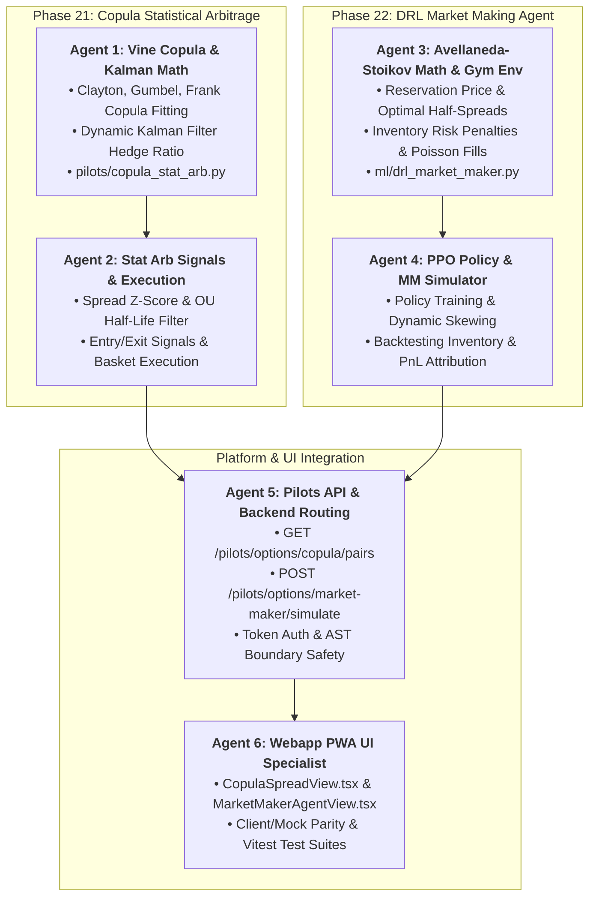

# Master Implementation Plan: Copula Statistical Arbitrage & DRL Market Making (Phases 21 & 22)

## Executive Overview
This phase integrates cross-asset non-linear joint tail risk modeling and autonomous reinforcement learning market making into the trading platform:

1. **Phase 21: Cross-Asset Statistical Arbitrage & Dynamic Vine Copula Engine**
   - **Regular Vine Copulas (Bedford & Cooke 2002; Aas et al. 2009)**:
     - Fits Clayton copula (lower tail crisis dependence $\lambda_L = 2^{-1/\theta}$), Gumbel copula (upper tail momentum $\lambda_U = 2 - 2^{1/\theta}$), and Frank copula.
     - Dynamic Kalman Filter estimating time-varying hedge ratio $\beta_t$ in state-space:
       $$y_t = \alpha_t + \beta_t x_t + \epsilon_t$$
     - Ornstein-Uhlenbeck (OU) half-life of mean reversion ($\tau_{1/2} \in [5, 60]$ days) and rolling spread Z-scores for long/short mean-reversion execution.

2. **Phase 22: Deep Reinforcement Learning (DRL) & Avellaneda-Stoikov Option Market Making Agent**
   - **Avellaneda-Stoikov (2008) High-Frequency Inventory Quoting**:
     - Reservation Price: $R(s, q, t) = s - q \gamma \sigma^2 (T - t)$
     - Optimal Quoting Spreads:
       $$\delta^a + \delta^b = \gamma \sigma^2 (T - t) + \frac{2}{\gamma} \ln\left(1 + \frac{\gamma}{\kappa}\right)$$
     - Poisson execution intensities: $\lambda(d) = A e^{-k d}$
   - **PPO Reinforcement Learning Policy**:
     - Optimizes bid-ask skewing under stochastic inventory constraints and jump hazard risk.

---

## Subagent Workstream Architecture

---

## User Review Required

> [!IMPORTANT]
> **Key Mathematical & Architectural Invariants**:
> 1. **Copula Fitting**: Must bound parameter estimates ($\theta > 0$ for Clayton/Gumbel) and handle near-zero correlation gracefully.
> 2. **Kalman State-Space**: State covariance initialized with $P_0 = 10^3 I$, measurement noise $R = 10^{-3}$, process noise $Q = 10^{-5} I$.
> 3. **AST Safety**: All modules under `pilots/` and `ml/` stay pure compute with zero heavy engine imports.

---

## Verification Plan

### Automated Tests
1. `pytest tests/test_copula_stat_arb.py` (Copula log-likelihood, tail dependence, Kalman filter convergence, OU half-life, spread Z-score, AST safety).
2. `pytest tests/test_drl_market_maker.py` (Avellaneda-Stoikov reservation price, spread symmetry, inventory damping, simulation PnL, AST safety).
3. `pytest tests/test_pilots_paper_broker.py` (API endpoints).
4. `npm run --prefix webapp typecheck` & `npm test`.
