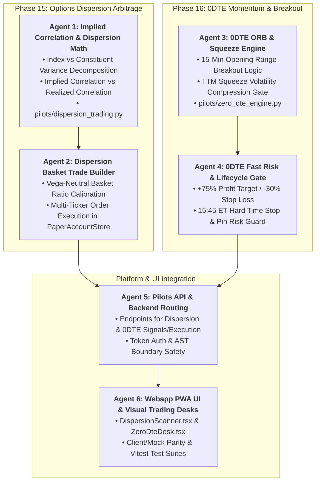

# Master Implementation Plan: Options Dispersion & 0DTE Breakout Desk (Phases 15 & 16)

## Executive Overview
This phase equips the options desk with two institutional capabilities:

1. **Phase 15: Cross-Asset Options Dispersion & Implied Correlation Arbitrage Engine**
   - **Implied Correlation ($\bar{\rho}_{\text{implied}}$)**: Decomposes index variance into weighted constituent variances and average pairwise correlation (Driessen, Maenhout, Vilkov 2009):
     $$\bar{\rho}_{\text{implied}} = \frac{\sigma_{\text{Index}}^2 - \sum_{i=1}^N w_i^2 \sigma_i^2}{\sum_{i \ne j} w_i w_j \sigma_i \sigma_j}$$
   - **Dispersion Alpha**: Exploits correlation risk premia ($\Delta \rho = \bar{\rho}_{\text{implied}} - \bar{\rho}_{\text{realized}}$).
     - **Long Dispersion**: Short Index Straddle (SPY/QQQ) + Long Vega-Weighted Basket of Constituent Straddles (AAPL, MSFT, NVDA, AMZN, GOOGL, META, TSLA, AVGO) when implied correlation is overpriced.
   - **Vega & Delta Neutrality**: Automatically calibrates constituent hedge ratios to maintain net $\Delta \approx 0$ and net $\mathcal{V} \approx 0$.

2. **Phase 16: 0DTE Intraday Momentum & Volatility Breakout Engine**
   - **15-Min Opening Range Breakout (ORB)**: Detects momentum thrust outside $[Low_{15}, High_{15}]$ on high volume acceleration.
   - **TTM Volatility Squeeze Gate**: Bollinger Bands ($2.0\sigma$) contracting inside Keltner Channels ($1.5\text{ATR}$) prior to breakout.
   - **High-Gamma Convexity Execution**: Buys ATM/1-OTM 0DTE calls or puts ($\Delta \approx 0.45$).
   - **0DTE Fast Risk Management**:
     - Fast Profit Target (+75% gain in premium)
     - Fast Stop Loss (-30% loss or opening range failure)
     - Mandatory 15:45 ET Hard Time Stop to eliminate settlement and pin risk.

Execution is organized across **6 Specialized Subagents** with strict AST safety, full test coverage, and 100% Mock/Live UI parity.

---

## Subagent Architecture & Workstream Division

---

## User Review Required

> [!IMPORTANT]
> **Key Architectural Controls**:
> 1. **Dispersion Basket Constituents**: Default universe covers top QQQ/SPY index components (AAPL, MSFT, NVDA, AMZN, GOOGL, META, TSLA, AVGO) with weights normalized to 100%.
> 2. **0DTE Hard Time Stop**: 0DTE positions are strictly prohibited from holding into expiration close; auto-closed at 15:45 ET.
> 3. **AST Import Safety**: All new engines under `pilots/` and `api/pilots_api.py` import only stdlib, numpy, scipy, pandas, and data stores.

---

## Detailed Agent Tasks & Proposed Changes

### Workstream 1: Agent 1 — Implied Correlation & Dispersion Math Specialist
- **Module**: `[NEW]` [`pilots/dispersion_trading.py`](file:///Users/kevinlee/.gemini/antigravity/worktrees/Stockpy-live/implement_multi_leg_paper_trading/pilots/dispersion_trading.py)
- **Features**:
  - `compute_implied_correlation(index_iv, constituent_ivs, weights)`: Computes $\bar{\rho}_{\text{implied}}$ from index and stock IVs.
  - `compute_realized_correlation_matrix(returns_df, weights)`: Computes weighted average historical realized correlation $\bar{\rho}_{\text{realized}}$.
  - `evaluate_dispersion_opportunity(index_symbol, constituent_symbols, ...)`:
    - Calculates Correlation Spread $\Delta \rho = \bar{\rho}_{\text{implied}} - \bar{\rho}_{\text{realized}}$.
    - Identifies Long Dispersion regime ($\Delta \rho \ge 0.15 \implies \text{Short Index Straddle} + \text{Long Component Straddles}$) vs Short Dispersion regime ($\Delta \rho \le -0.15$).

### Workstream 2: Agent 2 — Dispersion Basket Builder & Execution Specialist
- **Module**: [`pilots/dispersion_trading.py`](file:///Users/kevinlee/.gemini/antigravity/worktrees/Stockpy-live/implement_multi_leg_paper_trading/pilots/dispersion_trading.py), [`execution/options_paper_executor.py`](file:///Users/kevinlee/.gemini/antigravity/worktrees/Stockpy-live/implement_multi_leg_paper_trading/execution/options_paper_executor.py)
- **Features**:
  - `build_dispersion_basket(index_straddle, constituent_straddles, weights)`: Calibrates contract counts for each stock straddle to equalize basket vega against index vega ($\mathcal{V}_{\text{basket}} \approx \mathcal{V}_{\text{index}}$).
  - `execute_dispersion_trade(basket, store)`: Atomically submits the index order and constituent multi-leg orders with tag `strategy="Dispersion Arbitrage"`.

### Workstream 3: Agent 3 — 0DTE ORB & Squeeze Engine Specialist
- **Module**: `[NEW]` [`pilots/zero_dte_engine.py`](file:///Users/kevinlee/.gemini/antigravity/worktrees/Stockpy-live/implement_multi_leg_paper_trading/pilots/zero_dte_engine.py)
- **Features**:
  - `compute_opening_range(intraday_bars, range_minutes=15)`: Calculates $Low_{15}$ and $High_{15}$.
  - `detect_volatility_squeeze(bars)`: Checks if Bollinger Band ($20, 2\sigma$) width is inside Keltner Channel ($20, 1.5\text{ATR}$).
  - `scan_0dte_breakouts(symbol, intraday_bars, current_quote, chain_data)`:
    - Generates Bullish Call breakout signal on $Price > High_{15}$ + Squeeze Release + Volume $> 1.5\times$ average.
    - Generates Bearish Put breakdown signal on $Price < Low_{15}$ + Squeeze Release + Volume $> 1.5\times$ average.
    - Selects optimal 0DTE strike ($\Delta \in [0.40, 0.55]$).

### Workstream 4: Agent 4 — 0DTE Fast Risk & Lifecycle Specialist
- **Module**: [`pilots/zero_dte_engine.py`](file:///Users/kevinlee/.gemini/antigravity/worktrees/Stockpy-live/implement_multi_leg_paper_trading/pilots/zero_dte_engine.py), [`execution/options_paper_executor.py`](file:///Users/kevinlee/.gemini/antigravity/worktrees/Stockpy-live/implement_multi_leg_paper_trading/execution/options_paper_executor.py), [`settings.py`](file:///Users/kevinlee/.gemini/antigravity/worktrees/Stockpy-live/implement_multi_leg_paper_trading/settings.py)
- **Features**:
  - `evaluate_0dte_exits(positions, current_time, current_quotes)`:
    - Triggers profit target exit if P&L $\ge +75\%$.
    - Triggers stop loss exit if P&L $\le -30\%$.
    - **Hard Time Stop**: If time $\ge$ 15:45 ET, triggers immediate market order closure.
  - Settings: `OPTIONS_0DTE_ENABLED`, `OPTIONS_0DTE_PROFIT_TARGET_PCT` (`0.75`), `OPTIONS_0DTE_STOP_LOSS_PCT` (`0.30`), `OPTIONS_0DTE_HARD_EXIT_TIME` (`"15:45"`).

### Workstream 5: Agent 5 — Pilots API & Backend Routing Specialist
- **Module**: [`api/pilots_api.py`](file:///Users/kevinlee/.gemini/antigravity/worktrees/Stockpy-live/implement_multi_leg_paper_trading/api/pilots_api.py)
- **Features**:
  - `GET /pilots/options/dispersion/opportunities`: Returns implied vs realized correlation spreads and dispersion trade setups (Read token).
  - `POST /pilots/options/dispersion/execute`: Executes vega-neutral dispersion basket (Command token + Write switch).
  - `GET /pilots/options/zero-dte/signals?symbol=...`: Returns 0DTE ORB breakout signals, squeeze status, and recommended contract (Read token).
  - `POST /pilots/options/zero-dte/execute`: Executes 0DTE momentum trade (Command token + Write switch).

### Workstream 6: Agent 6 — Webapp PWA UI Specialist
- **Module**: [`webapp/src/api/types.ts`](file:///Users/kevinlee/.gemini/antigravity/worktrees/Stockpy-live/implement_multi_leg_paper_trading/webapp/src/api/types.ts), [`webapp/src/api/client.ts`](file:///Users/kevinlee/.gemini/antigravity/worktrees/Stockpy-live/implement_multi_leg_paper_trading/webapp/src/api/client.ts), [`webapp/src/api/mock.ts`](file:///Users/kevinlee/.gemini/antigravity/worktrees/Stockpy-live/implement_multi_leg_paper_trading/webapp/src/api/mock.ts), `[NEW]` [`webapp/src/components/options/DispersionScanner.tsx`](file:///Users/kevinlee/.gemini/antigravity/worktrees/Stockpy-live/implement_multi_leg_paper_trading/webapp/src/components/options/DispersionScanner.tsx), `[NEW]` [`webapp/src/components/options/ZeroDteDesk.tsx`](file:///Users/kevinlee/.gemini/antigravity/worktrees/Stockpy-live/implement_multi_leg_paper_trading/webapp/src/components/options/ZeroDteDesk.tsx), [`webapp/src/screens/PaperBroker.tsx`](file:///Users/kevinlee/.gemini/antigravity/worktrees/Stockpy-live/implement_multi_leg_paper_trading/webapp/src/screens/PaperBroker.tsx), [`webapp/src/screens/OptionsChain.tsx`](file:///Users/kevinlee/.gemini/antigravity/worktrees/Stockpy-live/implement_multi_leg_paper_trading/webapp/src/screens/OptionsChain.tsx)
- **Features**:
  - `DispersionScanner.tsx`: Correlation spread gauge ($\bar{\rho}_{\text{implied}} - \bar{\rho}_{\text{realized}}$), constituent weighting table, vega balance meter, and 1-click "Execute Basket" action.
  - `ZeroDteDesk.tsx`: Live 15-min Opening Range Breakout visual box, TTM Squeeze indicator light, live breakout momentum cards, and 1-click "⚡ Trade 0DTE" button.
  - Full TypeScript types, mock data parity, and Vitest test suites.

---

## Verification Plan

### Automated Tests
1. `pytest tests/test_dispersion_trading.py` (Implied correlation math, variance decomposition, vega neutrality ratios, basket trade execution).
2. `pytest tests/test_zero_dte_engine.py` (15-min ORB breakout detection, TTM squeeze triggers, strike selection, +75% TP / -30% SL, 15:45 ET hard exit).
3. `pytest tests/test_pilots_paper_broker.py` (API endpoints and write gates).
4. `npm run --prefix webapp typecheck` & `npm test`.
