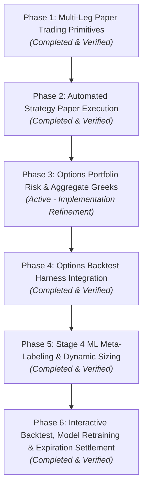

# Implementation Plan: Options Portfolio Risk & Aggregate Greeks (Phase 3)

**Tier:** "Everything else" (touches risk/execution-adjacent code) — per `CLAUDE.md`'s Start-of-session
checklist, this goes through `git checkout -b options-portfolio-greeks` and a PR; not committed
direct to `main`. This document is the required pre-code Implementation Plan for that gate and
should be copied to `.claude/e44_options_portfolio_greeks_implementation_plan.md` on the branch
per the PR Artifacts & Unique Naming convention.

## Overview
Architecture for portfolio-wide and per-position options Greeks risk on top of the completed
multi-leg paper trading primitives (Phase 1) and automated strategy execution (Phase 2). This
revision resolves four gaps found in review against `CLAUDE.md`/`AGENTS.md`'s documented
conventions before any code is written: the `pilots/`↔`processing_engine` import boundary, live
IV/quote sourcing, degenerate-input guards, and the required documentation-update step.

---

## 🗺️ Master Plan: 6 Phases

1. **Phase 1: Multi-Leg Paper Trading Primitives** *(Completed)*: Multi-leg order sizing, atomic
   multi-leg SQLite ledger in `PaperAccountStore`, short position tracking (`qty < 0`),
   Black-Scholes mark-to-market valuation, $0.65/leg fee model, PWA UI parity.
2. **Phase 2: Automated Strategy Paper Execution** *(Completed)*: `OptionsPaperExecutor` engine,
   `PAPER_OPTIONS_AUTO_EXECUTE_ENABLED`/`MAX_OPTION_NOTIONAL_PER_TRADE`/`MAX_CONCURRENT_OPTION_POSITIONS`,
   orchestrator cycle hooks, Pilots API endpoints, PWA candidates preview & execution panel.
3. **Phase 3: Options Portfolio Risk & Aggregate Greeks** *(Active Priority / Refinement)*.
4. **Phase 4: Options Backtest Harness Integration** *(Completed)*.
5. **Phase 5: Stage 4 ML Meta-Labeling & Dynamic Sizing** *(Completed)*.
6. **Phase 6: Interactive Backtest, Model Retraining & Expiration Settlement** *(Completed)*.

---

## 0. Dependency Check — Verify Before Writing Code

Per the same "audit the real implementation before scoping the fix" principle already applied to
the canonical `risk/position_sizing.py` work, confirm both of the following against the actual
codebase before starting Phase 3, and adjust this plan if either assumption is wrong:

1. **`PaperAccountStore` leg schema** — confirm each stored option leg carries `strike`, `expiry`,
   `right` (call/put), `contracts` (signed, negative = short), and whether an entry-time IV was
   captured. If entry IV isn't stored, that's fine (Phase 3 recomputes live IV — see §2 below) but
   must be confirmed either way.
2. **Existing per-symbol beta** — check whether `pipeline/production_steps.py` already computes and
   persists a per-symbol beta (e.g. alongside the `Value_Z`/`Quality_Z`/`LowVol_Z`/`Size_Z`
   multifactor columns, or in `state_snapshot.json`) via `BETA_LOOKBACK_DAYS`. This determines
   which of Option A / Option B in §1 applies. Do not assume either way — verify by reading
   `processing_engine.calculate_fundamental_metrics`'s callers and `config.COLUMN_SCHEMA`.

---

## 1. Architecture Decision: β-Weighted SPY Delta vs. the `pilots/` Import Boundary

**The gap in the original plan:** `pilots/options_risk.py` was scoped to compute "β-weighted SPY
delta" using only `get_provider()`. But per-symbol beta is `processing_engine.calculate_rolling_beta`,
and `CLAUDE.md` states `api/pilots_api.py` is AST-guarded against importing `processing_engine`
**even transitively-in-intent** (see the `pilots-endpoint` skill, and the Cache Long/Short precedent,
which routes any `processing_engine`-touching computation through `api/data_api.py` instead of
`pilots/*.py` for exactly this reason). As scoped, Phase 3 would either fail that guard the moment
real beta is wired in, or ship a fabricated/hardcoded beta to dodge the import — the latter is the
"fabricated metrics" failure class the original code audit already flagged once. This needs one
explicit resolution, chosen based on the §0.2 finding:

- **Option A — a per-symbol beta is already persisted somewhere pilots-safe** (state snapshot,
  dashboard column, a lightweight store). `pilots/options_risk.py` reads it directly — zero new
  engine dependency, stays entirely inside the AST guard. **Preferred if true**, since Greeks
  refresh on every request and a heavy per-request engine call would also be a latency problem.
- **Option B — no persisted beta exists yet.** Split the work the same way Cache Long/Short did:
  position-level and portfolio-net Greeks (Δ, Γ, Θ, 𝒱 — none of which need `processing_engine`)
  stay in `pilots/options_risk.py`, dependency-light, called from `api/pilots_api.py`. The single
  β-weighted-SPY-delta figure is computed by a new on-demand helper in `api/data_api.py` (mirroring
  `POST /data/pairs/analyze`'s existing on-demand pattern), which the PWA calls as a second,
  separate field — not bundled into the same guarded endpoint.

**This plan proceeds on Option B pending the §0.2 check**, since it's the safe default that matches
an established precedent; if §0.2 finds a persisted beta, collapse to Option A instead (strictly
simpler, no `data_api.py` change needed).

---

## 2. IV & Quote Sourcing (undefined in the original plan — now explicit)

Greeks are mark-to-market, not entry-time, so every open leg's inputs are re-derived **live** on
each request:

- **Spot (S)**: via `data.market_data.get_provider()` (matches the Cache Long/Short precedent of
  using the lightweight `CompositeProvider`, not `DataEngine`). **Batched by underlying symbol**,
  not per-leg — a multi-leg spread shares one underlying, and FMP Starter-tier rate limits make
  per-leg fetches wasteful.
- **IV (σ)**: re-queried per leg from `CompositeOptionsProvider` by exact strike/expiry/right. If
  the contract can't be located in the current chain (delisted strike, provider gap, illiquid
  near-expiry), that leg's Greeks are `NaN` (CONSTRAINT #4 — never silently reuse stale/entry IV
  as if it were live) and the leg is listed in the response's `positions_with_missing_data`.
- **Time to expiry (T)**: computed from wall-clock `now()` to the contract's real expiry, not from
  entry time.
- **Risk-free rate (r)**: `settings.OPTIONS_RISK_FREE_RATE`, a single settings-driven value — never
  a re-typed literal in `options_risk.py`, per the existing "thresholds must come from settings"
  convention. (Reuse the FMP treasury feed if a suitable series is already wired; otherwise a
  static settings default is acceptable for V1, same posture as other diagnostic-only rates
  elsewhere in this codebase.)

**Missing-data handling for portfolio aggregates:** a position with an unresolvable spot or IV is
**excluded from the sum, not zeroed** — zeroing a leg's delta because its quote failed would
silently shrink Net Delta/Gamma and understate real risk, the same class of bug the ETF-transmission
work already guards against ("a data outage must never relax a risk limit"). The excluded symbols
are surfaced in the API response so the PWA can flag an incomplete Greeks read rather than present
it as complete.

---

## 3. Mathematical Framework (unchanged formulas, added guards)

For a portfolio with $M$ equity positions and $N$ option leg positions:

- **Equity**: $\Delta_i = 1.0$, $\Gamma_i = \Theta_i = \mathcal{V}_i = 0$. Position Delta $= N_i$;
  Position Dollar Delta $= N_i \times S_i$.
- **Option Leg** (Strike $K$, time-to-expiry $T$, Spot $S$, IV $\sigma$, rate $r$):
  - $d_1 = \frac{\ln(S/K) + (r + \sigma^2/2)T}{\sigma \sqrt{T}}$, $d_2 = d_1 - \sigma\sqrt{T}$
  - $\Delta_{\text{call}} = N(d_1)$, $\Delta_{\text{put}} = N(d_1) - 1.0$
  - $\Gamma = \frac{N'(d_1)}{S\sigma\sqrt{T}}$
  - $\Theta_{\text{daily}} = \frac{1}{252}\left[-\frac{SN'(d_1)\sigma}{2\sqrt{T}} \mp rKe^{-rT}N(\pm d_2)\right]$
  - $\mathcal{V}_{1\%} = \frac{SN'(d_1)\sqrt{T}}{100}$
  - Position Multiplier $Q_j = \text{contracts}_j \times 100$ (negative for short)
  - Position Delta $= Q_j\Delta_j$; Dollar Delta $= Q_j\Delta_j S$; Gamma $= Q_j\Gamma_j$;
    Theta $= Q_j\Theta_j$; Vega $= Q_j\mathcal{V}_j$

**New required guards (not in the original plan):**
- **Degenerate denominator guard**: `σ√T` appears in every denominator above. Reuse this codebase's
  existing `< 1e-12` degenerate-std threshold (`risk/etf_transmission.py::_DEGENERATE_STD`, and its
  five other propagated sites) rather than inventing a fresh epsilon — same failure shape as a
  near-zero std blowing up a ratio.
- **T → 0 (0DTE / same-day expiry)**: below the guard threshold, do not `NaN` the leg — fall back to
  intrinsic-value delta (long call/put ITM → ±1.0 share-equivalent, OTM → 0), mirroring how equity
  delta is already hardcoded to 1.0 rather than derived. Gamma/Theta/Vega go to 0 at that point
  (no time value left to decay). This matters concretely given 0DTE automation is on the roadmap.
- **σ ≈ 0 or missing**: same guard/threshold, same NaN-and-exclude handling as a missing quote (§2).

### Portfolio Aggregate Metrics
- **Net Share Delta**: $\sum_{\text{Stock}} N_i + \sum_{\text{Opt}} Q_j\Delta_j$ (excludes any
  position flagged missing-data per §2)
- **Net Dollar Delta**, **Net Gamma**, **Net Theta ($/day)**, **Net Vega ($/1% IV)**: same pattern
- **SPY β-Weighted Delta**: $\sum_k \frac{\text{DollarDelta}_k \times \beta_k}{S_{\text{SPY}}}$ —
  sourced per §1 (Option A or B); a symbol with no available beta is excluded from this sum
  specifically (independent from whether it has valid Δ/Γ/Θ/𝒱), and the response notes which
  symbols were beta-excluded.

---

## 4. Proposed Changes

### 4.1 Greeks Risk Calculation Engine
#### [NEW] `pilots/options_risk.py`
- `calculate_position_greeks(position, spot, iv, r, now) -> PositionGreeks` — pure math, the
  guards in §3, no engine imports.
- `calculate_portfolio_greeks(positions, quotes, ivs) -> PortfolioGreeks` — aggregates per §3,
  returns `positions_with_missing_data` and (if Option A) `beta_excluded_symbols`.
- `get_batched_spot_quotes(symbols) -> dict` — dedupes by underlying before calling
  `data.market_data.get_provider()`.
- `get_leg_iv(strike, expiry, right) -> float | None` — queries `CompositeOptionsProvider`;
  returns `None` (never a fabricated fallback) on a miss.
- Explicitly verified by an AST/import test (mirroring `pilots-endpoint` skill's existing pattern)
  that this module never imports `processing_engine`, even transitively.

#### [NEW, only if Option B] on-demand helper in `api/data_api.py`
- `compute_beta_weighted_spy_delta(positions) -> float | dict` — the one piece of Phase 3 allowed
  to import `processing_engine.calculate_rolling_beta`, following `POST /data/pairs/analyze`'s
  existing on-demand pattern exactly.

### 4.2 Pilots API & Helpers
#### [MODIFY] `pilots/paper_broker.py`
- `get_paper_portfolio_greeks()` — delegates to `pilots/options_risk.py`; if Option B, also calls
  the `data_api.py` helper and merges the single beta-weighted figure into the response.

#### [MODIFY] `api/pilots_api.py`
- `GET /pilots/paper-broker/greeks`, protected by `require_read_token` (matches the existing
  read-endpoint convention). Read-only diagnostic endpoint — **no new `_ENABLED` flag**, consistent
  with the "new admin/write/execution capabilities" convention not applying here (this changes
  nothing about trading behavior; it's a GET).

### 4.3 PWA UI & Mock Parity
#### [MODIFY] `webapp/src/api/types.ts`
- `PortfolioGreeks`, `PositionGreekBreakdown`, plus `positionsWithMissingData: string[]` and (if
  Option B) `betaExcludedSymbols: string[]` — the incomplete-data signal must reach the UI, not be
  swallowed at the API layer.

#### [MODIFY] `webapp/src/api/client.ts` & `webapp/src/api/mock.ts`
- `getPaperBrokerGreeks()` on both `liveApi` and `mockApi`; mock fixture includes at least one
  exercised missing-data case so the UI path is covered before any live gap is hit for real.

#### [MODIFY] `webapp/src/screens/PaperBroker.tsx`
- Portfolio Risk & Aggregate Greeks cards: Net Delta (shares & $), Net Gamma, Net Theta ($/day),
  Net Vega ($/1% IV), β-Weighted SPY Delta.
- Delta/Theta/Vega columns in the positions table.
- A visible indicator (not just console-silent) when `positionsWithMissingData` or
  `betaExcludedSymbols` is non-empty — an incomplete Greeks read must look different from a
  complete one.

---

## 5. Documentation Updates (required step — was missing from the original plan)

- **`docs/architecture/execution.md`** (or the appropriate per-module architecture doc) — add
  `pilots/options_risk.py` and, if Option B, the new `data_api.py` beta helper, following the
  existing per-module reference pattern.
- **`CLAUDE.md` / `AGENTS.md`** (auto-synced by the existing hook) — one "Recent Architecture
  Updates" bullet documenting: the Greeks engine, the Option A/B beta-sourcing decision actually
  taken and why, the new `OPTIONS_RISK_FREE_RATE` setting, and the missing-data/NaN convention
  applied here — matching the density and reasoning style of existing bullets in that section.
- **`docs/HOW_TO_GUIDE.md`** — short entry for the new Paper Broker Greeks cards if that guide
  covers the Paper Broker screen already.

---

## 6. Verification Plan

### Automated Tests
1. **Unit tests (`tests/test_options_risk.py`)**:
   - Black-Scholes Greeks for Call/Put, Long/Short — **validated against a trusted external
     reference** (e.g. `py_vollib` / analytic closed-form) on known inputs, not only against the module's own formula,
     given "fabricated metrics" is a confirmed prior failure mode in this codebase.
   - Degenerate-input guards: `T` at/below the `1e-12` threshold (0DTE fallback to intrinsic
     delta), `σ` at/below threshold, missing spot, missing IV — each asserted to produce the
     documented NaN/exclusion behavior, not a crash or a silent zero.
   - Aggregate portfolio Greeks across multi-leg positions (Put Credit Spread net theta > 0,
     Iron Condor theta decay).
   - Missing-data exclusion: a position with an unresolvable quote is absent from the aggregate
     sum and present in `positions_with_missing_data`.
   - Import boundary: an AST-based test asserting `pilots/options_risk.py` never imports
     `processing_engine`, transitively or otherwise.
2. **API tests (`tests/test_pilots_paper_broker.py`)**: `GET /pilots/paper-broker/greeks` response
   schema, authentication, and the missing-data/beta-excluded fields under a simulated quote
   failure.
3. **Frontend tests (`webapp/src/screens/PaperBroker.test.tsx`)**: Greeks cards render, table
   columns populate, and the missing-data indicator renders under the mock's exercised gap case.
   - Run `npm run --prefix webapp typecheck` **and** `npm run --prefix webapp test`, **and** an
     actual `npm run dev` + browser check — per `CLAUDE.md`'s explicit rule that a clean typecheck
     alone doesn't prove a screen renders or behaves correctly.

### Manual / Pre-merge
- Confirm §0's two dependency checks were actually done (schema + persisted-beta check), and that
  §1's Option A/B choice in this document matches what was found — update this plan if not.
