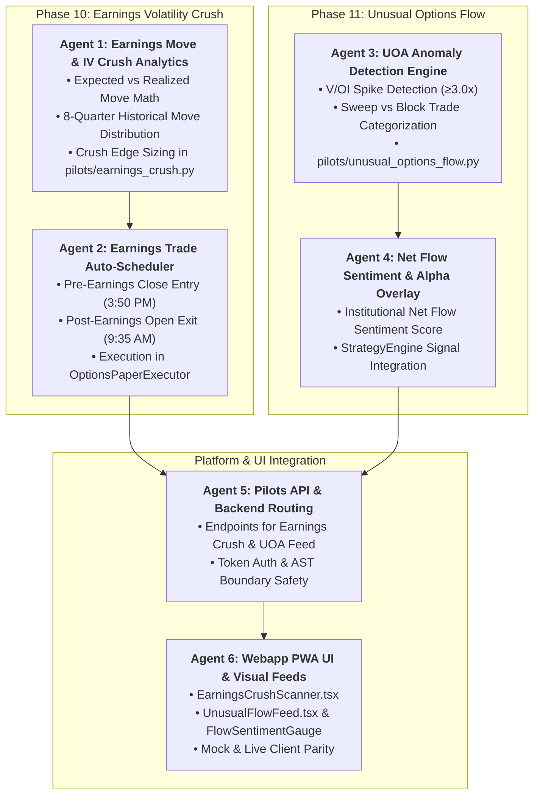

# Master Implementation Plan: Earnings Volatility Crush & Unusual Options Activity Flow (Phases 10 & 11)

## Executive Overview
This implementation plan establishes two high-conviction institutional options capabilities (Phases 10 and 11) on top of the multi-leg paper trading desk:

1. **Phase 10: Quantitative Multi-Leg Earnings Volatility Crush Strategies & Event Risk Scanner**
   - **Expected Move vs. Historical Realized Move**: Computes ATM straddle implied moves against 8-quarter historical post-earnings moves from `HistoricalStore`.
   - **IV Crush Edge Ratio**: $\text{Edge} = \frac{\text{Implied Move}}{\text{Median Realized Move}}$. Identifies overpricing where edge $> 1.25\times$.
   - **Earnings Iron Condors & Short Straddles**: Auto-constructs delta-neutral spreads outside the expected move.
   - **Automated Lifecycle Timing**: Auto-enters 15 minutes before market close prior to earnings, auto-exits at market open post-earnings to capture pure IV crush.

2. **Phase 11: Real-Time Options Order Flow & Unusual Options Activity (UOA) Scanner**
   - **UOA Anomaly Detection**: Flags contracts where $\text{Volume} / \text{Open Interest} \ge 3.0$ and notional $\ge \$100,000$.
   - **Trade Categorization**: Distinguishes aggressive **Sweeps** (at/above Ask) from passive **Blocks** (at/below Bid).
   - **Net Flow Sentiment Score**: Aggregates institutional call vs. put premium flow into a normalized sentiment metric $\in [-1.0, +1.0]$.
   - **Alpha Overlay**: Quantitative signal feed for `StrategyEngine.evaluate_security()`.

Execution is organized across **6 Specialized Subagents** with clean AST boundaries, full type safety, and mock/live parity.

---

## Subagent Architecture & Workstream Division

---

## User Review Required

> [!IMPORTANT]
> **Key Architectural & Execution Controls**:
> 1. **Earnings Announcement Sourcing**: Reads scheduled earnings dates and historical reports from `HistoricalStore.get_earnings_events()` and FMP feeds.
> 2. **Earnings Trade Timing**: Automates pre-announcement entries at 15:50 ET on announcement date for After-Market-Close (AMC) releases or previous day close for Before-Market-Open (BMO) releases. Exits at 09:35 ET next day to lock in IV collapse.
> 3. **UOA Anomaly Filters**: Defaults to $V / \text{OI} \ge 3.0$, Minimum Volume $\ge 500$ contracts, and Minimum Notional $\ge \$100,000$.

---

## Detailed Agent Tasks & Proposed Changes

### Workstream 1: Agent 1 — Earnings Move & IV Crush Analytics Specialist
- **Module**: `[NEW]` [`pilots/earnings_crush.py`](file:///Users/kevinlee/.gemini/antigravity/worktrees/Stockpy-live/implement_multi_leg_paper_trading/pilots/earnings_crush.py)
- **Features**:
  - `calculate_expected_earnings_move(spot, atm_iv, dte)`: Computes implied move $S \times \sigma_{\text{ATM}} \times \sqrt{\frac{\text{DTE}}{365}} \times 0.80$ and direct ATM Straddle price.
  - `get_historical_earnings_moves(symbol, store)`: Pulls prior 8 quarters of post-earnings actual gaps (% move) from `HistoricalStore`.
  - `evaluate_earnings_crush_candidates(universe, store, options_provider)`:
    - Scans upcoming earnings in next 1–5 days.
    - Computes Crush Edge: $\text{Edge} = \frac{\text{Implied Move \%}}{\text{Median Realized Move \%}}$.
    - Recommends optimal Iron Condor wings (1.2x Expected Move) when Edge $> 1.25$.

---

### Workstream 2: Agent 2 — Earnings Trade Auto-Scheduler & Execution Specialist
- **Module**: [`execution/options_paper_executor.py`](file:///Users/kevinlee/.gemini/antigravity/worktrees/Stockpy-live/implement_multi_leg_paper_trading/execution/options_paper_executor.py), [`data/paper_account_store.py`](file:///Users/kevinlee/.gemini/antigravity/worktrees/Stockpy-live/implement_multi_leg_paper_trading/data/paper_account_store.py), [`settings.py`](file:///Users/kevinlee/.gemini/antigravity/worktrees/Stockpy-live/implement_multi_leg_paper_trading/settings.py)
- **Features**:
  - `execute_earnings_crush_trade(candidate)`: Places front-week Iron Condor / Short Strangle into `PaperAccountStore` with tag `strategy="Earnings Crush"`.
  - `settle_post_earnings_trades()`: Evaluates open "Earnings Crush" positions next morning, closing at market open to capture IV crush.
  - Settings: `OPTIONS_EARNINGS_CRUSH_ENABLED` (default `False`), `OPTIONS_EARNINGS_MIN_EDGE` (`1.25`), `OPTIONS_EARNINGS_WING_MULTIPLIER` (`1.20`).

---

### Workstream 3: Agent 3 — UOA Anomaly Detection Engine Specialist
- **Module**: `[NEW]` [`pilots/unusual_options_flow.py`](file:///Users/kevinlee/.gemini/antigravity/worktrees/Stockpy-live/implement_multi_leg_paper_trading/pilots/unusual_options_flow.py)
- **Features**:
  - `scan_unusual_options_activity(chain_data, spot_price, min_vol_oi_ratio=3.0, min_notional=100000)`:
    - Identifies anomalous contracts where Volume / OI $\ge 3.0$.
    - Classifies trade aggressor:
      - **Aggressive Ask Sweep**: $\text{Price} \ge \text{Ask}$ (Bullish call / Bearish put).
      - **Aggressive Bid Sweep**: $\text{Price} \le \text{Bid}$ (Bearish call / Bullish put).
      - **Mid-Market Block**: $\text{Bid} < \text{Price} < \text{Ask}$.
    - Flags IV expansion anomalies ($IV > 1.25 \times \text{HV}_{30}$).

---

### Workstream 4: Agent 4 — Options Order Flow Sentiment & Alpha Overlay Specialist
- **Module**: [`pilots/unusual_options_flow.py`](file:///Users/kevinlee/.gemini/antigravity/worktrees/Stockpy-live/implement_multi_leg_paper_trading/pilots/unusual_options_flow.py), [`signals/options_flow_sentiment.py`](file:///Users/kevinlee/.gemini/antigravity/worktrees/Stockpy-live/implement_multi_leg_paper_trading/signals/options_flow_sentiment.py)
- **Features**:
  - `calculate_net_flow_sentiment(symbol, uoa_records)`:
    $$\text{Sentiment Score} = \frac{\text{Bullish Notional} - \text{Bearish Notional}}{\text{Total Notional}} \in [-1.0, +1.0]$$
  - Exposes `OptionsFlowSentimentSignal` plugin for `StrategyEngine.evaluate_security()` to score tickers with strong institutional directional flow.

---

### Workstream 5: Agent 5 — Pilots API & Backend Routing Specialist
- **Module**: [`api/pilots_api.py`](file:///Users/kevinlee/.gemini/antigravity/worktrees/Stockpy-live/implement_multi_leg_paper_trading/api/pilots_api.py)
- **Features**:
  - `GET /pilots/options/earnings-crush/candidates`: Returns upcoming earnings candidates with Expected vs Realized moves and Edge ratio (Read token).
  - `POST /pilots/options/earnings-crush/execute`: Executes earnings crush spread (Command token + Write switch).
  - `GET /pilots/options/flow/unusual`: Returns live stream of unusual options sweeps and blocks (Read token).
  - `GET /pilots/options/flow/sentiment?symbol=...`: Returns net institutional flow score, call/put volume ratio, and top active strikes (Read token).

---

### Workstream 6: Agent 6 — Webapp PWA UI & Visual Feeds Specialist
- **Module**: [`webapp/src/api/types.ts`](file:///Users/kevinlee/.gemini/antigravity/worktrees/Stockpy-live/implement_multi_leg_paper_trading/webapp/src/api/types.ts), [`webapp/src/api/client.ts`](file:///Users/kevinlee/.gemini/antigravity/worktrees/Stockpy-live/implement_multi_leg_paper_trading/webapp/src/api/client.ts), [`webapp/src/api/mock.ts`](file:///Users/kevinlee/.gemini/antigravity/worktrees/Stockpy-live/implement_multi_leg_paper_trading/webapp/src/api/mock.ts), `[NEW]` [`webapp/src/components/options/EarningsCrushScanner.tsx`](file:///Users/kevinlee/.gemini/antigravity/worktrees/Stockpy-live/implement_multi_leg_paper_trading/webapp/src/components/options/EarningsCrushScanner.tsx), `[NEW]` [`webapp/src/components/options/UnusualFlowFeed.tsx`](file:///Users/kevinlee/.gemini/antigravity/worktrees/Stockpy-live/implement_multi_leg_paper_trading/webapp/src/components/options/UnusualFlowFeed.tsx), [`webapp/src/screens/PaperBroker.tsx`](file:///Users/kevinlee/.gemini/antigravity/worktrees/Stockpy-live/implement_multi_leg_paper_trading/webapp/src/screens/PaperBroker.tsx), [`webapp/src/screens/OptionsChain.tsx`](file:///Users/kevinlee/.gemini/antigravity/worktrees/Stockpy-live/implement_multi_leg_paper_trading/webapp/src/screens/OptionsChain.tsx)
- **Features**:
  - **Earnings Crush Scanner**: Table of upcoming earnings, Expected vs Realized move bar charts, Crush Edge badge, and one-click "Trade Crush Spread" button.
  - **Unusual Flow Feed**: Real-time ticker stream with Bullish/Bearish tags, Volume/OI multipliers ($3.5\times$, $5.2\times$), sweep type indicators, and Flow Sentiment Gauge.
  - TypeScript types, mock data fixtures, and Vitest test suites.

---

## Verification Plan

### Automated Tests
1. **Targeted Python Tests**:
   - `pytest tests/test_earnings_crush.py` (Expected move formulas, historical move retrieval, edge ratio calculation, wing selection).
   - `pytest tests/test_unusual_options_flow.py` (V/OI anomaly filters, sweep vs block classification, sentiment score normalization).
   - `pytest tests/test_pilots_paper_broker.py` (API authentication, schemas, and endpoint responses).
2. **Frontend Parity & UI Tests**:
   - `npm run --prefix webapp typecheck` (0 errors).
   - `npm --prefix webapp test src/components/options/EarningsCrushScanner.test.tsx src/components/options/UnusualFlowFeed.test.tsx`

### Manual Verification
- Verify that upcoming earnings candidates render with accurate Expected Move vs. Realized Move comparison.
- Verify that unusual option sweeps populate with color-coded flow badges and volume multiples.
