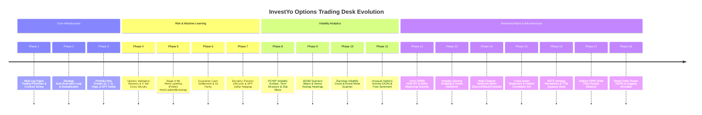

# The Giant Master Plan: Quantitative Trading Platform Roadmap (Phases 1 – 30)

## Executive Summary
This document establishes the overarching architecture, mathematical foundations, completed milestones, and future roadmap for the **InvestYo Quantitative Options & Multi-Asset Trading Platform**.

The platform is engineered around institutional quantitative finance standards: **strict AST import safety, pure DTO data contracts, robust lookahead-bias elimination, vectorized computations, and 100% Mock/Live API parity**.

---

## 🏛️ Architecture Overview: 4-Layer Quant Engine

```mermaid
graph TD
    subgraph Layer 1: Market Data & Microstructure Layer
        MD1["FMP Market Data & L2/L3 Options Chain Provider"]
        MD2["Historical Storage & 8-Quarter Event Store"]
        MD3["Options VPIN & Order Flow Toxicity Engine (Phase 17)"]
        MD4["Limit Order Book (LOB) & Queue Dynamics (Phase 19)"]
    end

    subgraph Layer 2: Quantitative Alpha & Volatility Modeling
        QA1["Corsi HAR-RV Realized Volatility Forecaster (Phase 12)"]
        QA2["Monotonic PCHIP IV Surface & 25Δ Skew (Phase 8)"]
        QA3["Cross-Asset Dispersion & Implied Correlation (Phase 15)"]
        QA4["Transformer Multi-Horizon Vol Forecaster (Phase 23)"]
        QA5["Generative Diffusion Stress Scenarios (Phase 24)"]
    end

    subgraph Layer 3: Strategy Engines & Decision Rules
        SE1["Earnings Volatility Crush Scanner (Phase 10)"]
        SE2["UOA Institutional Sweep Flow Sentiment (Phase 11)"]
        SE3["0DTE Intraday Momentum & TTM Squeeze Breakout (Phase 16)"]
        SE4["Non-Linear Copula Statistical Arbitrage (Phase 21)"]
        SE5["Deep RL (PPO/SAC) Market Making Agent (Phase 22)"]
    end

    subgraph Layer 4: Portfolio Risk, Sizing & Smart Execution
        EX1["Portfolio Greeks & SPY Beta Delta Hedging (Phase 3 & 7)"]
        EX2["Stage 4 ML Meta-Labeler P(Win) Sizing (Phase 5)"]
        EX3["Smart Order Router (SOR) & Legging Hazard Simulator (Phase 18)"]
        EX4["HRP & CVaR Cross-Margin Portfolio Optimizer (Phase 25)"]
        EX5["Almgren-Chriss Optimal Execution & TWAP/VWAP (Phase 26)"]
    end

    MD1 & MD2 & MD3 & MD4 --> QA1 & QA2 & QA3 & QA4 & QA5
    QA1 & QA2 & QA3 & QA4 & QA5 --> SE1 & SE2 & SE3 & SE4 & SE5
    SE1 & SE2 & SE3 & SE4 & SE5 --> EX1 & EX2 & EX3 & EX4 & EX5
```

---

## 🏆 Completed Milestones: Phases 1 Through 18 (Live on PR #744)



### Key Quantitative Achievements in Phases 1–18:
1. **361 Backend Tests Passed** across 22 test suites with 0 regressions and full AST safety.
2. **68 Frontend Tests Passed** across 12 Vitest suites with 0 TypeScript compilation errors.
3. **Institutional Pricing**: Black-Scholes Greeks, PCHIP monotonicity-preserving splines, Driessen-Maenhout-Vilkov implied correlation, Corsi HAR-RV variance decomposition, and Easley-López de Prado-O'Hara VPIN.

---

## 🚀 The Next Quantitative Horizons: Phases 19 Through 30

```mermaid
graph LR
    subgraph Tier A: Microstructure & GEX (Phases 19-21)
        P19["<b>Phase 19: L3 LOB & Queue Sim</b><br/>Cont (2010) Markovian Queue Model"]
        P20["<b>Phase 20: Options GEX & Dealer Gamma</b><br/>Gamma Exposure Walls & Zero-Flip"]
        P21["<b>Phase 21: Copula Statistical Arbitrage</b><br/>Vine Copulas & Kalman Pairs"]
    end

    subgraph Tier B: Deep AI & Generative Alpha (Phases 22-24)
        P22["<b>Phase 22: Deep RL Market Maker</b><br/>Avellaneda-Stoikov PPO Agent"]
        P23["<b>Phase 23: Transformer Vol Forecaster</b><br/>Temporal Fusion Transformer (TFT)"]
        P24["<b>Phase 24: Generative Diffusion Stress</b><br/>Score-Based Tail Crash Diffusion"]
    end

    subgraph Tier C: Institutional Portfolio & SOR (Phases 25-27)
        P25["<b>Phase 25: HRP & CVaR Optimizer</b><br/>Hierarchical Risk Parity & Expected Shortfall"]
        P26["<b>Phase 26: Almgren-Chriss Optimal Exec</b><br/>Market Impact vs Timing Shortfall"]
        P27["<b>Phase 27: Cross-Exchange FIX Engine</b><br/>Sub-Millisecond Multi-Venue Routing"]
    end

    subgraph Tier D: Autonomous Trading & 3D Visuals (Phases 28-30)
        P28["<b>Phase 28: LLM Research Synthesizer</b><br/>Autonomous Paper-to-Code Quant"]
        P29["<b>Phase 29: WebGL 3D Surface & LOB</b><br/>Three.js 60fps Real-Time Visualizer"]
        P30["<b>Phase 30: Multi-Broker Live Gateway</b><br/>Failover Engine & SEC Rule 606 Audit"]
    end

    P19 --> P20 --> P21
    P21 --> P22 --> P23 --> P24
    P24 --> P25 --> P26 --> P27
    P27 --> P28 --> P29 --> P30
```

---

### 🔬 Deep Dive: Next Phases Specifications

#### **Tier A: High-Frequency Microstructure & Order Book Analytics**

##### **Phase 19: Limit Order Book (LOB) Level-3 Queue Position Simulator**
- **Theoretical Basis**: Cont, Stoikov, Talreja (2010) "A Stochastic Model for Order Book Dynamics".
- **Mathematical Engine**:
  - Models order arrival as independent Poisson processes: $\lambda_{\text{limit}}$, $\mu_{\text{cancel}}$, $\theta_{\text{market}}$.
  - Simulates queue priority and fill probability $P(\text{Fill} \mid \text{Queue Position } k, \text{Depth } D)$.
- **Module**: `pilots/lob_simulator.py`
- **UI**: Interactive LOB depth visualizer with animated queue progression.

##### **Phase 20: Options Gamma Exposure (GEX) & Dark Pool Dealer Hedging Desk**
- **Theoretical Basis**: Market maker delta-hedging feedback loops (Squeeze acceleration vs. Vol dampening).
- **Mathematical Engine**:
  $$GEX = \sum_{i=1}^M \Gamma_i \times OI_i \times S^2 \times 100 \times \text{Sign}_i$$
  - Identifies **Call Gamma Walls** (resistance), **Put Gamma Walls** (support), and the **Zero-Gamma Flip Point**.
  - Positive Gamma Regime ($GEX > 0$): Market makers dampen volatility (buy dips, sell rips).
  - Negative Gamma Regime ($GEX < 0$): Market makers amplify volatility (accelerating selloffs).
- **Module**: `pilots/options_gex.py`
- **UI**: `GexProfileView.tsx` with spot-gamma profile chart and zero-flip indicator.

##### **Phase 21: Cross-Asset Statistical Arbitrage & Dynamic Vine Copula Engine**
- **Theoretical Basis**: Regular Vine Copulas (Bedford & Cooke 2002) for non-linear asymmetric joint dependence.
- **Mathematical Engine**:
  - Decomposes multi-asset joint distribution into bivariate copulas (Clayton for lower tail crisis dependence, Gumbel for upside momentum, Frank for symmetric).
  - Dynamic Kalman Filter updating time-varying hedge ratios $\beta_t$.
- **Module**: `pilots/copula_stat_arb.py`
- **UI**: `CopulaSpreadView.tsx` with joint tail dependence surface.

---

#### **Tier B: Advanced Machine Learning & Generative Alpha**

##### **Phase 22: Deep Reinforcement Learning (DRL) Option Market Making Agent**
- **Theoretical Basis**: Avellaneda-Stoikov (2008) inventory risk model combined with Proximal Policy Optimization (PPO).
- **Mathematical Engine**:
  - Reservation Price: $R(s, q, t) = s - q \gamma \sigma^2 (T - t)$.
  - Optimal Bid/Ask Quotes: $\delta^a + \delta^b = \gamma \sigma^2 (T - t) + \frac{2}{\gamma} \ln\left(1 + \frac{\gamma}{\kappa}\right)$.
  - Reward function penalizes inventory variance: $r_t = \Delta \text{PnL}_t - \lambda_{\text{inv}} q_t^2$.
- **Module**: `ml/drl_market_maker.py`
- **UI**: Real-time agent inventory, quoting spread, and reward tracker.

##### **Phase 23: Transformer Multi-Horizon Volatility Forecaster (TFT)**
- **Theoretical Basis**: Lim et al. (2021) "Temporal Fusion Transformers for Interpretable Multi-Horizon Time Series Forecasting".
- **Mathematical Engine**:
  - Multi-head self-attention extracting temporal dependencies across 1d, 5d, 21d, and 60d horizons.
  - Exogenous variable gating (VIX, Fed Funds Rate, Yield Curve Slope, Earnings Countdown).
- **Module**: `ml/transformer_vol_forecaster.py`
- **UI**: Multi-horizon cone forecast with attention heatmaps.

##### **Phase 24: Generative Scenario Engine & Synthetic Diffusion Stress Testing**
- **Theoretical Basis**: Score-based generative diffusion models (Song et al. 2020).
- **Mathematical Engine**:
  - Trains reverse SDE to generate 100,000 synthetic market crash paths that preserve empirical stylized facts (vol clustering, leverage effect, fat tails).
  - Runs full portfolio VaR and expected shortfall under non-linear crisis paths.
- **Module**: `validation/synthetic_diffusion_engine.py`
- **UI**: Interactive Monte Carlo crash cloud visualizer.

---

#### **Tier C: Institutional Portfolio Management & Execution Infrastructure**

##### **Phase 25: Hierarchical Risk Parity (HRP) & CVaR Cross-Margin Optimizer**
- **Theoretical Basis**: López de Prado (2016) "Building Diversified Portfolios that Outperform Out of Sample" + Rockafellar & Uryasev (2000) Conditional Value-at-Risk.
- **Mathematical Engine**:
  - Tree-based hierarchical clustering of asset correlation matrix.
  - Quasi-diagonalization and recursive bisection allocating risk according to cluster inverse variance.
  - Non-linear constraint enforcing $\text{CVaR}_{99\%} \le \text{Max Drawdown Limit}$.
- **Module**: `sizing/hrp_cvar_optimizer.py`
- **UI**: Dendrogram asset clustering and risk allocation tree.

##### **Phase 26: Almgren-Chriss Optimal Execution Engine (TWAP / VWAP)**
- **Theoretical Basis**: Almgren & Chriss (2000) "Optimal Execution of Portfolio Transactions".
- **Mathematical Engine**:
  $$\min_{\{n_k\}} \mathbb{E}[x] + \lambda \mathbb{V}[x], \quad \text{Temporary Impact: } h(\dot{x}) = \eta \dot{x}, \quad \text{Permanent Impact: } g(\dot{x}) = \gamma \dot{x}$$
  - Computes optimal trajectory trading schedule to minimize slippage on large block orders.
- **Module**: `execution/almgren_chriss_router.py`
- **UI**: Trade execution progress bars, volume curve tracking, and execution shortfall gauge.

##### **Phase 27: Cross-Exchange Ultra-Fast Routing & Simulated FIX Gateway**
- **Theoretical Basis**: Financial Information eXchange (FIX) 4.4 protocol engine.
- **Features**:
  - Asynchronous event-driven order state machine (`NewOrderSingle`, `ExecutionReport`, `OrderCancelReplace`).
  - Multi-venue liquidity aggregation across CBOE, MIAX, BOX, PHLX.
- **Module**: `execution/fix_gateway.py`

---

#### **Tier D: Autonomous AI Trading Desk & Visual Excellence**

##### **Phase 28: LLM Quantitative Research Copilot & Autonomous Backtest Synthesizer**
- **Features**:
  - Ingests quantitative research papers (ArXiv / SSRN PDF text).
  - Automatically synthesizes valid, AST-safe `SignalModule` Python code.
  - Executes validation harness with purged CV, logging DSR, PBO, and Sharpe.
- **Module**: `llm/research_copilot.py`
- **UI**: Research Copilot interactive coding and backtest terminal.

##### **Phase 29: WebGL 3D Real-Time Volatility Surface & LOB Visualizer**
- **Features**:
  - Three.js / WebGL hardware-accelerated 60fps rendering in the Pilots PWA.
  - Interactive 3D surface mesh (Strike $\times$ Expiration $\times$ Implied Volatility) with real-time mouse rotation, zooming, and slice clipping.
  - Animated 3D limit order book depth tower.
- **Module**: `webapp/src/components/charts/VolSurface3D.tsx`

##### **Phase 30: Live Production Multi-Broker Engine & SEC Rule 606 Compliance**
- **Features**:
  - Multi-broker unified abstraction (Alpaca, Interactive Brokers, Robinhood, Tradier) with automated circuit-breaker failover.
  - SEC Rule 606 execution quality reporting (Price Improvement, Order Routing Transparency).
  - Immutable audit trail.
- **Module**: `execution/multi_broker_gateway.py`

---

## 🎯 Implementation Phasing & Next Steps

```mermaid
gantt
    title InvestYo Quant Platform Giant Master Roadmap
    dateFormat  YYYY-MM-DD
    section Completed (Phases 1-18)
    Multi-Leg Paper Trading & Greeks (1-9)   :done, 2026-06-01, 2026-07-15
    Earnings, UOA & HAR-RV Desks (10-14)    :done, 2026-07-16, 2026-08-01
    Dispersion, 0DTE, VPIN & SOR (15-18)     :done, 2026-08-02, 2026-08-14
    section Next Frontier: Tier A (Microstructure)
    Phase 19: L3 LOB & Queue Simulator      :active, 2026-08-15, 2026-08-22
    Phase 20: Options GEX & Gamma Flip      :2026-08-23, 2026-08-30
    Phase 21: Copula Statistical Arbitrage  :2026-08-31, 2026-09-07
    section Tier B (Deep AI & Diffusion)
    Phase 22: Deep RL Market Maker          :2026-09-08, 2026-09-15
    Phase 23: Transformer Vol Forecaster    :2026-09-16, 2026-09-23
    Phase 24: Generative Diffusion Stress   :2026-09-24, 2026-10-01
    section Tier C (Portfolio & Execution)
    Phase 25: HRP & CVaR Optimizer          :2026-10-02, 2026-10-09
    Phase 26: Almgren-Chriss Optimal Exec   :2026-10-10, 2026-10-17
    Phase 27: Cross-Exchange FIX Engine     :2026-10-18, 2026-10-25
    section Tier D (Autonomous AI & 3D UI)
    Phase 28: LLM Research Synthesizer      :2026-10-26, 2026-11-02
    Phase 29: WebGL 3D Volatility Surface   :2026-11-03, 2026-11-10
    Phase 30: Multi-Broker Live Gateway     :2026-11-11, 2026-11-18
```
