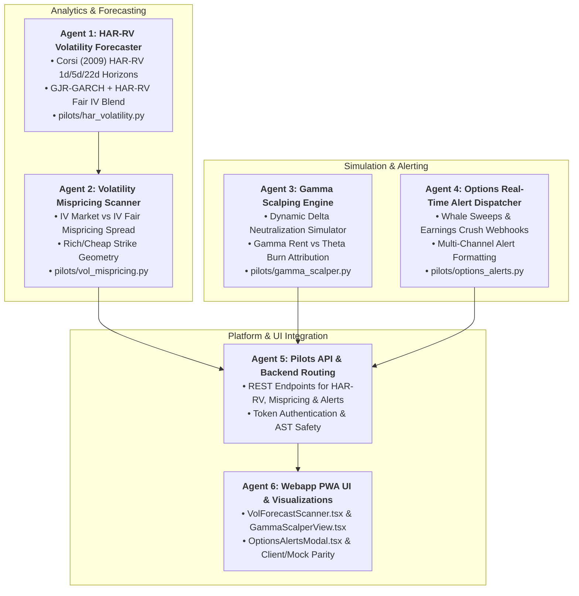

# Master Implementation Plan: HAR-RV Volatility Forecasting, Gamma Scalping & Real-Time Options Alerting (Phases 12, 13, 14)

## Executive Overview
This phase expands the institutional quantitative capabilities of the options desk with three core analytical and execution engines:

1. **Phase 12: Corsi (2009) HAR-RV & Volatility Mispricing Engine**
   - **Heterogeneous Autoregressive Realized Volatility (HAR-RV)**: Decomposes realized volatility into daily ($RV^{(d)}$), weekly ($RV^{(w)}$), and monthly ($RV^{(m)}$) horizon components to predict forward variance:
     $$RV_{t+1d} = \beta_0 + \beta_d RV_t^{(d)} + \beta_w RV_t^{(w)} + \beta_m RV_t^{(m)}$$
   - **Fair Value IV & Mispricing Spread**: Blends HAR-RV with GJR-GARCH to derive fair theoretical implied volatility $IV_{\text{fair}}$. Identifies overpriced strikes ($IV_{\text{mkt}} > IV_{\text{fair}} + 2\sigma \implies \text{Sell Premium}$) and underpriced convexity ($IV_{\text{mkt}} < IV_{\text{fair}} - 2\sigma \implies \text{Buy Gamma/Debits}$).

2. **Phase 13: Intraday Gamma Scalping Simulator & Greeks Rebalancer**
   - **Continuous & Threshold Delta Neutralization**: Simulates dynamic equity hedging for long options positions when $|\Delta| \ge \Delta_{\text{thresh}}$ (e.g. $\pm 0.15$).
   - **Theta vs. Gamma P&L Attribution**: Quantifies pure empirical capture of realized gamma rent vs. theta burn:
     $$\Delta \text{P\&L} \approx \frac{1}{2} \Gamma (\Delta S)^2 - \Theta \cdot \Delta t$$

3. **Phase 14: Options Multi-Channel Real-Time Alerts & Notification Engine**
   - **Institutional Whale UOA Sweeps**: Instant push/webhook notification when $V / \text{OI} \ge 5.0$ and Notional $\ge \$250,000$.
   - **Earnings Crush Gating Alerts**: Alerts when earnings edge $\ge 1.35\times$ with proposed Iron Condor strikes.
   - **Delta Hedge & Risk Limit Notifications**: Alerts when portfolio $\beta$-weighted SPY delta exceeds deadband threshold.

Execution is organized across **6 Specialized Subagents** with strict AST safety, full test coverage, and 100% Mock/Live UI parity.

---

## Subagent Architecture & Workstream Division

---

## User Review Required

> [!IMPORTANT]
> **Key Architectural Standards**:
> 1. **Zero Heavy Engine Imports**: All modules under `pilots/` and `api/pilots_api.py` remain strictly AST-safe and dependency-light (numpy, scipy/statsmodels/pchip, pandas, stdlib).
> 2. **Lookahead Bias Prevention**: Realized volatility calculations use strictly trailing window bars with purged horizons.
> 3. **Alert Webhook Routing**: Reuses existing `observability/alerts.py` and `settings.ALERT_WEBHOOK_URL` / discord / slack channels.

---

## Detailed Agent Tasks & Proposed Changes

### Workstream 1: Agent 1 — HAR-RV Volatility Forecaster Specialist
- **Module**: `[NEW]` [`pilots/har_volatility.py`](file:///Users/kevinlee/.gemini/antigravity/worktrees/Stockpy-live/implement_multi_leg_paper_trading/pilots/har_volatility.py)
- **Features**:
  - `compute_realized_variance_components(returns_series)`: Computes daily $RV^{(d)}$, 5-day rolling average $RV^{(w)}$, and 22-day rolling average $RV^{(m)}$.
  - `fit_har_rv_model(returns_series)`: Fits Corsi OLS regression coefficients $(\beta_0, \beta_d, \beta_w, \beta_m)$ with non-negativity constraints.
  - `forecast_forward_volatility(returns_series, horizon_days=30)`: Forecasts annualized forward volatility $\sigma_{\text{HAR}}$ and combines with GJR-GARCH asymmetric leverage adjustments.

### Workstream 2: Agent 2 — Volatility Mispricing Scanner Specialist
- **Module**: `[NEW]` [`pilots/vol_mispricing.py`](file:///Users/kevinlee/.gemini/antigravity/worktrees/Stockpy-live/implement_multi_leg_paper_trading/pilots/vol_mispricing.py)
- **Features**:
  - `evaluate_strike_mispricing(chain_data, spot_price, fair_iv_forecast)`:
    - Computes Volatility Spread $= IV_{\text{market}} - IV_{\text{fair}}$ for every strike.
    - Flags **Overvalued (Rich)** options: $IV_{\text{market}} > IV_{\text{fair}} + 1.5\sigma \implies \text{Credit Spread / Condor candidate}$.
    - Flags **Undervalued (Cheap)** options: $IV_{\text{market}} < IV_{\text{fair}} - 1.5\sigma \implies \text{Debit Spread / Long Straddle candidate}$.
    - Generates actionable trade recommendations with defined-risk payoff profiles.

### Workstream 3: Agent 3 — Gamma Scalping Engine Specialist
- **Module**: `[NEW]` [`pilots/gamma_scalper.py`](file:///Users/kevinlee/.gemini/antigravity/worktrees/Stockpy-live/implement_multi_leg_paper_trading/pilots/gamma_scalper.py)
- **Features**:
  - `simulate_gamma_scalping(option_position, underlying_price_path, delta_threshold=0.15)`:
    - Simulates discrete intraday stock rebalancing on threshold delta violations.
    - Logs hedge trades (buy low / sell high), total stock cash flow, transaction costs, and option mark-to-market.
    - Attribution: Decomposes total P&L into Realized Gamma Rent $\frac{1}{2}\sum \Gamma (\Delta S)^2$, Theta Decay $\sum \Theta \Delta t$, and Residual Slippage/Costs.

### Workstream 4: Agent 4 — Options Real-Time Alert Dispatcher Specialist
- **Module**: `[NEW]` [`pilots/options_alerts.py`](file:///Users/kevinlee/.gemini/antigravity/worktrees/Stockpy-live/implement_multi_leg_paper_trading/pilots/options_alerts.py)
- **Features**:
  - `dispatch_uoa_whale_alert(uoa_record)`: Sends rich embeds for unusual volume sweeps ($V/\text{OI} \ge 5.0$, Notional $\ge \$250\text{k}$).
  - `dispatch_earnings_crush_alert(candidate)`: Sends alert with Expected vs. Realized move and recommended Iron Condor strikes.
  - `dispatch_delta_hedge_alert(preview)`: Sends alert when portfolio beta-weighted SPY delta violates deadband.
  - Formats Discord, Slack, and Console payloads.

### Workstream 5: Agent 5 — Pilots API & Backend Routing Specialist
- **Module**: [`api/pilots_api.py`](file:///Users/kevinlee/.gemini/antigravity/worktrees/Stockpy-live/implement_multi_leg_paper_trading/api/pilots_api.py)
- **Features**:
  - `GET /pilots/options/forecast/har-rv?symbol=...`: Returns HAR-RV model fit, components ($RV_d, RV_w, RV_m$), and forward volatility forecast (Read token).
  - `GET /pilots/options/forecast/mispricing?symbol=...`: Returns strike-by-strike market IV vs fair IV spread and Rich/Cheap candidate recommendations (Read token).
  - `POST /pilots/options/gamma-scalp/simulate`: Simulates gamma scalping on an option position (Read token).
  - `POST /pilots/options/alerts/test`: Tests options alert dispatcher webhook delivery (Command token).

### Workstream 6: Agent 6 — Webapp PWA UI Specialist
- **Module**: [`webapp/src/api/types.ts`](file:///Users/kevinlee/.gemini/antigravity/worktrees/Stockpy-live/implement_multi_leg_paper_trading/webapp/src/api/types.ts), [`webapp/src/api/client.ts`](file:///Users/kevinlee/.gemini/antigravity/worktrees/Stockpy-live/implement_multi_leg_paper_trading/webapp/src/api/client.ts), [`webapp/src/api/mock.ts`](file:///Users/kevinlee/.gemini/antigravity/worktrees/Stockpy-live/implement_multi_leg_paper_trading/webapp/src/api/mock.ts), `[NEW]` [`webapp/src/components/options/VolForecastScanner.tsx`](file:///Users/kevinlee/.gemini/antigravity/worktrees/Stockpy-live/implement_multi_leg_paper_trading/webapp/src/components/options/VolForecastScanner.tsx), `[NEW]` [`webapp/src/components/options/GammaScalperView.tsx`](file:///Users/kevinlee/.gemini/antigravity/worktrees/Stockpy-live/implement_multi_leg_paper_trading/webapp/src/components/options/GammaScalperView.tsx), [`webapp/src/screens/PaperBroker.tsx`](file:///Users/kevinlee/.gemini/antigravity/worktrees/Stockpy-live/implement_multi_leg_paper_trading/webapp/src/screens/PaperBroker.tsx), [`webapp/src/screens/OptionsChain.tsx`](file:///Users/kevinlee/.gemini/antigravity/worktrees/Stockpy-live/implement_multi_leg_paper_trading/webapp/src/screens/OptionsChain.tsx)
- **Features**:
  - `VolForecastScanner.tsx`: Interactive chart of Market IV vs. HAR-RV Fair IV across strikes, Rich/Cheap strike tags, and spread recommendations.
  - `GammaScalperView.tsx`: Cumulative Gamma Scalping P&L chart, hedge rebalancing ledger, and Gamma Rent vs. Theta Burn breakdown.
  - Vitest test suites and TypeScript parity.

---

## Verification Plan

### Automated Tests
1. `pytest tests/test_har_volatility.py` (Corsi OLS regression, RV components, forward variance forecasting, non-negativity constraint).
2. `pytest tests/test_vol_mispricing.py` (Market vs Fair IV spread, Rich/Cheap strike filters, delta-neutral trade construction).
3. `pytest tests/test_gamma_scalper.py` (Threshold delta rebalancing, gamma rent vs theta decay math, transaction cost modeling).
4. `pytest tests/test_options_alerts.py` (Alert payload formatting, webhook dispatching, threshold filtering).
5. `pytest tests/test_pilots_paper_broker.py` (Endpoints and auth).
6. `npm run --prefix webapp typecheck` & `npm test`.
