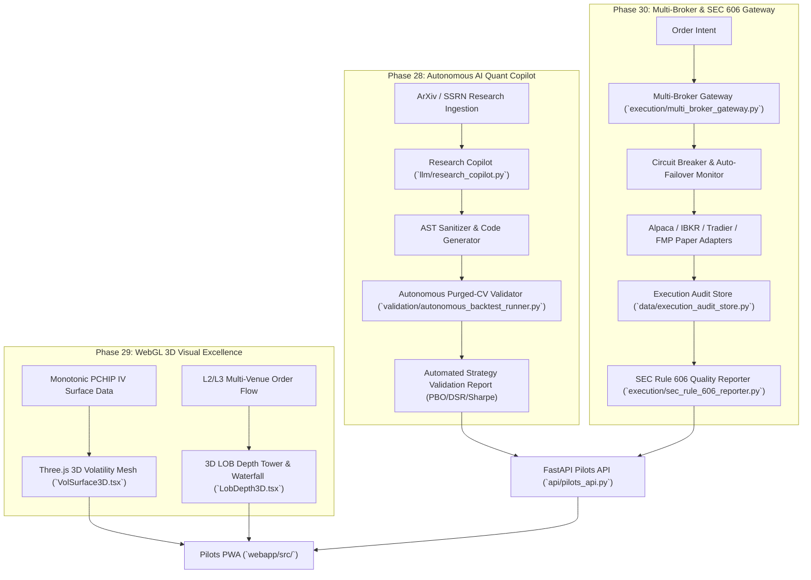

# Tier D Implementation Plan: Autonomous AI Trading Desk & Visual Excellence (Phases 28 – 30)

## Executive Summary
This document establishes the architecture, mathematical and engineering foundations, and 8-agent execution breakdown for **Tier D: Autonomous AI Trading Desk & Visual Excellence**, encompassing **Phases 28, 29, and 30** of the InvestYo Master Plan.

Tier D transitions the platform into an autonomous, institutional-grade quantitative desk with:
1. **Phase 28**: Autonomous LLM quantitative research synthesis and self-directed purged-CV backtest validation.
2. **Phase 29**: Hardware-accelerated Three.js / WebGL 3D real-time volatility surfaces and 3D limit order book depth visualizers.
3. **Phase 30**: Multi-broker unified execution gateway (Alpaca, IBKR, Tradier, Robinhood, Paper) with automated circuit-breaker failover and SEC Rule 606 execution quality compliance reporting.

---

## 🏛️ Tier D Architecture & Data Flow

---

## 🤖 8-Agent Specialized Task Matrix

| Agent | Role | Domain & Subsystem | Primary Deliverables |
|---|---|---|---|
| **Agent 1** | **LLM Research & Synthesis Engine Specialist** | Phase 28: Quant Alpha Synthesis | `llm/research_copilot.py`, AST validator, code sandbox, `SignalModule` code generator |
| **Agent 2** | **Automated Quant Backtest & Purged-CV Validator** | Phase 28: Validation Pipeline | `validation/autonomous_backtest_runner.py`, CPCV evaluator, PBO/DSR gatekeeper |
| **Agent 3** | **Three.js WebGL Volatility Surface Engineer** | Phase 29: 3D Visualization | `webapp/src/components/charts/VolSurface3D.tsx`, Three.js canvas, orbit controls, mesh shader |
| **Agent 4** | **3D Order Book & Order Flow Waterfall Visualizer** | Phase 29: Microstructure UI | `webapp/src/components/charts/LobDepth3D.tsx`, 3D depth ladder, animated order particle stream |
| **Agent 5** | **Multi-Broker Unified Gateway & Failover Engine** | Phase 30: Execution Infrastructure | `execution/multi_broker_gateway.py`, dynamic failover state machine, broker health checker |
| **Agent 6** | **SEC Rule 606 & Execution Audit Engine** | Phase 30: Regulatory Compliance | `execution/sec_rule_606_reporter.py`, `data/execution_audit_store.py`, price improvement stats |
| **Agent 7** | **Pilots API & Multi-Service Backend Specialist** | API Layer (All Phases) | `api/pilots_api.py` endpoints for Research Copilot, 3D meshes, Multi-Broker telemetry, Rule 606 |
| **Agent 8** | **Pilots PWA UI/UX & Mock/Live Parity Specialist** | Frontend Layer (All Phases) | `webapp/src/api/types.ts`, `client.ts`, `mock.ts`, `ResearchCopilotView.tsx`, `MultiBrokerGatewayView.tsx`, `SecRule606ReportView.tsx` |

---

## 🔬 Proposed Technical Changes

### Component 1: Autonomous AI Quant Copilot (Phase 28)
#### [NEW] [`llm/research_copilot.py`](file:///Users/kevinlee/.gemini/antigravity/worktrees/Stockpy-live/implement_multi_leg_paper_trading/llm/research_copilot.py)
- Ingests quantitative strategy descriptions, equations, or PDF text.
- Synthesizes clean, AST-safe Python implementations of `signals.SignalModule`.
- Runs static AST safety validation: verifies no system calls, dynamic `eval()`, network calls, or invalid imports.
- Formats synthesized code with standard docstrings, indicators, and vectorized compute logic.

#### [NEW] [`validation/autonomous_backtest_runner.py`](file:///Users/kevinlee/.gemini/antigravity/worktrees/Stockpy-live/implement_multi_leg_paper_trading/validation/autonomous_backtest_runner.py)
- Dynamically loads and tests synthesized `SignalModule` candidates in an isolated execution harness.
- Runs Combinatorial Purged Cross-Validation (CPCV) over historical OHLCV data.
- Computes Probability of Backtest Overfitting (PBO), Deflated Sharpe Ratio (DSR), annualized Sharpe, and Max Drawdown.
- Returns structured validation scores and auto-registers passing strategies into `candidate_strategies` registry.

---

### Component 2: WebGL 3D Real-Time Visualizer (Phase 29)
#### [NEW] [`webapp/src/components/charts/VolSurface3D.tsx`](file:///Users/kevinlee/.gemini/antigravity/worktrees/Stockpy-live/implement_multi_leg_paper_trading/webapp/src/components/charts/VolSurface3D.tsx)
- Three.js / WebGL canvas rendering a 3D spline surface of Implied Volatility ($Strike \times Expiration \times IV$).
- Interactive orbit controls: mouse rotation, pan, zoom, wireframe toggle, and strike cross-section slicing.
- Colormap shader mapping IV levels from low (navy blue) to high (neon amber/magenta).
- Pure fallback mode using canvas/CSS when WebGL is unavailable in headless environments.

#### [NEW] [`webapp/src/components/charts/LobDepth3D.tsx`](file:///Users/kevinlee/.gemini/antigravity/worktrees/Stockpy-live/implement_multi_leg_paper_trading/webapp/src/components/charts/LobDepth3D.tsx)
- 3D Limit Order Book depth tower displaying cumulative bid vs ask depth across price levels.
- Real-time animated order arrival waterfall visualizing order book flow dynamics.

---

### Component 3: Multi-Broker Live Gateway & SEC Rule 606 Compliance (Phase 30)
#### [NEW] [`execution/multi_broker_gateway.py`](file:///Users/kevinlee/.gemini/antigravity/worktrees/Stockpy-live/implement_multi_leg_paper_trading/execution/multi_broker_gateway.py)
- Unified multi-broker adapter framework routing orders to Alpaca, Interactive Brokers (simulated), Tradier, Robinhood, or FMP Paper.
- Real-time heartbeat latency and connection health monitoring.
- Automated circuit-breaker failover: automatically diverts orders to secondary broker if primary fails 3 consecutive health checks or latency spikes > 500ms.

#### [NEW] [`data/execution_audit_store.py`](file:///Users/kevinlee/.gemini/antigravity/worktrees/Stockpy-live/implement_multi_leg_paper_trading/data/execution_audit_store.py)
- SQLite persistent store tracking every child order route, exchange destination, fill price vs NBBO, maker/taker fee, and timestamp down to microsecond resolution.

#### [NEW] [`execution/sec_rule_606_reporter.py`](file:///Users/kevinlee/.gemini/antigravity/worktrees/Stockpy-live/implement_multi_leg_paper_trading/execution/sec_rule_606_reporter.py)
- Generates SEC Rule 606(a)(1) quarterly execution quality disclosure reports:
  - Percentage of total orders routed to each venue (CBOE, MIAX, BOX, PHLX, ARCA, EDGX).
  - Breakdown by order type: Market, Marketable Limit, Non-Marketable Limit, Other.
  - Net payment for order flow (PFOF) received / paid and average net rebate per hundred shares/contracts.
  - Price improvement percentage and average price improvement per order.

---

### Component 4: API & Webapp Integration (Phases 28 – 30)
#### [MODIFY] [`api/pilots_api.py`](file:///Users/kevinlee/.gemini/antigravity/worktrees/Stockpy-live/implement_multi_leg_paper_trading/api/pilots_api.py)
- `POST /pilots/ai/research/synthesize`: Synthesizes a new quantitative signal from prompt/paper description.
- `POST /pilots/ai/research/backtest`: Executes autonomous backtest on candidate signal with CPCV.
- `GET /pilots/options/vol-surface/3d-mesh`: Returns 3D coordinate vertices and face normals for Three.js rendering.
- `GET /pilots/execution/brokers/status`: Returns multi-broker gateway health, latency, and active routing hierarchy.
- `POST /pilots/execution/brokers/failover`: Operator command to trigger broker failover.
- `GET /pilots/execution/sec-606/report`: Generates quarterly SEC Rule 606 compliance table.

#### [MODIFY] [`webapp/src/api/types.ts`](file:///Users/kevinlee/.gemini/antigravity/worktrees/Stockpy-live/implement_multi_leg_paper_trading/webapp/src/api/types.ts), [`webapp/src/api/client.ts`](file:///Users/kevinlee/.gemini/antigravity/worktrees/Stockpy-live/implement_multi_leg_paper_trading/webapp/src/api/client.ts), [`webapp/src/api/mock.ts`](file:///Users/kevinlee/.gemini/antigravity/worktrees/Stockpy-live/implement_multi_leg_paper_trading/webapp/src/api/mock.ts)
- Add full TypeScript type definitions and client/mock implementations with 100% Mock/Live parity.

#### [NEW] [`webapp/src/components/ai/ResearchCopilotView.tsx`](file:///Users/kevinlee/.gemini/antigravity/worktrees/Stockpy-live/implement_multi_leg_paper_trading/webapp/src/components/ai/ResearchCopilotView.tsx)
- Interactive paper synthesizer IDE, code editor, and backtest metrics panel.

#### [NEW] [`webapp/src/components/execution/MultiBrokerGatewayView.tsx`](file:///Users/kevinlee/.gemini/antigravity/worktrees/Stockpy-live/implement_multi_leg_paper_trading/webapp/src/components/execution/MultiBrokerGatewayView.tsx)
- Multi-broker status monitor, active route selector, and circuit-breaker failover switches.

#### [NEW] [`webapp/src/components/execution/SecRule606ReportView.tsx`](file:///Users/kevinlee/.gemini/antigravity/worktrees/Stockpy-live/implement_multi_leg_paper_trading/webapp/src/components/execution/SecRule606ReportView.tsx)
- Regulatory disclosure tables, venue percentage breakdowns, and net fee/rebate summaries.

---

## 📖 Mandatory Documentation Updates
- Update [`CLAUDE.md`](file:///Users/kevinlee/.gemini/antigravity/worktrees/Stockpy-live/implement_multi_leg_paper_trading/CLAUDE.md) / [`AGENTS.md`](file:///Users/kevinlee/.gemini/antigravity/worktrees/Stockpy-live/implement_multi_leg_paper_trading/AGENTS.md) with Tier D execution modules.
- Update [`docs/architecture/execution.md`](file:///Users/kevinlee/.gemini/antigravity/worktrees/Stockpy-live/implement_multi_leg_paper_trading/docs/architecture/execution.md) for Multi-Broker Gateway and SEC Rule 606 Reporter.
- Update [`docs/architecture/ml-and-reports.md`](file:///Users/kevinlee/.gemini/antigravity/worktrees/Stockpy-live/implement_multi_leg_paper_trading/docs/architecture/ml-and-reports.md) for Research Copilot and Autonomous Validator.
- Update [`docs/architecture/webapp-and-gui.md`](file:///Users/kevinlee/.gemini/antigravity/worktrees/Stockpy-live/implement_multi_leg_paper_trading/docs/architecture/webapp-and-gui.md) for WebGL 3D Visualizers.

---

## 🧪 Verification Plan

### Automated Tests
1. **Research Copilot & Backtesting Tests**:
   - `pytest tests/test_research_copilot.py`
   - `pytest tests/test_autonomous_backtest_runner.py`
2. **Multi-Broker & SEC 606 Tests**:
   - `pytest tests/test_multi_broker_gateway.py`
   - `pytest tests/test_sec_rule_606_reporter.py`
   - `pytest tests/test_execution_audit_store.py`
3. **Backend API Integration Tests**:
   - `pytest tests/test_pilots_paper_broker.py`
4. **Full Test Suite Gate**:
   - `pytest tests/` (Zero failures)
   - `npm run --prefix webapp test` (1640+ passing tests, 100% Mock/Live parity)
   - `npm run --prefix webapp typecheck` (Zero TypeScript errors)

### Manual Verification
1. Inspect 3D Volatility Surface rendering in browser via Three.js canvas.
2. Simulate a paper research paper synthesis and verify that the emitted Python signal passes AST safety checks.
3. Trigger a manual broker failover switch and verify that subsequent execution routes to the backup broker.
