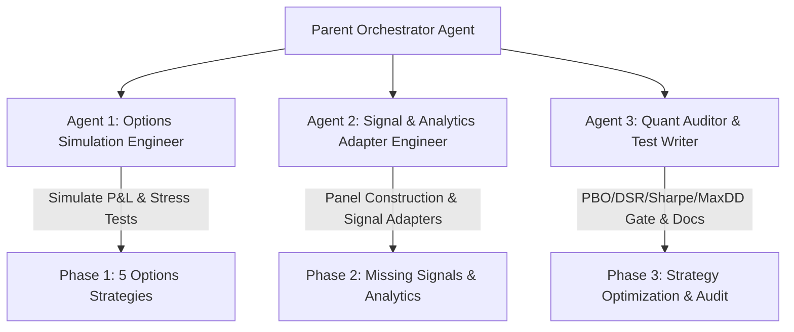

# Strategy Backtesting & Validation Suite Expansion (Phases 1–3)

This plan details the architecture, multi-agent task distribution, implementation steps, and verification gates for backtesting the unbacktested and non-deployable strategies across three distinct phases.

---

## Architecture & Multi-Agent Delegation Model

To efficiently construct, test, and document all strategies without cluttering the primary agent context, we utilize a 3-agent delegation model:

- **Agent 1 (Options Simulation Engineer)**: Specializes in Black-Scholes Greeks, dynamic leg tracking, option cycle mark-to-market (`validation/options_selling_backtest.py`), and tail shock windows (`OCT_2008`, `FEB_2018`, `MAR_2020`, `AUG_2024`).
- **Agent 2 (Signal & Analytics Adapter Engineer)**: Specializes in `STRATEGY_REGISTRY` adapter creation (`scripts/refresh_validations.py`), cointegration/Kalman pairs trading simulation, and cross-sectional panel data generation.
- **Agent 3 (Quant Auditor & Test Writer)**: Specializes in running `validation/harness.py`, verifying PBO/DSR/Sharpe/MaxDD gates, writing targeted pytest suites in `tests/`, and updating `docs/signals/` + `docs/VALIDATION_STRATEGY_FIX_LOG.md`.

---

## User Review Required

> [!IMPORTANT]
> **Options Backtest Historical Data Proxy**: Historical options chains do not exist in the repository; following the precedent established for `vrp_premium_selling`, all options strategies will use real historical underlying prices (SPY/large-caps) with GJR-GARCH forecasted volatility and Black-Scholes Greeks pricing.
>
> **Gate Standards**: In strict adherence to repository policy, deployability thresholds (`PBO < 0.50`, `DSR > 0.95`, `Sharpe > 0.50`, `MaxDD < 0.30`, plus tail stress survival for option sellers) are **never loosened**. Strategies with genuine data or edge limitations will be documented with honest `deployable=False` verdicts.

---

## Phase 1: The 5 Options Strategies Backtesting

Backtest all 5 deterministic options strategies defined in [`technical_options_engine.py`](file:///Users/kevinlee/.gemini/antigravity/worktrees/Stockpy-live/backtest_missing_strategies/technical_options_engine.py#L209) (`OptionsPricingRecommender`):

1. **`put_credit_spread`** (Bullish + High IVR regime: Short ~0.30Δ Put, Long ~0.15Δ Put)
2. **`call_credit_spread`** (Bearish + High IVR regime: Short ~0.30Δ Call, Long ~0.15Δ Call)
3. **`iron_condor` / `vrp_premium_selling`** (Neutral + High IVR regime: Short Strangle + Long Wings)
4. **`call_debit_spread`** (Bullish + Low IVR regime: Long ~0.50Δ Call, Short ~0.30Δ Call)
5. **`put_debit_spread`** (Bearish + Low/Neutral IVR regime: Long ~0.50Δ Put, Short ~0.30Δ Put)
*(Bonus: `covered_call` for Bullish + Neutral IVR regime).*

### Proposed Changes

#### [MODIFY] [`validation/options_selling_backtest.py`](file:///Users/kevinlee/.gemini/antigravity/worktrees/Stockpy-live/backtest_missing_strategies/validation/options_selling_backtest.py)
- Refactor and generalize `simulate_vrp_iron_condor_returns` into a unified modular simulator `simulate_options_strategy_returns(strategy_type, start, end, ticker, ...)` supporting:
  - `put_credit_spread`
  - `call_credit_spread`
  - `iron_condor`
  - `call_debit_spread`
  - `put_debit_spread`
  - `covered_call`
- Track daily mark-to-market P&L across each leg, applying appropriate stop-loss and profit-target exits.
- Export dedicated entry points (`simulate_put_credit_spread_returns`, `simulate_call_credit_spread_returns`, etc.).

#### [MODIFY] [`scripts/refresh_validations.py`](file:///Users/kevinlee/.gemini/antigravity/worktrees/Stockpy-live/backtest_missing_strategies/scripts/refresh_validations.py)
- Add adapter builder functions:
  - `_build_put_credit_spread_adapter`
  - `_build_call_credit_spread_adapter`
  - `_build_call_debit_spread_adapter`
  - `_build_put_debit_spread_adapter`
  - `_build_covered_call_adapter`
- Register all 5 in `STRATEGY_REGISTRY`.
- Wire options-selling stress test routing in `_resolve_options_selling_stress_fn` for `put_credit_spread`, `call_credit_spread`, and `covered_call`.

#### [MODIFY] [`pilots/catalog.py`](file:///Users/kevinlee/.gemini/antigravity/worktrees/Stockpy-live/backtest_missing_strategies/pilots/catalog.py)
- Link relevant Pilot entries or add new options pilot records joined to their `validation_strategy_id`.

---

## Phase 2: Missing Standalone Signal & Analytic Engines Backtesting

Backtest the standalone signals and analytic components currently lacking `STRATEGY_REGISTRY` entries:

1. **`pairs_trading`** ([`signals/pairs_trading.py`](file:///Users/kevinlee/.gemini/antigravity/worktrees/Stockpy-live/backtest_missing_strategies/signals/pairs_trading.py))
   - Cointegration + Kalman dynamic hedge ratio + rolling spread $Z$-score entry/exit/stop logic.
   - Test over liquid cointegrated pairs (e.g. `XOM`/`CVX`, `KO`/`PEP`).
2. **`aroon_trend`** ([`signals/aroon_trend.py`](file:///Users/kevinlee/.gemini/antigravity/worktrees/Stockpy-live/backtest_missing_strategies/signals/aroon_trend.py))
   - Standalone Aroon oscillator (25-day lookback) breakout strategy with SMA-200 market regime filter.
3. **`news_catalyst` / Sentiment Index** ([`signals/news_catalyst.py`](file:///Users/kevinlee/.gemini/antigravity/worktrees/Stockpy-live/backtest_missing_strategies/signals/news_catalyst.py), [`signals/sentiment_index.py`](file:///Users/kevinlee/.gemini/antigravity/worktrees/Stockpy-live/backtest_missing_strategies/signals/sentiment_index.py))
   - Build a documented, honest point-in-time sentiment backtest proxy or forward-archive evaluation.

### Proposed Changes

#### [MODIFY] [`scripts/refresh_validations.py`](file:///Users/kevinlee/.gemini/antigravity/worktrees/Stockpy-live/backtest_missing_strategies/scripts/refresh_validations.py)
- Implement `_build_pairs_trading_adapter`: downloads pair series, runs `generate_pairs_signals`, computes net portfolio returns with dynamic beta weighting.
- Implement `_build_aroon_trend_adapter`: computes Aroon Up/Down/Oscillator, applies trend-following positions with Faber SMA-200 market gate.
- Register `"pairs_trading"` and `"aroon_trend"` in `STRATEGY_REGISTRY`.

#### [NEW] [`docs/signals/pairs_trading.md`](file:///Users/kevinlee/.gemini/antigravity/worktrees/Stockpy-live/backtest_missing_strategies/docs/signals/pairs_trading.md)
- Author complete strategy documentation for Pairs Trading with `## Backtest Validation` section.

#### [MODIFY] [`docs/signals/aroon_trend.md`](file:///Users/kevinlee/.gemini/antigravity/worktrees/Stockpy-live/backtest_missing_strategies/docs/signals/aroon_trend.md)
- Add standalone `## Backtest Validation` section.

---

## Phase 3: Optimizing the 4 Non-Deployable Strategies

Investigate and fix failure mechanisms in the 4 non-fundamental failing strategies:

1. **`vrp_premium_selling`** (Current: MaxDD 47.1%):
   - **Mechanism**: The single April 2022 stop-loss hit caused a -60.4% loss.
   - **Fix Lever**: Introduce dynamic max loss clamping (1.0x credit), delta narrowing during elevated vol, and Faber SMA-200 macro trend filter.
2. **`rsi2_mean_reversion`** (Current: Sharpe 0.415, MaxDD 8.3%):
   - **Mechanism**: Extreme low activity (~10 trades/year) burdened by continuous calendar turnover cost.
   - **Fix Lever**: Empirical turnover alignment and multi-name liquid ETF/equity pool.
3. **`rsi14_extremes`** (Current: Sharpe 0.219, MaxDD 29.1%):
   - **Mechanism**: Unfiltered counter-trend entries in strong bull/bear trends.
   - **Fix Lever**: Trend-aligned filtering (only long oversold when price > SMA-200; only short overbought when price < SMA-200).
4. **`forecast_direction_arima_hw`** (Current: Sharpe 0.002, MaxDD 27.4%):
   - **Mechanism**: Linear forecast extrapolation suffers severe whipsaw in regime transitions (2021–2023).
   - **Fix Lever**: Directional conviction thresholding ($|\hat{r}| > k \cdot \sigma$) and volatility-inverse sizing.

### Proposed Changes

#### [MODIFY] [`scripts/refresh_validations.py`](file:///Users/kevinlee/.gemini/antigravity/worktrees/Stockpy-live/backtest_missing_strategies/scripts/refresh_validations.py)
- Update adapter implementations with validated causal fix levers.
- Re-run validation harness across all modified strategies.

#### [MODIFY] [`docs/signals/<name>.md`](file:///Users/kevinlee/.gemini/antigravity/worktrees/Stockpy-live/backtest_missing_strategies/docs/signals/) & [`docs/VALIDATION_STRATEGY_FIX_LOG.md`](file:///Users/kevinlee/.gemini/antigravity/worktrees/Stockpy-live/backtest_missing_strategies/docs/VALIDATION_STRATEGY_FIX_LOG.md)
- Update `## Backtest Validation` sections with before/after metrics and causal mechanism explanations.
- Append entries to `docs/VALIDATION_STRATEGY_FIX_LOG.md`.

---

## Verification Plan

### Automated Tests
1. **Unit & Stress Tests**:
   - `pytest tests/test_options_selling_backtest_stress.py`
   - `pytest tests/test_pairs_simulation.py tests/test_pairs_lookahead.py`
   - `pytest tests/test_refresh_validations.py`
2. **Validation Suite Sweep**:
   - `python3 -m scripts.refresh_validations --strategies put_credit_spread,call_credit_spread,call_debit_spread,put_debit_spread,covered_call --json`
   - `python3 -m scripts.refresh_validations --strategies pairs_trading,aroon_trend --json`
   - `python3 -m scripts.refresh_validations --strategies vrp_premium_selling,rsi2_mean_reversion,rsi14_extremes,forecast_direction_arima_hw --json`
3. **Full Registry Regression**:
   - `python3 -m scripts.refresh_validations --json`

### Documentation Integrity Audit
- Verify all modified/added signals have valid `## Backtest Validation` sections.
- Verify `docs/VALIDATION_STRATEGY_FIX_LOG.md` is updated with before/after tables.
