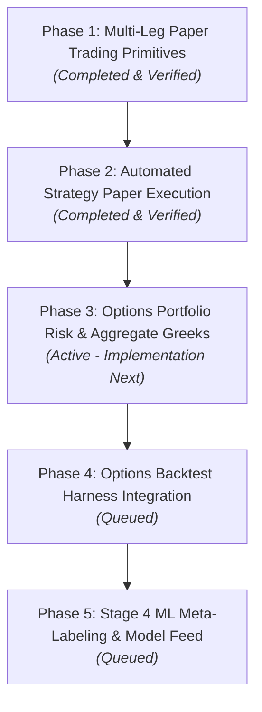

# Master Implementation Plan: Multi-Leg Options Paper Trading, Greeks Risk & Machine Learning Pipeline

## Overview
This master plan details the architecture for end-to-end multi-leg options paper trading, automated strategy execution, portfolio Greek risk management, backtesting harness integration, and machine learning meta-labeling.

---

## 🗺️ Master Plan: 5 Phases

### Phase Summary
1. **Phase 1: Multi-Leg Paper Trading Primitives** *(Completed)*: Multi-leg order sizing, atomic multi-leg SQLite ledger in `PaperAccountStore`, short position tracking (`qty < 0`), Black-Scholes mark-to-market valuation, $0.65/leg fee model, and PWA UI parity.
2. **Phase 2: Automated Strategy Paper Execution** *(Completed)*: `OptionsPaperExecutor` engine, settings (`PAPER_OPTIONS_AUTO_EXECUTE_ENABLED`, `MAX_OPTION_NOTIONAL_PER_TRADE`, `MAX_CONCURRENT_OPTION_POSITIONS`), orchestrator cycle hooks in `main.py`, Pilots API endpoints (`/pilots/paper-broker/strategy-options/*`), and PWA candidates preview & execution panel.
3. **Phase 3: Options Portfolio Risk & Aggregate Greeks** *(Active Priority)*: Portfolio-wide and per-position Greeks engine ($\Delta_{\text{net}}$, $\Delta_{\$}$, $\Gamma_{\text{net}}$, $\Theta_{\text{net}}$, $\mathcal{V}_{\text{net}}$, $\beta$-weighted $\Delta_{\text{SPY}}$), REST endpoint `GET /pilots/paper-broker/greeks`, and PWA Greek KPI cards & position tables.
4. **Phase 4: Options Backtest Harness Integration** *(Queued)*: Historical multi-leg option backtest engine in `validation/harness.py`, historical IV surface/VRP modeling, DTE rollout & profit-target exit simulation, and CPCV OOS validation.
5. **Phase 5: Stage 4 ML Meta-Labeling & Model Feed** *(Queued)*: Logging option paper trade features and P&L outcomes into ML training store, training LightGBM meta-labelers to classify probability of profit and dynamically size contracts.

---

## 🎯 Phase 3 Detailed Specification: Options Portfolio Risk & Aggregate Greeks

### Mathematical Framework
For a portfolio with $M$ equity positions and $N$ option leg positions:
1. **Per-Position Greek Calculations**:
   - **Equity**:
     - $\Delta_i = 1.0$, $\Gamma_i = 0$, $\Theta_i = 0$, $\mathcal{V}_i = 0$
     - Position Delta: $N_i \times \Delta_i$ (where $N_i$ is number of shares)
     - Position Dollar Delta: $N_i \times S_i$
   - **Option Leg** (Strike $K$, Time to expiry $T$, Spot $S$, Implied Vol $\sigma$, Risk-free rate $r$):
     - $d_1 = \frac{\ln(S/K) + (r + \sigma^2/2)T}{\sigma \sqrt{T}}$, $d_2 = d_1 - \sigma \sqrt{T}$
     - $\Delta_{\text{call}} = N(d_1)$, $\Delta_{\text{put}} = N(d_1) - 1.0$
     - $\Gamma = \frac{N'(d_1)}{S \sigma \sqrt{T}}$
     - $\Theta_{\text{daily}} = \frac{1}{252} \left[ -\frac{S N'(d_1) \sigma}{2 \sqrt{T}} \mp r K e^{-r T} N(\pm d_2) \right]$
     - $\mathcal{V}_{\text{1\%}} = \frac{S N'(d_1) \sqrt{T}}{100}$ (dollar sensitivity per 1% change in IV)
     - Position Multiplier: $Q_j = \text{contracts}_j \times 100$ (negative for short options)
     - Position Delta: $Q_j \times \Delta_j$ (share equivalents)
     - Position Dollar Delta: $Q_j \times \Delta_j \times S$
     - Position Gamma: $Q_j \times \Gamma_j$
     - Position Theta: $Q_j \times \Theta_j$ ($/day)
     - Position Vega: $Q_j \times \mathcal{V}_j$ ($/1% IV)

2. **Portfolio Aggregate Metrics**:
   - **Net Share Delta**: $\sum_{i \in \text{Stock}} N_i + \sum_{j \in \text{Opt}} Q_j \Delta_j$
   - **Net Dollar Delta**: $\sum_{i \in \text{Stock}} N_i S_i + \sum_{j \in \text{Opt}} Q_j \Delta_j S_j$
   - **Net Gamma**: $\sum_{j \in \text{Opt}} Q_j \Gamma_j$
   - **Net Theta ($/day)**: $\sum_{j \in \text{Opt}} Q_j \Theta_j$
   - **Net Vega ($/1% IV)**: $\sum_{j \in \text{Opt}} Q_j \mathcal{V}_j$
   - **SPY $\beta$-Weighted Delta**: $\sum_k \frac{\text{Dollar Delta}_k \times \beta_k}{S_{\text{SPY}}}$

---

## 🛠️ Proposed Changes for Phase 3

### 1. Greeks Risk Calculation Engine
#### [NEW] [`pilots/options_risk.py`](file:///Users/kevinlee/.gemini/antigravity/worktrees/Stockpy-live/implement_multi_leg_paper_trading/pilots/options_risk.py)
- Implements `calculate_position_greeks` and `calculate_portfolio_greeks`.
- Reads positions from `PaperAccountStore`.
- Obtains underlying spot quotes via `get_provider()`.
- Computes position-level Greeks and portfolio aggregates.
- Computes beta-weighted SPY delta.

### 2. Pilots API & Helpers
#### [MODIFY] [`pilots/paper_broker.py`](file:///Users/kevinlee/.gemini/antigravity/worktrees/Stockpy-live/implement_multi_leg_paper_trading/pilots/paper_broker.py)
- Add `get_paper_portfolio_greeks()` helper delegating to `pilots/options_risk.py`.

#### [MODIFY] [`api/pilots_api.py`](file:///Users/kevinlee/.gemini/antigravity/worktrees/Stockpy-live/implement_multi_leg_paper_trading/api/pilots_api.py)
- Add `GET /pilots/paper-broker/greeks` endpoint protected by `require_read_token`.

### 3. PWA UI & Mock Parity
#### [MODIFY] [`webapp/src/api/types.ts`](file:///Users/kevinlee/.gemini/antigravity/worktrees/Stockpy-live/implement_multi_leg_paper_trading/webapp/src/api/types.ts)
- Add `PortfolioGreeks` and `PositionGreekBreakdown` interfaces.

#### [MODIFY] [`webapp/src/api/client.ts`](file:///Users/kevinlee/.gemini/antigravity/worktrees/Stockpy-live/implement_multi_leg_paper_trading/webapp/src/api/client.ts) & [`webapp/src/api/mock.ts`](file:///Users/kevinlee/.gemini/antigravity/worktrees/Stockpy-live/implement_multi_leg_paper_trading/webapp/src/api/mock.ts)
- Add `getPaperBrokerGreeks()` method to `liveApi` and `mockApi`.

#### [MODIFY] [`webapp/src/screens/PaperBroker.tsx`](file:///Users/kevinlee/.gemini/antigravity/worktrees/Stockpy-live/implement_multi_leg_paper_trading/webapp/src/screens/PaperBroker.tsx)
- Add **Portfolio Risk & Aggregate Greeks** dashboard cards:
  - Net Delta ($\Delta_{\text{net}}$ shares & $\Delta_{\$}$)
  - Net Gamma ($\Gamma$)
  - Net Theta ($\Theta$ / day decay income)
  - Net Vega ($\mathcal{V}$ / 1% IV)
  - $\beta$-Weighted SPY Delta
- Add Delta, Theta, and Vega columns in the positions table.

---

## 🧪 Verification Plan

### Automated Tests
1. **Unit Tests (`tests/test_options_risk.py`)**:
   - Test Black-Scholes Greeks calculation for Call/Put and Long/Short option positions.
   - Test stock position delta/dollar delta handling.
   - Test aggregate portfolio Greeks sum across multi-leg positions (e.g. Put Credit Spread net theta > 0, Iron Condor theta decay).
   - Test SPY $\beta$-weighting calculation.
2. **API Tests (`tests/test_pilots_paper_broker.py`)**:
   - Test `GET /pilots/paper-broker/greeks` endpoint response schema and authentication.
3. **Frontend Tests (`webapp/src/screens/PaperBroker.test.tsx`)**:
   - Verify Greeks cards rendering and table columns.
   - Run `npm run --prefix webapp typecheck` and `npm run --prefix webapp test`.
