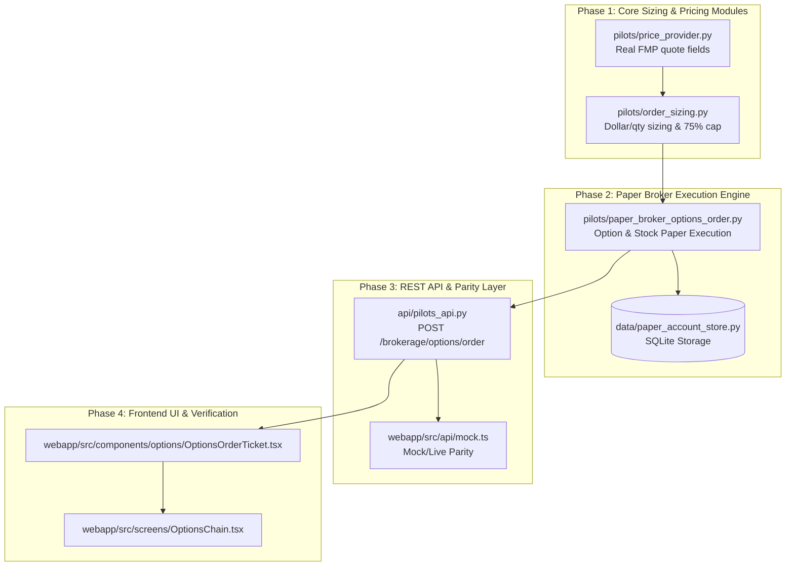

# Phased Implementation Plan: Stock & Options Order Input & Execution System

Build and organize the stock & options order input, sizing, pricing, and execution capabilities into 4 modular phases with complete unit test verification.

---

## Phase Breakdown



---

### Phase 1: Core Sizing & Pricing Modules (`pilots/`)
- **`pilots/price_provider.py`**:
  - Encapsulates quote retrieval using Financial Modeling Prep (FMP) live quote fields (`price`, `previousClose`, `dayLow`, `dayHigh`, without assuming nonexistent bid/ask).
  - Gracefully falls back to previous close or explicit fallback price when market is closed or quote is unavailable.
- **`pilots/order_sizing.py`**:
  - Sizing calculation engine for Stocks (shares from dollar amount, fractional rounding) and Options (contracts from premium, 100x multiplier, integer contract rounding).
  - **75% Cash Preset Cap**: Calculates a safe max preset (`Math.floor(cash * 0.75)`) ensuring no single order commits 100% of available cash.
  - Sizing validation: checks order feasibility against available cash, min contract limits, and max position sizing limits.
- **Tests**: `tests/test_order_sizing.py`, `tests/test_price_provider.py`.

---

### Phase 2: Paper Broker Execution Engine (`pilots/` & `data/`)
- **`pilots/paper_broker_options_order.py`**:
  - Bridges `order_sizing.py` and `data/paper_account_store.py::PaperAccountStore`.
  - Computes commissions ($0.65/contract for options, tiered equity commissions for stocks).
  - Applies atomic fills via `PaperAccountStore.apply_fill(...)`.
  - Rejects live execution in advisory-only mode.
- **`data/paper_account_store.py`**:
  - Supports 64-character symbol descriptors for options (e.g. `AGNC 2026-08-14 $10.50 PUT`).
- **Tests**: `tests/test_paper_broker_options_order.py`, `tests/test_paper_account_store.py`.

---

### Phase 3: REST API & Mock/Live Parity Layer (`api/` & `webapp/src/api/`)
- **`api/pilots_api.py`**:
  - Pydantic model `OptionsOrderRequestModel`.
  - Route `@app.post("/brokerage/options/order")` delegating to `pilots.paper_broker_options_order.execute_paper_order`.
- **`webapp/src/api/types.ts`**:
  - `OptionsOrderRequest` and `OptionsOrderResult` interfaces.
- **`webapp/src/api/mock.ts`**:
  - Comprehensive `mockApi.postOptionsOrder` that mutates `paperAccount`, `paperPositions`, and `paperOrders` arrays.
- **Tests**: `tests/test_pilots_api.py`.

---

### Phase 4: Frontend UI Components & Full Verification (`webapp/src/`)
- **`webapp/src/components/options/OptionsOrderTicket.tsx`**:
  - Dual Sizing Modes: **By Dollar ($)** vs **By Quantity (Contracts/Shares)**.
  - Preset Chips: `$100`, `$250`, `$500`, `$1,000`, `$2,500`, and **`75% Cash`**.
  - Order Type selector: **Market** vs **Limit** with limit price input and steppers.
  - Dynamic sizing calculation readout (e.g. "Calculated Sizing: 33 contracts | Est. Total: $516.45").
  - Live available paper cash display with insufficient funds protection.
  - Direct Underlying Stock Trading mode.
  - Active `+ Add to Watchlist` integration calling `api.watchCandidate(symbol)`.
- **`webapp/src/screens/OptionsChain.tsx`**:
  - `📈 Trade {ticker} Stock` action button in the Share Price banner.
- **Tests**: `webapp/src/components/options/OptionsOrderTicket.test.tsx`, `webapp/src/screens/OptionsChain.test.tsx`.

---

## Verification Plan

1. **Phase 1 & 2 Verification**:
   ```bash
   pytest tests/test_price_provider.py tests/test_order_sizing.py tests/test_paper_broker_options_order.py -v
   ```
2. **Phase 3 & 4 Verification**:
   ```bash
   npm run --prefix webapp typecheck
   npm test --prefix webapp -- --run src/components/options/OptionsOrderTicket.test.tsx src/screens/OptionsChain.test.tsx
   pytest tests/test_pilots_api.py -v
   ```
