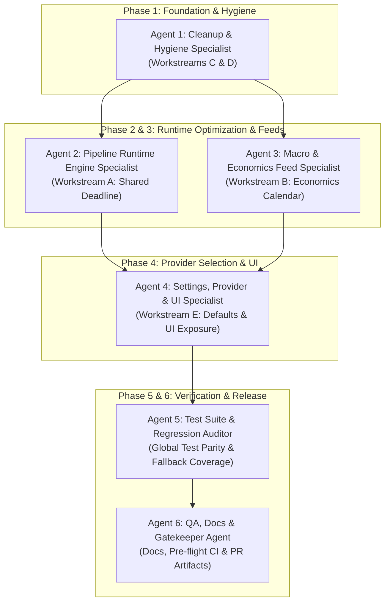

# FMP Pipeline Optimization — Phased Execution Plan (6 Specialized Agents)

This implementation plan orchestrates the full execution of the FMP Pipeline Optimization across 5 workstreams (A–E) using a **6-agent phased execution strategy**.

All capability flags default to `True`, FMP becomes the primary provider (`MARKET_DATA_PROVIDER="fmp"`, `FUNDAMENTALS_SOURCE="fmp"`), all ~31 flags are UI-exposed in the Pilots PWA, the shared deadline budget is implemented, dead code is removed, the economics calendar feed is wired, and comprehensive test suite / documentation updates are delivered.

---

## User Review & Recorded Risk Decision

> [!CAUTION]
> **Operator Decision Recorded (Risk Accepted):**
> Enabling `FMP_BARS_ENABLED`, `FMP_QUOTES_ENABLED`, `FMP_FUNDAMENTALS_ENABLED`, and `FMP_UNIVERSE_ENABLED` by default switches the platform's primary market data, fundamentals, and universe change feeds to FMP.
> In this sandbox environment (which lacks live network access and configured `FMP_API_KEY`), `scripts/verify_fmp_bars.py` cannot be run against a live account.
> Per explicit operator instruction, this risk has been evaluated and accepted. All docstrings and documentation will explicitly record this decision and recommend running the live verification gate prior to capital deployment.

---

## 6-Agent Team Structure & Phased Execution



### Agent Roles & Workstream Allocations

| Agent | Specialized Role | Primary Focus / Workstream | Target Deliverables |
|---|---|---|---|
| **Agent 1** | **Cleanup & Hygiene Specialist** | Workstreams C & D | Delete dead `earnings_calendar` in `data/fmp_client.py`, fix `FMP_ECON_INDICATORS` docstring in `settings.py`, document `CNN_LSTM_PROCESS_POOL_WORKERS=3`, annotate `docs/FMP_INTEGRATION.md`, annotate `data/fmp_feeds_market.py`. |
| **Agent 2** | **Pipeline Runtime Engine Specialist** | Workstream A | Refactor `StrategyEvalStep.run` in `pipeline/production_steps.py` to calculate one shared monotonic cycle deadline and thread it into analyst, earnings, and insider feeds. Add `TestSharedDeadline` tests. |
| **Agent 3** | **Macro & Economics Feed Specialist** | Workstream B | Wire FMP `/economics-calendar` via `_apply_fmp_econ_calendar` in `pipeline/production_steps.py`, update `config.py` `COLUMN_SCHEMA` (`Next_Macro_Event`, `Next_Macro_Event_Date`), add `FMP_ECON_CALENDAR_ENABLED`, expose in API & UI. |
| **Agent 4** | **Settings, Provider & UI Specialist** | Workstream E | Flip 14 `FMP_*` flags to `default=True`, flip `MARKET_DATA_PROVIDER` & `FUNDAMENTALS_SOURCE` defaults to `"fmp"` in `settings.py`. Add risk notices in docstrings. Complete `_FMP_GROUPS` and `FMP_LABEL_MAP` in webapp. |
| **Agent 5** | **Test Suite & Regression Auditor** | Workstream E & Regressions | Grep and update assertions in `tests/` across `test_market_data.py`, `test_settings.py`, `test_production_steps_fmp_stubs.py`, `test_fmp_client.py`. Add `TestFMPSettingsDefaults`. Maintain explicit flag-off coverage. |
| **Agent 6** | **QA, Docs & Gatekeeper Agent** | Verification & Release | Update `docs/FMP_INTEGRATION.md`, `CLAUDE.md`/`AGENTS.md`, `docs/architecture/data-layer.md`, `.env.example`. Run full `pytest` and `npm run typecheck`. Commit `.claude/` PR artifacts. |

---

## Detailed Proposed Changes by Component

### 1. Data Layer & Settings (`settings.py`, `data/`)

#### [MODIFY] [settings.py](file:///Users/kevinlee/.gemini/antigravity/worktrees/Stockpy-live/multi_agent_phased_build/settings.py)
- **Workstream E (Agent 4)**: Change default from `None` -> `"fmp"` for `MARKET_DATA_PROVIDER` (:396).
- **Workstream E (Agent 4)**: Change default from `"yahoo"` -> `"fmp"` for `FUNDAMENTALS_SOURCE` (:600).
- **Workstream E (Agent 4)**: Flip `default=False` -> `default=True` for all capability booleans:
  - `FMP_QUOTES_ENABLED` (:729)
  - `FMP_BARS_ENABLED` (:746)
  - `FMP_FUNDAMENTALS_ENABLED` (:760)
  - `FMP_ANALYST_ENABLED` (:773)
  - `FMP_EARNINGS_ENABLED` (:786)
  - `FMP_NEWS_ENABLED` (:798)
  - `FMP_MACRO_ENABLED` (:821)
  - `FMP_INSIDER_ENABLED` (:834)
  - `FMP_SECTOR_SNAPSHOT_ENABLED` (:846)
  - `FMP_OPTIONS_HEALTH_ENABLED` (:857)
  - `FMP_OPTIONS_CONTEXT_ENABLED` (:880)
  - `FMP_PEERS_ENABLED` (:902)
  - `FMP_UNIVERSE_ENABLED` (:925)
  - `FMP_QUOTES_REALTIME` (:961)
- **Workstream B (Agent 3)**: Add new setting `FMP_ECON_CALENDAR_ENABLED: bool = Field(default=True, ...)` with Starter-tier unverified entitlement notice.
- **Workstream C (Agent 1)**: Correct `FMP_ECON_INDICATORS` docstring (:1056) to remove false multi-series claim.
- **Workstream D (Agent 1)**: Update `CNN_LSTM_PROCESS_POOL_WORKERS` docstring (:1955) documenting `3` as the recommended operator-tuned setting.
- **Workstream A (Agent 2)**: Clarify `FMP_MAX_SECONDS_PER_CYCLE` docstring (:1070) regarding the shared monotonic budget.

#### [MODIFY] [data/fmp_client.py](file:///Users/kevinlee/.gemini/antigravity/worktrees/Stockpy-live/multi_agent_phased_build/data/fmp_client.py)
- **Workstream C (Agent 1)**: Delete the dead, uncalled, colliding `earnings_calendar(from_date, to_date)` function (:816-824).

#### [MODIFY] [data/fmp_feeds_market.py](file:///Users/kevinlee/.gemini/antigravity/worktrees/Stockpy-live/multi_agent_phased_build/data/fmp_feeds_market.py)
- **Workstream D (Agent 1)**: Add a comment above `fetch_volatility_benchmarks()` (:327) noting that it is intentionally unwired in production to prevent conflicting VIX sources against the macro kill switch.

---

### 2. Pipeline Execution & Schema (`pipeline/`, `config.py`)

#### [MODIFY] [pipeline/production_steps.py](file:///Users/kevinlee/.gemini/antigravity/worktrees/Stockpy-live/multi_agent_phased_build/pipeline/production_steps.py)
- **Workstream A (Agent 2)**: In `_apply_fmp_analyst`, `_apply_fmp_earnings`, and `_apply_fmp_insider`, add `deadline: Optional[float] = None` keyword argument. If `deadline` is None, compute `time.monotonic() + max_seconds` as local fallback; otherwise use the shared deadline.
- **Workstream A (Agent 2)**: In `StrategyEvalStep.run` (:1890), compute `fmp_deadline = time.monotonic() + max_seconds` once and pass `deadline=fmp_deadline` into `_apply_fmp_analyst`, `_apply_fmp_earnings`, and `_apply_fmp_insider`.
- **Workstream B (Agent 3)**: Implement `_apply_fmp_econ_calendar(dashboard_df: pd.DataFrame) -> None` which:
  - Initializes `Next_Macro_Event` and `Next_Macro_Event_Date` to `""` / `NaN` or string representations.
  - Checks `if not getattr(settings, "FMP_ECON_CALENDAR_ENABLED", False): return`.
  - Calls `data.fmp_feeds_market.fetch_economics_calendar()`, filters for earliest upcoming US/High impact event, and broadcasts the event name and date to all rows in `dashboard_df`.
  - Never raises (CONSTRAINT #6).
- **Workstream B (Agent 3)**: Call `_apply_fmp_econ_calendar(ctx.dashboard_df)` in `StrategyEvalStep.run`.

#### [MODIFY] [config.py](file:///Users/kevinlee/.gemini/antigravity/worktrees/Stockpy-live/multi_agent_phased_build/config.py)
- **Workstream B (Agent 3)**: Add `Next_Macro_Event` (`"format": "string"`, header `"Next Macro Event"`) and `Next_Macro_Event_Date` (`"format": "string"`, header `"Macro Event Date"`) to `COLUMN_SCHEMA` under the FMP Diagnostic section.

---

### 3. API & Webapp UI (`api/`, `webapp/`)

#### [MODIFY] [api/pilots_api.py](file:///Users/kevinlee/.gemini/antigravity/worktrees/Stockpy-live/multi_agent_phased_build/api/pilots_api.py)
- **Workstream B & E (Agents 3 & 4)**: Ensure `_FMP_GROUPS` has complete coverage for all ~31 settings, specifically ensuring `FMP_ECON_CALENDAR_ENABLED`, `FMP_NEWS_ENABLED`, `FMP_NEWS_PAGE_LIMIT`, `FMP_NEWS_MAX_PAGES`, `FMP_OPTIONS_HEALTH_ENABLED`, `FMP_OPTIONS_CONTEXT_ENABLED`, `FMP_PEERS_ENABLED` are fully grouped and indexed.

#### [MODIFY] [webapp/src/screens/FmpSettings.tsx](file:///Users/kevinlee/.gemini/antigravity/worktrees/Stockpy-live/multi_agent_phased_build/webapp/src/screens/FmpSettings.tsx)
- **Workstream B & E (Agents 3 & 4)**: Add labels in `FMP_LABEL_MAP` for:
  - `FMP_ECON_CALENDAR_ENABLED`: `"Enable Economics Calendar Feed"`
  - `FMP_NEWS_ENABLED`: `"Enable News Feed"`
  - `FMP_NEWS_PAGE_LIMIT`: `"News Page Limit"`
  - `FMP_NEWS_MAX_PAGES`: `"News Max Pages"`
  - `FMP_OPTIONS_HEALTH_ENABLED`: `"Enable Options Fundamental Health Overlay"`
  - `FMP_OPTIONS_CONTEXT_ENABLED`: `"Enable Options Market Context Overlay"`
  - `FMP_PEERS_ENABLED`: `"Enable On-Demand Peer Suggestion Feed"`

---

### 4. Documentation Updates (`docs/`, `CLAUDE.md`, `AGENTS.md`, `.env.example`)

#### [MODIFY] [docs/FMP_INTEGRATION.md](file:///Users/kevinlee/.gemini/antigravity/worktrees/Stockpy-live/multi_agent_phased_build/docs/FMP_INTEGRATION.md)
- **Workstream D (Agent 1)**: Correct line 24 to reflect that `/income-statement-ttm` is Ultimate/Enterprise only and `trailingEps` falls back to `ratios_ttm.netIncomePerShareTTM`.
- **Workstream E (Agent 6)**: Record the explicit operator decision to default FMP flags to `True` without prior live account eyeball verification. Update settings reference table.
- **Workstream B (Agent 6)**: Document `FMP_ECON_CALENDAR_ENABLED` and the economics calendar feed columns.

#### [MODIFY] [CLAUDE.md](file:///Users/kevinlee/.gemini/antigravity/worktrees/Stockpy-live/multi_agent_phased_build/CLAUDE.md) / [AGENTS.md](file:///Users/kevinlee/.gemini/antigravity/worktrees/Stockpy-live/multi_agent_phased_build/AGENTS.md)
- **Workstream E & B (Agent 6)**: Record dated entry for FMP default flips, provider selections, economics calendar addition, and shared-deadline optimization. (Auto-synced by hooks).

#### [MODIFY] [docs/architecture/data-layer.md](file:///Users/kevinlee/.gemini/antigravity/worktrees/Stockpy-live/multi_agent_phased_build/docs/architecture/data-layer.md)
- **Workstream A, B, E (Agent 6)**: Update FMP data layer section with shared deadline semantics, economics calendar feed, and default provider selection.

#### [MODIFY] [docs/known_issues/cnn_lstm_tf_deadlock.md](file:///Users/kevinlee/.gemini/antigravity/worktrees/Stockpy-live/multi_agent_phased_build/docs/known_issues/cnn_lstm_tf_deadlock.md) & [docs/architecture/signal-engines.md](file:///Users/kevinlee/.gemini/antigravity/worktrees/Stockpy-live/multi_agent_phased_build/docs/architecture/signal-engines.md)
- **Workstream D (Agent 1)**: Document `CNN_LSTM_PROCESS_POOL_WORKERS=3` tuning guidance.

#### [MODIFY] [.env.example](file:///Users/kevinlee/.gemini/antigravity/worktrees/Stockpy-live/multi_agent_phased_build/.env.example)
- **Workstream B & E (Agent 6)**: Mirror new `FMP_ECON_CALENDAR_ENABLED` and update default comments.

---

### 5. Test Suite Updates (`tests/`)

#### [MODIFY] [tests/test_production_steps_fmp_stubs.py](file:///Users/kevinlee/.gemini/antigravity/worktrees/Stockpy-live/multi_agent_phased_build/tests/test_production_steps_fmp_stubs.py)
- **Workstream A (Agent 2)**: Add `TestSharedDeadline` asserting that when an expired deadline is passed, subsequent feeds skip network requests and populate NaN.
- **Workstream B (Agent 3)**: Add `_apply_fmp_econ_calendar` to `_WRITERS` test parametrization.
- **Workstream E (Agent 5)**: Explicitly patch `FMP_*_ENABLED=False` in `TestGatesOffIsANoOp` to ensure the disabled fallback mechanism retains full test coverage despite the flipped code defaults.

#### [MODIFY] [tests/test_fmp_feeds_market.py](file:///Users/kevinlee/.gemini/antigravity/worktrees/Stockpy-live/multi_agent_phased_build/tests/test_fmp_feeds_market.py)
- **Workstream B (Agent 3)**: Add test cases for `fetch_economics_calendar`: happy-path parsing, date sorting, US/High impact filtering, empty response, and exception degradation.

#### [MODIFY] [tests/test_settings.py](file:///Users/kevinlee/.gemini/antigravity/worktrees/Stockpy-live/multi_agent_phased_build/tests/test_settings.py)
- **Workstream E (Agent 5)**: Add `TestFMPSettingsDefaults` verifying that an unconfigured `Settings(_env_file=None)` yields `MARKET_DATA_PROVIDER == "fmp"`, `FUNDAMENTALS_SOURCE == "fmp"`, and all `FMP_*_ENABLED` flags `True`.

#### [MODIFY] [tests/test_market_data.py](file:///Users/kevinlee/.gemini/antigravity/worktrees/Stockpy-live/multi_agent_phased_build/tests/test_market_data.py)
- **Workstream E (Agent 5)**: Update tests in `TestCompositeProviderSelection`, `TestFMPCapabilityGates`, and `TestFMPQuotesBarsWiring` to account for new defaults while ensuring explicit `MARKET_DATA_PROVIDER=None` / `FUNDAMENTALS_SOURCE="yahoo"` / `FMP_*_ENABLED=False` tests continue to test fallback paths.

---

## Verification Plan

### Automated Tests
1. **Targeted FMP & Pipeline Suite**:
   ```bash
   pytest tests/test_production_steps_fmp_stubs.py tests/test_fmp_feeds_market.py tests/test_market_data.py tests/test_fmp_client.py tests/test_settings.py -v
   ```
2. **Full Test Suite & Anti-Drift Check**:
   ```bash
   pytest tests/ -q
   ```
3. **Webapp TypeScript & Parity Checks**:
   ```bash
   npm run --prefix webapp -s typecheck
   ```
4. **Settings Default Assertion Scan**:
   ```bash
   grep -rn "FMP_" tests/ | grep -i "is False\|== False\|assert not"
   ```

### Manual / Browser Verification
1. Launch `api/pilots_api.py` and verify `GET /settings/fmp` returns all 31 settings with active values.
2. In `webapp/`, verify `/settings/fmp` renders all toggles and inputs with correct label mappings.
3. Validate fresh `Settings(_env_file=None)` in interactive Python session.
