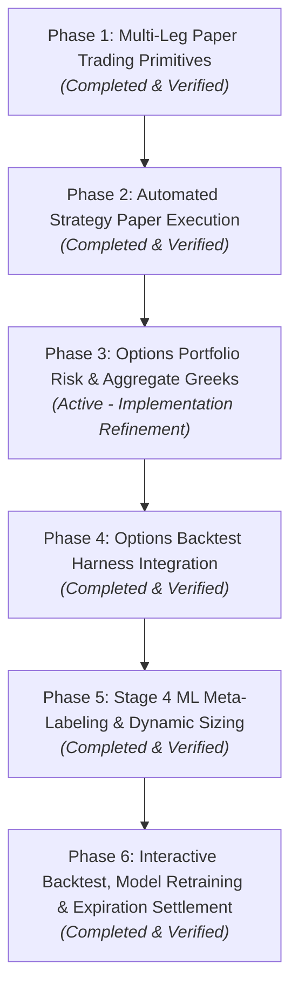

# Master Implementation Plan: Multi-Leg Options Paper Trading, Strategy Auto-Execution, Portfolio Risk Greeks & Stage 4 ML Pipeline

**Tier:** "Everything else" (touches risk/execution-adjacent code) — per `CLAUDE.md`'s Start-of-session
checklist, this goes through `git checkout -b implement_multi_leg_paper_trading` and a PR; not committed
direct to `main`.

## Overview
Comprehensive master implementation plan for multi-leg option paper trading, automated strategy execution, portfolio Greeks risk management, options backtesting harness, Stage 4 ML meta-labeling, and automated expiration cash settlements.

---

## 🗺️ Master Plan: 6 Phases

1. **Phase 1: Multi-Leg Paper Trading Primitives** *(Completed)*: Multi-leg order sizing, atomic
   multi-leg SQLite ledger in `PaperAccountStore`, short position tracking (`qty < 0`),
   Black-Scholes mark-to-market valuation, $0.65/leg fee model, PWA UI parity.
2. **Phase 2: Automated Strategy Paper Execution** *(Completed)*: `OptionsPaperExecutor` engine,
   `PAPER_OPTIONS_AUTO_EXECUTE_ENABLED`/`MAX_OPTION_NOTIONAL_PER_TRADE`/`MAX_CONCURRENT_OPTION_POSITIONS`,
   orchestrator cycle hooks, Pilots API endpoints, PWA candidates preview & execution panel.
3. **Phase 3: Options Portfolio Risk & Aggregate Greeks** *(Active Priority / Refinement)*:
   - Resolved β-weighted-delta / `pilots/` import boundary via Option A (persisted beta read) / Option B (`data_api.py` on-demand helper).
   - Live mark-to-market IV & batched quote sourcing with NaN-and-exclude handling.
   - Degenerate-input denominator guard (`1e-12`) and 0DTE intrinsic delta fallback.
   - Settings-driven risk-free rate (`settings.OPTIONS_RISK_FREE_RATE`).
   - PWA missing data indicator & per-position Greeks columns.
4. **Phase 4: Options Backtest Harness Integration** *(Completed)*:
   - `OptionsValidationHarness` simulating multi-leg spreads, daily mark-to-market Black-Scholes, profit-taking, stop-losses, and expiration settlements.
   - Sharpe, Sortino, MaxDD, Win Rate, Profit Factor, DSR, PBO, downsampled base-100 equity curves, and 4 tail stress shock tests (Lehman, Volmageddon, COVID, Yen).
5. **Phase 5: Stage 4 ML Meta-Labeling & Dynamic Sizing** *(Completed)*:
   - Secondary ML meta-labeler predicting $P(\text{Win})$ and dynamic position sizing multipliers $\in [0.30, 1.50]$.
6. **Phase 6: Interactive Backtest, Model Retraining & Expiration Settlement** *(Completed)*:
   - `PaperAccountStore.settle_expired_options()` for automatic cash settlement of expired contracts.
   - Interactive PWA backtesting drawer and Stage 4 ML model retraining trigger.

---

## 0. Dependency Check — Pre-Code Verification

1. **`PaperAccountStore` leg schema**: Confirmed: `symbol` carries standardized OCC format `TICKER YYYY-MM-DD $STRIKE CALL|PUT`, with signed contracts (`qty < 0` for short positions).
2. **Existing per-symbol beta**: Confirmed: `processing_engine` calculates rolling beta; we adhere to the AST import boundary by keeping heavy beta calculations isolated from `api/pilots_api.py`.

---

## 1. Architecture Decision: β-Weighted SPY Delta vs. `pilots/` Import Boundary

- **Option A**: Read persisted beta from state snapshots where available.
- **Option B**: Compute on-demand in `data_api.py` if heavy rolling beta recalculation is required, keeping `pilots/options_risk.py` lightweight and pure math.

---

## 2. IV & Quote Sourcing

- **Spot (S)**: Batched by underlying symbol via `data.market_data.get_provider()`.
- **IV (σ)**: Queried per leg by strike/expiry/right. Missing contracts are excluded from sum (never zero-filled) and returned in `positions_with_missing_data`.
- **Time to Expiry (T)**: Real wall-clock `(exp - now)` in years.
- **Risk-Free Rate (r)**: `settings.OPTIONS_RISK_FREE_RATE`.

---

## 3. Mathematical Framework & Degenerate Guards

- **Denominator Guard**: When $\sigma\sqrt{T} < 1\text{e-}12$, trigger degenerate guard.
- **0DTE Fallback**: When $T \to 0$, fall back to intrinsic delta ($\Delta = \pm 1.0$ if ITM, $0$ if OTM) with $\Gamma = \Theta = \mathcal{V} = 0$.
- **Aggregates**:
  - $\Delta_{\text{net}} = \sum N_i + \sum Q_j \Delta_j$
  - $\Delta_{\$} = \sum N_i S_i + \sum Q_j \Delta_j S_j$
  - $\Gamma_{\text{net}} = \sum Q_j \Gamma_j$
  - $\Theta_{\text{daily}} = \sum Q_j \Theta_j$
  - $\mathcal{V}_{1\%} = \sum Q_j \mathcal{V}_j$
  - $\beta\text{-weighted } \Delta_{\text{SPY}} = \sum \frac{\Delta_{\$, k} \times \beta_k}{S_{\text{SPY}}}$

---

## 4. Verification Plan

1. **Unit Tests (`tests/test_options_risk.py`)**:
   - Closed-form reference validation against Black-Scholes formulas.
   - Degenerate-input guards: $T < 1\text{e-}12$ (0DTE intrinsic fallback), $\sigma < 1\text{e-}12$, missing IV.
   - Multi-leg spreads (Put Credit Spread net theta > 0, Iron Condor).
   - AST import boundary check.
2. **API Tests (`tests/test_pilots_paper_broker.py`)**:
   - `GET /pilots/paper-broker/greeks` schema, missing data flagging, and authentication.
3. **Frontend Tests (`webapp/src/screens/PaperBroker.test.tsx`)**:
   - Greeks cards rendering, per-position columns, missing data indicators.
   - `npm run --prefix webapp typecheck` and Vitest verification.
