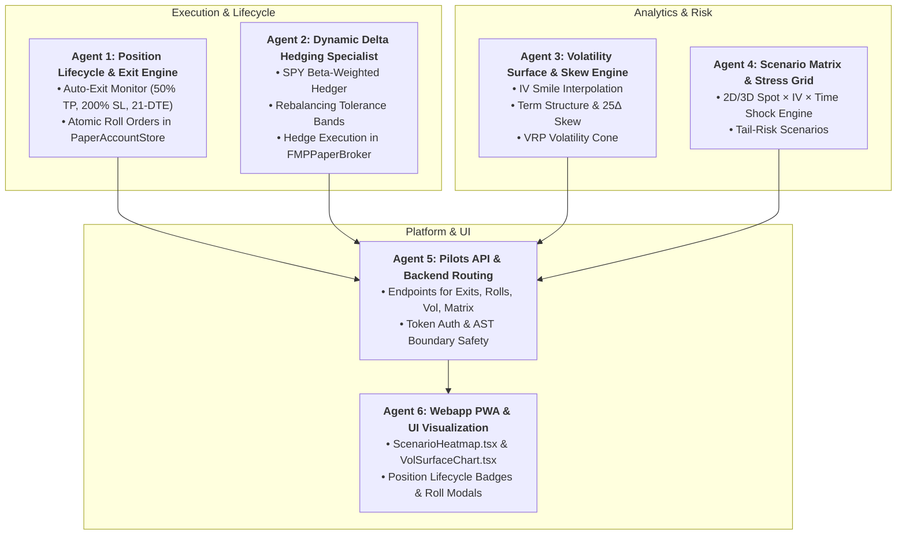

# Master Implementation Plan: Dynamic Options Lifecycle, Volatility Surface & Scenario Matrix (Phases 7, 8, 9)

## Executive Overview
This plan details the implementation of three major subsystems (Options 1, 2, and 3) to elevate the platform's quantitative options desk into an autonomous, institutional-grade lifecycle and risk management system:

1. **Option 1 (Phase 7): Dynamic Position Lifecycle Management, Auto-Exits & Delta Hedging**
   - Automated profit-target exits (50% max profit), stop-loss exits (2.0x max loss), and 21-DTE gamma management.
   - Atomic roll primitives (closing near-term leg and opening next monthly cycle).
   - $\beta$-weighted $\Delta_{\text{SPY}}$ dynamic delta hedging with rebalancing bands.
2. **Option 2 (Phase 8): Interactive Volatility Surface & Skew Analytics**
   - Interpolated IV smile curve across strikes and term structure across expiries.
   - 25-delta Put-Call skew ($S_{\text{skew}} = IV_{25P} - IV_{25C}$) and Volatility Risk Premium (VRP) cone analytics.
3. **Option 3 (Phase 9): 2D Scenario Matrix & Stress Testing Grid**
   - Real-time $N \times M$ scenario grid computing portfolio P&L and net Greeks across Spot Price Shifts ($\pm 10\%$), IV Shocks ($\pm 20\%$), and Time Decay intervals ($0\text{d}$ to expiration).
   - Tail-risk shock projections for historical event scenarios.

Execution is organized across **6 Specialized Subagents** with clean boundaries, AST safety, and mock/live parity.

---

## Subagent Architecture & Workstream Division

---

## User Review Required

> [!IMPORTANT]
> **Key Architectural Decisions for User Alignment**:
> 1. **Auto-Hedging Instrument**: Delta hedging is pegged to `SPY` equity shares by default via $\beta$-weighted dollar delta $\frac{\Delta_{\$, \text{net}}}{S_{\text{SPY}}}$, with a configurable tolerance band (default $\pm 25$ SPY shares).
> 2. **Roll Execution**: Atomic roll operations close existing legs and open replacement legs within a single database transaction, ensuring no intermediate unhedged states.
> 3. **Volatility Surface Data**: Uses `YFinanceOptionsProvider` raw strikes & IV combined with `FMP` live underlying spot for Black-Scholes spline interpolation. Missing strikes gracefully interpolate or flag gaps.

---

## Detailed Agent Tasks & Proposed Changes

### Workstream 1: Agent 1 — Position Lifecycle & Exit Engine
- **Module**: [`execution/options_paper_executor.py`](file:///Users/kevinlee/.gemini/antigravity/worktrees/Stockpy-live/implement_multi_leg_paper_trading/execution/options_paper_executor.py), [`data/paper_account_store.py`](file:///Users/kevinlee/.gemini/antigravity/worktrees/Stockpy-live/implement_multi_leg_paper_trading/data/paper_account_store.py), [`settings.py`](file:///Users/kevinlee/.gemini/antigravity/worktrees/Stockpy-live/implement_multi_leg_paper_trading/settings.py)
- **Features**:
  - Add `evaluate_position_exits()` to `OptionsPaperExecutor`:
    - Checks each open option position: Current P&L % vs Max Credit (50% target profit), Stop Loss (200% loss), DTE $\le 21$ days.
    - Generates closing multi-leg market orders.
  - Add `apply_roll_fill()` to `PaperAccountStore`:
    - Atomically closes existing leg contracts and opens target expiration legs in one database transaction.
  - Settings: `OPTIONS_AUTO_EXIT_ENABLED` (default `False`), `OPTIONS_PROFIT_TARGET_PCT` (`0.50`), `OPTIONS_STOP_LOSS_MULTIPLE` (`2.0`), `OPTIONS_MANAGE_DTE_THRESHOLD` (`21`).

---

### Workstream 2: Agent 2 — Dynamic Delta Hedging & Rebalancing Specialist
- **Module**: `[NEW]` [`pilots/options_hedging.py`](file:///Users/kevinlee/.gemini/antigravity/worktrees/Stockpy-live/implement_multi_leg_paper_trading/pilots/options_hedging.py), [`execution/fmp_paper_broker.py`](file:///Users/kevinlee/.gemini/antigravity/worktrees/Stockpy-live/implement_multi_leg_paper_trading/execution/fmp_paper_broker.py)
- **Features**:
  - `calculate_delta_hedge_order(portfolio_greeks, spy_spot, tolerance_band_shares)`:
    - Calculates required SPY shares to return $\beta$-weighted delta to $0.0$.
    - Applies deadband filter (`abs(shares) > DELTA_HEDGE_BAND`) to prevent over-trading.
  - `execute_delta_hedge()`: Submits stock order for SPY to `PaperAccountStore`.
  - Settings: `OPTIONS_DELTA_HEDGE_ENABLED` (default `False`), `OPTIONS_DELTA_HEDGE_BAND_SPY_SHARES` (`25.0`).

---

### Workstream 3: Agent 3 — Volatility Surface & Skew Engine Specialist
- **Module**: `[NEW]` [`pilots/volatility_surface.py`](file:///Users/kevinlee/.gemini/antigravity/worktrees/Stockpy-live/implement_multi_leg_paper_trading/pilots/volatility_surface.py)
- **Features**:
  - `calculate_volatility_surface(ticker, chain_data, spot_price)`:
    - Strike-dimension spline interpolation of implied volatility (IV Smile) for each expiration.
    - Expiration-dimension term structure ($T \in [7, 14, 30, 60, 90, 180, 365]$ days).
    - 25-Delta Put/Call Skew metric: $\text{Skew}_{25} = \text{IV}_{25\Delta \text{ Put}} - \text{IV}_{25\Delta \text{ Call}}$.
    - Volatility Risk Premium (VRP) Cone: Historical Realized Volatility ($10\text{d}, 20\text{d}, 30\text{d}, 60\text{d}$) vs Implied Volatility.

---

### Workstream 4: Agent 4 — Scenario Matrix & Stress Grid Engine Specialist
- **Module**: `[NEW]` [`pilots/scenario_matrix.py`](file:///Users/kevinlee/.gemini/antigravity/worktrees/Stockpy-live/implement_multi_leg_paper_trading/pilots/scenario_matrix.py)
- **Features**:
  - `evaluate_scenario_matrix(positions, spot_map, spot_shifts, iv_shifts, time_shifts)`:
    - Grid evaluation over:
      - Spot shifts: $[-10\%, -5\%, -3\%, -1\%, 0\%, +1\%, +3\%, +5\%, +10\%]$
      - IV shocks: $[-20\%, -10\%, -5\%, 0\%, +5\%, +10\%, +20\%]$
      - Days forward: $[0, 7, 14, 21, \text{expiration}]$
    - Computes net position market value, P&L shift ($\$), and shocked Greeks ($\Delta, \Gamma, \Theta, \mathcal{V}$) for every cell in the grid.
    - Historical Shock Presets: Lehman 2008 ($-15\%$ Spot, $+50\%$ IV), Volmageddon 2018 ($-4\%$ Spot, $+100\%$ IV), COVID 2020 ($-12\%$ Spot, $+40\%$ IV), Yen Unwind 2024 ($-6\%$ Spot, $+30\%$ IV).

---

### Workstream 5: Agent 5 — Pilots API & Backend Routing Specialist
- **Module**: [`api/pilots_api.py`](file:///Users/kevinlee/.gemini/antigravity/worktrees/Stockpy-live/implement_multi_leg_paper_trading/api/pilots_api.py)
- **Features**:
  - `POST /pilots/paper-broker/manage-exits`: Evaluates and executes rule-based profit/stop/DTE exits.
  - `POST /pilots/paper-broker/roll`: Executes atomic option roll.
  - `GET /pilots/paper-broker/delta-hedge/preview` & `POST /pilots/paper-broker/delta-hedge/execute`: Delta hedging status and execution.
  - `GET /pilots/options/vol-surface`: Implied volatility surface and skew data for an underlying.
  - `POST /pilots/paper-broker/scenario-matrix`: Computes multi-dimensional P&L and Greeks stress matrix.

---

### Workstream 6: Agent 6 — Webapp PWA & UI Visualization Specialist
- **Module**: [`webapp/src/api/types.ts`](file:///Users/kevinlee/.gemini/antigravity/worktrees/Stockpy-live/implement_multi_leg_paper_trading/webapp/src/api/types.ts), [`webapp/src/api/client.ts`](file:///Users/kevinlee/.gemini/antigravity/worktrees/Stockpy-live/implement_multi_leg_paper_trading/webapp/src/api/client.ts), [`webapp/src/api/mock.ts`](file:///Users/kevinlee/.gemini/antigravity/worktrees/Stockpy-live/implement_multi_leg_paper_trading/webapp/src/api/mock.ts), [`webapp/src/screens/PaperBroker.tsx`](file:///Users/kevinlee/.gemini/antigravity/worktrees/Stockpy-live/implement_multi_leg_paper_trading/webapp/src/screens/PaperBroker.tsx), `[NEW]` [`webapp/src/components/options/ScenarioHeatmap.tsx`](file:///Users/kevinlee/.gemini/antigravity/worktrees/Stockpy-live/implement_multi_leg_paper_trading/webapp/src/components/options/ScenarioHeatmap.tsx), `[NEW]` [`webapp/src/components/options/VolSurfaceView.tsx`](file:///Users/kevinlee/.gemini/antigravity/worktrees/Stockpy-live/implement_multi_leg_paper_trading/webapp/src/components/options/VolSurfaceView.tsx)
- **Features**:
  - Full TypeScript types and Mock/Live API parity.
  - **Scenario Heatmap Component**: Color-coded matrix showing dollar P&L and Greek changes with spot and IV sliders.
  - **Vol Surface & Skew Component**: Visualizes strike IV smile curves, term structure decay, and 25Δ skew gauge.
  - **Position Management Actions**: "⚡ Auto-Manage Exits", "⚖️ Delta Hedge Portfolio", and position "Roll" buttons.
  - Vitest test coverage and typecheck validation.

---

## Verification Plan

### Automated Tests
1. **Targeted Python Tests**:
   - `pytest tests/test_options_lifecycle.py` (Exit evaluation, profit target triggers, stop losses, 21-DTE rolls).
   - `pytest tests/test_options_hedging.py` (SPY beta-weighted delta hedging, deadband filters, hedge order execution).
   - `pytest tests/test_volatility_surface.py` (Spline smile interpolation, term structure, 25-delta skew, VRP cone).
   - `pytest tests/test_scenario_matrix.py` (Grid valuations, P&L calculations, historical shock presets, AST safety).
   - `pytest tests/test_pilots_paper_broker.py` (Endpoint authentication, payload schemas, fail-closed write guards).
2. **Frontend Parity & UI Tests**:
   - `npm run --prefix webapp typecheck`
   - `npm --prefix webapp test src/screens/PaperBroker.test.tsx src/components/options/ScenarioHeatmap.test.tsx src/components/options/VolSurfaceView.test.tsx`

### Manual & Visual Verification
- Browser inspection of the Scenario Heatmap matrix, Volatility Surface curve charts, and Auto-Exit / Delta-Hedge triggers in the Pilots PWA.
