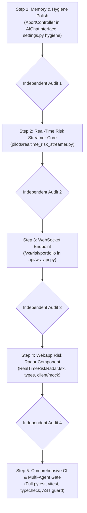

# Phase 31: Real-Time Portfolio Risk Streamer & Memory Hygiene Polish

This plan establishes the implementation of **Phase 31 (Real-Time Portfolio Risk Streamer)** and foundational memory hygiene improvements across the quantitative trading platform, enforcing **independent audit subagent reviews after every step**.

---

## User Review Required

> [!IMPORTANT]
> - **Independent Multi-Agent Audit Review Gate**: After every step, a dedicated independent audit agent will verify AST boundaries, mock/live API parity, lookahead bias invariants, and memory/lifecycle cleanup before proceeding to the next step.
> - **Zero-Lookahead & Constraint #4**: All streaming risk calculations strictly adhere to non-fabrication (missing data yields `NaN`/`None`, never dummy zeros) and degenerate-std guards (`< 1e-12`).

---

## Proposed Changes & Phasing

---

### Step 1: Memory & Hygiene Polish

#### [MODIFY] [AIChatInterface.tsx](file:///Users/kevinlee/.gemini/antigravity/worktrees/Stockpy-live/resolve_memory_leak_root/webapp/src/components/AIChatInterface.tsx)
- Integrate an `AbortController` into `handleSend` SSE streaming.
- Abort in-flight fetch and stream reader loops upon drawer close or unmount to eliminate orphaned microtask scheduling and state updates.

#### [MODIFY] [settings.py](file:///Users/kevinlee/.gemini/antigravity/worktrees/Stockpy-live/resolve_memory_leak_root/settings.py)
- Declare `NO_VENV_REEXEC: bool = False` to resolve the static AST undeclared env var finding from `scripts/_bootstrap.py`.

---

### Step 2: Real-Time Risk Streamer Core Engine

#### [NEW] [realtime_risk_streamer.py](file:///Users/kevinlee/.gemini/antigravity/worktrees/Stockpy-live/resolve_memory_leak_root/pilots/realtime_risk_streamer.py)
- Implement `RealTimeRiskStreamer`:
  - Computes position-level and aggregate portfolio Greeks ($\Delta_{\text{net}}, \Delta_{\$}, \Gamma, \Theta, \mathcal{V}, \beta\text{-SPY}$) on sub-second spot price ticks.
  - Re-evaluates Black-Scholes Greeks dynamically given live underlying quotes and IV.
  - Honors degenerate-std `< 1e-12` guards and Constraint #4 (excludes unresolvable legs from sums, surfaces `missing_data_count`).
  - AST-safe: zero forbidden imports (`processing_engine`, `data_engine`).

---

### Step 3: WebSocket Streaming Hub

#### [MODIFY] [ws_api.py](file:///Users/kevinlee/.gemini/antigravity/worktrees/Stockpy-live/resolve_memory_leak_root/api/ws_api.py)
- Add `risk_router` exposing `/ws/risk/portfolio`.
- Authenticate via `_check_ws_token` against `STATE_API_TOKEN`.
- Subscribe to real-time tick updates and push sub-second Greek updates to connected frontend clients.
- Clean task cancellation on disconnect via `asyncio.wait([t1, t2], return_when=asyncio.FIRST_COMPLETED)`.

---

### Step 4: Webapp UI & Real-Time Risk Radar

#### [MODIFY] [types.ts](file:///Users/kevinlee/.gemini/antigravity/worktrees/Stockpy-live/resolve_memory_leak_root/webapp/src/api/types.ts)
- Add `PortfolioRiskStreamEvent` interface.

#### [MODIFY] [client.ts](file:///Users/kevinlee/.gemini/antigravity/worktrees/Stockpy-live/resolve_memory_leak_root/webapp/src/api/client.ts) & [mock.ts](file:///Users/kevinlee/.gemini/antigravity/worktrees/Stockpy-live/resolve_memory_leak_root/webapp/src/api/mock.ts)
- Add `portfolioRiskWsUrl()` helper with token support and 100% mock parity.

#### [NEW] [RealTimeRiskRadar.tsx](file:///Users/kevinlee/.gemini/antigravity/worktrees/Stockpy-live/resolve_memory_leak_root/webapp/src/components/options/RealTimeRiskRadar.tsx)
- Real-time visual telemetry dashboard displaying live portfolio Greeks, beta-weighted SPY delta, gamma acceleration gauge, and connection status badge.
- Explicit `useEffect` unmount cleanup for WebSocket connections and timers.

---

### Step 5: Test Suite & Independent Audits

#### [NEW] [test_realtime_risk_streamer.py](file:///Users/kevinlee/.gemini/antigravity/worktrees/Stockpy-live/resolve_memory_leak_root/tests/test_realtime_risk_streamer.py)
- Unit tests for Greek recalculation, Black-Scholes edge cases (0DTE, zero volatility), and degenerate input handling.

#### [NEW] [test_ws_risk_stream.py](file:///Users/kevinlee/.gemini/antigravity/worktrees/Stockpy-live/resolve_memory_leak_root/tests/test_ws_risk_stream.py)
- WebSocket endpoint auth, tick push, and disconnect cancellation tests.

#### [NEW] [RealTimeRiskRadar.test.tsx](file:///Users/kevinlee/.gemini/antigravity/worktrees/Stockpy-live/resolve_memory_leak_root/webapp/src/components/options/RealTimeRiskRadar.test.tsx)
- Frontend rendering, mock data streaming, and unmount cleanup tests.

---

## Verification Plan

### Automated Tests
- Python tests: `uv run pytest tests/test_realtime_risk_streamer.py tests/test_ws_risk_stream.py -v`
- Webapp typecheck: `npm run --prefix webapp typecheck`
- Webapp unit tests: `npm run --prefix webapp test`
- Full offline suite: `uv run pytest -m "not network" -q`

### Multi-Agent Independent Review Checkpoints
- **AST & Boundary Auditor**: Verify `pilots/realtime_risk_streamer.py` adheres to AST boundary.
- **Mock/Live Parity Auditor**: Validate 100% parity across `types.ts`, `client.ts`, `mock.ts`.
- **Memory & Lifecycle Auditor**: Validate cleanup in `RealTimeRiskRadar.tsx` and `AIChatInterface.tsx`.
