# Phased Remediation Plan: Giant Master Plan (Phases 1–30) Build-Out & System Audit

## Executive Summary

Based on the findings established in the audit document ([`.claude/giant_master_plan_audit.md`](giant_master_plan_audit.md)) and the quantitative roadmap ([`.claude/giant_master_plan.md`](giant_master_plan.md)), the platform possesses genuine mathematical foundations across all 30 phases (Black-Scholes Greeks, PCHIP splines, Cont LOB queue dynamics, Corsi HAR-RV, Copula stat arb, HRP/CVaR, Almgren-Chriss, and FIX 4.4 protocol).

However, the audit confirmed **12 critical, high, and medium deficiencies (F1–F12)** where features were either orphaned from runtime execution paths, suffered from systemic frontend mock/live API schema drift, contained fabricated placeholders, skipped quantitative deployability gates, or lacked lookahead-bias perturbation tests.

This plan organizes the complete remediation and end-to-end certification of the entire 30-Phase Quantitative Trading System into **6 Specialized Implementation Agent Phases**, each paired with a dedicated **Independent Audit Agent & Verification Protocol**.

```mermaid
graph TD
    subgraph "Implementation & Audit Pipeline (6 Agents + 6 Independent Audits)"
        A1["<b>Agent 1: Execution & Safety Specialist</b><br/>Meta-Labeler, 0DTE Auto-Close, FIX Gap-Fill, Beta-SPY"] --> IA1["<b>Independent Audit 1</b><br/>Execution Safety & Gating Verifier"]
        IA1 --> A2["<b>Agent 2: Quantitative Models Specialist</b><br/>CVaR Anti-Fabrication, AS-MM Policy, Analytical Greeks"] --> IA2["<b>Independent Audit 2</b><br/>Math Rigor & Fabrication Verifier"]
        IA2 --> A3["<b>Agent 3: AI Forecasters & Microstructure</b><br/>Real Data Feeds, Lookahead Tests, AST Dynamic Guard"] --> IA3["<b>Independent Audit 3</b><br/>Lookahead & Microstructure Verifier"]
        IA3 --> A4["<b>Agent 4: Strategy Validation & Governance</b><br/>Options Pilots Gating, PBO/DSR/MaxDD, Tail Stress"] --> IA4["<b>Independent Audit 4</b><br/>Strategy Deployability Gate Verifier"]
        IA4 --> A5["<b>Agent 5: Frontend & API Parity Specialist</b><br/>100% Mock/Live Parity, 8 Broken Screens, New UI Views"] --> IA5["<b>Independent Audit 5</b><br/>Mock/Live Contract Parity Verifier"]
        IA5 --> A6["<b>Agent 6: Systems & Release Specialist</b><br/>Master Orchestration, SEC 606, Static Auditor, Preflight"] --> IA6["<b>Independent Audit 6</b><br/>End-to-End System-Wide Certification"]
    end
```



---

## 6-Phase Implementation & 6-Independent-Audit Structure

```mermaid
timeline
    title 6-Agent Build-Out & 6-Independent-Audit Flow
    section Phase 1: Execution & Safety
        Agent 1 : ML Meta-Labeler Live Wiring + 0DTE 15:45 Exit + FIX Recovery + β-SPY Hedging
        Audit 1 : Live Execution Trace & Auto-Liquidation Sim
    section Phase 2: Quantitative Models
        Agent 2 : CVaR Anti-Fabrication + Avellaneda-Stoikov Policy + Reference Greeks Tests
        Audit 2 : Closed-Form Math & Zero-Fabrication Audit
    section Phase 3: AI & Microstructure
        Agent 3 : Real Data Feeds for Forecasters + Lookahead Perturbation Tests + Dynamic AST Guard
        Audit 3 : Temporal Perturbation Verification & Import Sandbox
    section Phase 4: Strategy Validation
        Agent 4 : Options Pilots Registration + Harness Stress Testing + Two-Place Docs Logging
        Audit 4 : Deployability Gate Re-Run & Tail-Shock Audit
    section Phase 5: Webapp & API Parity
        Agent 5 : Mock/Live Parity Overhaul across 8 Screens + Multi-Leg UI + Honest 3D Canvas
        Audit 5 : OpenAPI Schema vs TS Contract Verification
    section Phase 6: Release Certification
        Agent 6 : End-to-End Daemon Wiring + SEC 606 + Static Codebase Auditor + Preflight Gate
        Audit 6 : Full Suite Certification (11,200+ Pytest + Vitest + Preflight)
```

---

### Phase 1: Backend Execution Integrity & Safety Gating
**Assigned: Implementation Agent 1 (Execution & Safety Specialist)**

#### Objectives & Deliverables:
1. **Fix ML Meta-Labeler Live Path (F3)**:
   - In `execution/options_paper_executor.py`, call `global_options_meta_labeler.load_model()` during initialization.
   - In `api/pilots_api.py`, replace the static hardcoded feature vector (`ivr=50.0, vrp=0.02, vix=20.0...`) with dynamic feature extraction from real market context (`HistoricalStore` / `data_engine.py`).
2. **Wire 0DTE 15:45 ET Auto-Liquidation Gate (F5)**:
   - Wire `evaluate_0dte_exits` and `execute_0dte_exits` from `pilots/zero_dte_engine.py` into `desktop/daemon_runtime.py`'s periodic loop and expose explicit management endpoints in `api/pilots_api.py`.
3. **Consolidate FIX Recovery & Gateway (F8)**:
   - Import and integrate `execution/fix_recovery.py` into `execution/fix_gateway.py` to eliminate duplicate gap-fill logic and activate the dedicated recovery store.
4. **Upgrade $\beta$-SPY Delta Hedging (F11)**:
   - In `pilots/options_hedging.py` and `pilots/options_risk.py`, incorporate true per-symbol regression beta from `pilots/rolling_beta.py` / `data/fmp_fundamentals.py`.

#### Independent Audit 1: Execution Safety & Gating Verifier
- **Auditor Role**: Independent verification of execution safety gates, startup life-cycles, and order-risk quarantine.
- **Audit Verification Steps**:
  - [ ] Test cold-start auto-execution to verify `global_options_meta_labeler` loads weights and produces sizing adjustments $\neq 1.0$ when confidence deviates from baseline.
  - [ ] Run simulated 15:45 ET clock step and verify all open 0DTE contracts are auto-liquidated and recorded in `PaperAccountStore`.
  - [ ] Test FIX sequence mismatch and verify gap-fill resend request is handled through `fix_recovery.py`.
  - [ ] Verify beta-weighted SPY hedge ratio produces non-trivial hedge sizing for non-1.0 beta securities.

---

### Phase 2: Quantitative Models, Optimization & Anti-Fabrication
**Assigned: Implementation Agent 2 (Quantitative Models Specialist)**

#### Objectives & Deliverables:
1. **CVaR 95% Anti-Fabrication & Sizing Rigor (F2)**:
   - In `api/pilots_api.py`, replace `"cvar_95": float(0.05), # placeholder` with the actual mathematical result of `constrain_cvar()` from `sizing/hrp_cvar_optimizer.py`.
   - In `webapp/src/api/mock.ts`, replace static response constants with realistic dynamic calculations.
2. **Avellaneda-Stoikov Market Maker Alignment & Wiring (F6, F12)**:
   - Accurately brand and expose `ml/drl_market_maker.py` as an Avellaneda-Stoikov Optimal Quoting & Policy Optimization Engine.
   - Wire `train_market_maker_policy` into `api/pilots_api.py` and `pilots/lob_simulator.py`.
   - Document the RL/Market-Making validation exemption and custom evaluation metric (Inventory Variance vs Spread Capture) in `docs/VALIDATION_STRATEGY_FIX_LOG.md`.
3. **Black-Scholes & Dispersion Math Reference Tests (F15, F16)**:
   - Add exact hand-computed closed-form reference tests to `tests/test_options_risk.py` for Delta, Gamma, Theta, Vega, and Rho across ITM/ATM/OTM strikes.
   - Add non-trivial correlation ($\rho \in [0.2, 0.8]$) tests to `tests/test_dispersion_trading.py` for the Driessen-Maenhout-Vilkov index implied correlation formula.

#### Independent Audit 2: Math Rigor & Fabrication Verifier
- **Auditor Role**: Independent audit of all mathematical formulas, optimization solvers, and numeric return values.
- **Audit Verification Steps**:
  - [ ] Static AST analysis on all return dictionaries in `api/pilots_api.py` and `sizing/` to confirm zero hardcoded fallback literals.
  - [ ] Numeric validation of SLSQP CVaR optimization bounds and weight sum $\sum w_i = 1.0$.
  - [ ] Verify reservation price $r(s, q, t) = s - q\gamma\sigma^2(T-t)$ and optimal spread $\delta_a + \delta_b = \gamma\sigma^2(T-t) + \frac{2}{\gamma}\ln(1 + \frac{\gamma}{\kappa})$ in `drl_market_maker.py`.
  - [ ] Run newly authored analytical test assertions with tolerance $1e-4$.

---

### Phase 3: AI Volatility Forecasters & Microstructure Real-Data Pipelines
**Assigned: Implementation Agent 3 (AI & Microstructure Specialist)**

#### Objectives & Deliverables:
1. **Real Data Feeds for Forecasters (F7)**:
   - In `api/pilots_api.py`, replace `np.random.randn(...)` synthetic noise in `/pilots/options/ai/transformer-forecast` and `/pilots/options/ai/diffusion-stress-test` with actual historical price return arrays, realized volatility, and IV term structures loaded from `data/historical_store.py`.
2. **Lookahead-Bias Perturbation Test Suites (F7)**:
   - Implement strict temporal perturbation tests in `tests/test_transformer_vol_forecaster.py` and `tests/test_synthetic_diffusion_engine.py`.
   - Verify that altering future bar data $t > T$ produces zero difference in forecasted volatility or generated diffusion paths for steps $\le T$.
3. **Dynamic AST Import Boundary Confinement (F10)**:
   - Refactor `tests/test_pilots_strategy_matrix.py` to dynamically discover all files under `pilots/*.py` using `pathlib.Path.glob()` and enforce the AST heavy-engine import ban across all 18+ pilots modules.

#### Independent Audit 3: Lookahead & Microstructure Verifier
- **Auditor Role**: Independent verification of temporal causality, data pipeline integrity, and AST import safety boundaries.
- **Audit Verification Steps**:
  - [ ] Execute perturbation tests for Transformer Vol Forecaster and Generative Diffusion Engine; confirm bit-exact invariance on past time slices.
  - [ ] Inspect API routes `/pilots/options/ai/transformer-forecast` and `/pilots/options/ai/diffusion-stress-test` to verify real market feeds are consumed.
  - [ ] Run AST dynamic scanner on all `pilots/*.py` modules and confirm zero unauthorized imports of `main.py`, `strategy_engine.py`, or heavy orchestrators.

---

### Phase 4: Strategy Validation & Deployability Gate Registration
**Assigned: Implementation Agent 4 (Strategy Validation Specialist)**

#### Objectives & Deliverables:
1. **Formal Strategy Registration (F4)**:
   - Register the 6 active options-selling pilot strategies into `validation/harness.py` / `STRATEGY_REGISTRY`:
     - `earnings_crush` (`pilots/earnings_crush.py`)
     - `vol_mispricing` (`pilots/vol_mispricing.py`)
     - `dispersion_trading` (`pilots/dispersion_trading.py`)
     - `zero_dte_engine` (`pilots/zero_dte_engine.py`)
     - `gamma_scalper` (`pilots/gamma_scalper.py`)
     - `copula_stat_arb` (`pilots/copula_stat_arb.py`)
2. **Execute Validation & Tail-Stress Harness**:
   - Run walk-forward backtests and purged k-fold CV across all 6 strategies via `validation/options_selling_backtest.py` and historical crisis stress shocks in `validation/stress_scenarios.py`.
3. **Two-Place Documentation Logging**:
   - Author `docs/signals/earnings_crush.md`, `vol_mispricing.md`, `dispersion_trading.md`, `zero_dte_engine.md`, `gamma_scalper.md`, and `copula_stat_arb.md`.
   - Record exact measured metrics ($PBO < 0.50$, $DSR > 0.95$, $Sharpe > 0.50$, $MaxDD < 30\%$, options tail-loss caps) and deployability status in `docs/VALIDATION_STRATEGY_FIX_LOG.md`.

#### Independent Audit 4: Strategy Deployability Gate Verifier
- **Auditor Role**: Independent audit of backtest validity, selection bias / PBO calculations, and strategy registry compliance.
- **Audit Verification Steps**:
  - [ ] Run `python -m scripts.refresh_validations --strategies earnings_crush,vol_mispricing,dispersion_trading,zero_dte_engine,gamma_scalper,copula_stat_arb`.
  - [ ] Verify that every strategy in `STRATEGY_REGISTRY` has an entry in `docs/VALIDATION_STRATEGY_FIX_LOG.md`.
  - [ ] Confirm no fabricated or hardcoded validation numbers; assert all metrics trace to execution logs.

---

### Phase 5: Webapp Mock/Live API Parity & Frontend Integration
**Assigned: Implementation Agent 5 (Frontend & API Parity Specialist)**

#### Objectives & Deliverables:
1. **Field-by-Field API Parity Overhaul (F1)**:
   - Fix `webapp/src/screens/` and `webapp/src/components/options/` for all affected Phase 20–24, 28, 30 views:
     - `GexProfileView.tsx`: Map `net_gex_dollars`, `call_gamma_wall`, `put_gamma_wall`, `zero_gamma_strike`, and per-strike GEX arrays.
     - `LobDepthView.tsx`: Map real queue position parameters (`price_level`, `depth_ahead`, `fill_probability`, `order_type`).
     - `CopulaSpreadView.tsx`: Map real API fields (`symbol_x/symbol_y`, `current_beta`, `mispricing_zscore`, `joint_cdf`).
     - `MarketMakerAgentView.tsx`: Align with real Avellaneda-Stoikov response shape (`bid_quote`, `ask_quote`, `optimal_spread`, `inventory_penalty`).
     - `TransformerVolForecastView.tsx`: Correct endpoint to `/pilots/options/ai/transformer-forecast` and fix request body parameters.
     - `GenerativeDiffusionStressView.tsx`: Correct endpoint to `/pilots/options/ai/diffusion-stress-test` and supply required `spot_price`.
     - `MultiBrokerGatewayView.tsx`: Correct URL path prefix to `/pilots/execution/brokers/...`.
     - `ResearchCopilotView.tsx`: Match schema to `{success, code, validation_passed, ast_safety_passed, test_output}`.
2. **Missing Frontend Wiring & Components (F1)**:
   - Build UI panels and client API functions for **Multi-Leg Pricing** (`POST /pilots/options/pricing/price`, `POST /pilots/options/pricing/validate`) and **FIX Venues** (`GET /pilots/execution/fix/venues`, `POST /pilots/execution/fix/route`).
3. **Honest 3D Visualization Labeling (F9)**:
   - In `VolSurface3D.tsx` and `LobDepth3D.tsx`, update rendering status badges to honestly label the high-performance Canvas 2D isometric/perspective projection engine.
4. **TypeScript Types & Mock Parity**:
   - Update `webapp/src/types.ts`, `webapp/src/api/client.ts`, and `webapp/src/api/mock.ts` to ensure 100% strict type alignment between mock and live responses.

#### Independent Audit 5: Mock/Live Contract Parity Verifier
- **Auditor Role**: Independent audit of frontend-to-backend schema alignment, TypeScript types, and UI rendering integrity.
- **Audit Verification Steps**:
  - [ ] Run `npm run --prefix webapp typecheck` (`tsc --noEmit`) and verify 0 errors.
  - [ ] Run `npm run --prefix webapp test` (Vitest) across all 160+ test suites.
  - [ ] Run schema comparator between FastAPI `/openapi.json` and `webapp/src/types.ts`.
  - [ ] Execute browser/API integration test with `VITE_USE_MOCK=false` against live `api/pilots_api.py` endpoints to confirm zero 404s or uncaught property exceptions.

---

### Phase 6: End-to-End Orchestration, Multi-Broker Infrastructure & System Hardening
**Assigned: Implementation Agent 6 (Systems & Release Specialist)**

#### Objectives & Deliverables:
1. **Master Pipeline Orchestration & Daemon Integration**:
   - Verify all 30 phases are cleanly integrated into `main_orchestrator.py`, `desktop/daemon_runtime.py`, and `api/pilots_api.py`.
2. **SEC Rule 606 & Execution Audit Wiring**:
   - Connect `execution/sec_rule_606_reporter.py` and `data/execution_audit_store.py` to multi-broker live order routing for execution audit trails.
3. **Resolve Existing Test Suite Edge Cases**:
   - Fix `tests/test_forecast_backfill.py::test_step_3_skips_cross_sectional_modules_with_no_meta_label_features` by synchronizing gating expectations with newly added cross-sectional modules.
4. **Documentation & Runbook Alignment**:
   - Update `CLAUDE.md`, `AGENTS.md`, `docs/architecture/execution.md`, `docs/architecture/signal-engines.md`, `docs/RUNBOOK.md`, and `docs/HOW_TO_GUIDE.md`.

#### Independent Audit 6: Final System-Wide Certification & Release Audit
- **Auditor Role**: Final overarching audit certifying platform health, compliance, test coverage, and operational readiness.
- **Audit Verification Steps**:
  - [ ] Execute full pytest suite: `uv run pytest -m "not network" -q -n 4` (confirm 11,260+ passed, 0 failed).
  - [ ] Execute full webapp test suite: `npm run --prefix webapp test` (160+ files, 1,720+ tests passed).
  - [ ] Run static codebase auditor: `python scripts/auditor/stockpy_codebase_auditor.py --root . --fail-on HIGH`.
  - [ ] Run platform preflight check: `python scripts/preflight_check.py`.
  - [ ] Generate comprehensive release walkthrough at `.claude/phased_agent_audit_system_walkthrough.md`.

---

## Verification Plan

### Automated Test Gates
```bash
# 1. Backend Python Unit & Regression Suite
uv run pytest -m "not network" -q -n 4

# 2. Targeted Execution & Math Verification
uv run pytest tests/test_options_paper_executor.py tests/test_zero_dte_engine.py tests/test_hrp_cvar_optimizer.py tests/test_options_risk.py tests/test_transformer_vol_forecaster.py tests/test_synthetic_diffusion_engine.py tests/test_pilots_strategy_matrix.py -v

# 3. Strategy Validation Harness
python -m scripts.refresh_validations --workers 4

# 4. Frontend Vitest & TypeScript Parity
npm run --prefix webapp test
npm run --prefix webapp typecheck

# 5. Static Codebase Auditor & Security Gate
python scripts/auditor/stockpy_codebase_auditor.py --root . --fail-on HIGH

# 6. Preflight Readiness Gate
python scripts/preflight_check.py
```
