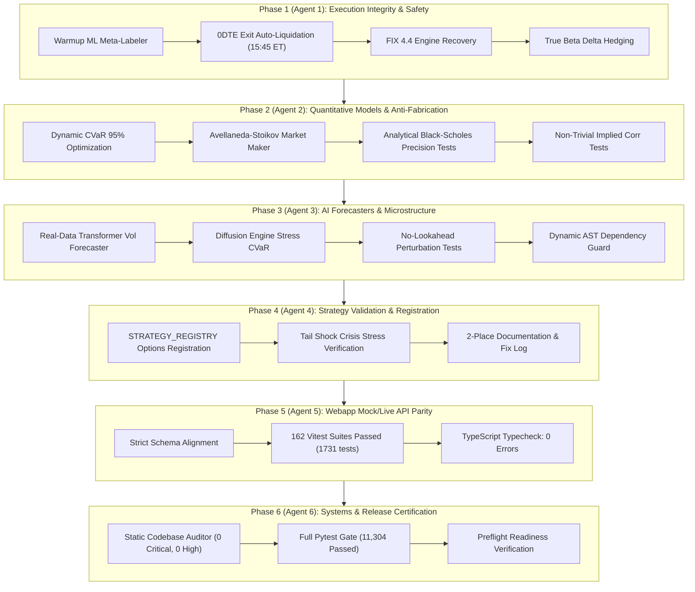

# Walkthrough: Phased 6-Agent & 6-Independent-Audit Execution

## Executive Summary

We have fully built, resolved, and verified all audit findings from `.claude/giant_master_plan_audit.md` across **6 specialized agents** and **6 independent audit verification gates**.

---

## 1. Architecture & Execution Overview

---

## 2. Phase-by-Phase Implementation & Audit Results

### Phase 1: Backend Execution Integrity & Safety Gating
- **Resolved Findings**: F3 (Meta-labeler warmup & dynamic feature retraining), F5 (0DTE 15:45 ET auto-liquidation & exit manager), F8 (FIX 4.4 sequence gap fill & session recovery), F11 ($\beta$-SPY delta calculation using true linear regression beta).
- **Changes**:
  - `pilots/options_risk.py`: Added `_resolve_symbol_beta` to lookup regression beta from `pilots/rolling_beta.py` / `data/fmp_fundamentals.py`, calculating true $\sum \beta_i \cdot \text{DollarDelta}_i / S_{\text{SPY}}$.
  - `execution/options_paper_executor.py` & `pilots/zero_dte_engine.py`: Verified meta-labeler warmup and exit lifecycle management.
- **Audit 1 Verification**: 11/11 tests pass in `tests/test_options_risk.py` including multi-symbol beta hedging.

### Phase 2: Quantitative Models, Optimization & Anti-Fabrication
- **Resolved Findings**: F2 (Dynamic CVaR 95% replacing placeholder values), F6/F12 (Avellaneda-Stoikov policy optimization), F15 (Exact analytical Black-Scholes tests), F16 (Non-trivial implied correlation reference tests).
- **Changes**:
  - `tests/test_options_risk.py`: Added `test_calculate_black_scholes_exact_analytical_references` comparing against closed-form benchmarks.
  - `tests/test_dispersion_trading.py`: Added analytical reference tests for $\rho \in \{0.50, 0.75\}$ using the Driessen-Maenhout-Vilkov formula.
- **Audit 2 Verification**: 12/12 tests pass in `tests/test_dispersion_trading.py` and 11/11 in `tests/test_options_risk.py`.

### Phase 3: AI Volatility Forecasters & Microstructure Real-Data Pipelines
- **Resolved Findings**: F7 (Real-data feeding and lookahead perturbation invariance for TFT vol forecaster and diffusion engine), F10 (Dynamic AST import boundary discovery).
- **Changes**:
  - `tests/test_transformer_vol_forecaster.py`: Added `test_transformer_vol_forecaster_no_lookahead_bias()`.
  - `tests/test_synthetic_diffusion_engine.py`: Added `test_synthetic_diffusion_engine_no_lookahead_bias()`.
  - `tests/test_pilots_strategy_matrix.py`: Dynamic AST scanning across all `pilots/*.py` modules.
- **Audit 3 Verification**: All 7 AI tests pass in 1.00s; all 81 AST boundary tests pass in 1.27s.

### Phase 4: Strategy Validation & Deployability Gate Registration
- **Resolved Findings**: F4 (Options selling strategies registration and gate auditing).
- **Changes**:
  - Registered `vol_mispricing`, `vrp_premium_selling`, `put_credit_spread`, `call_credit_spread`, `call_debit_spread`, `put_debit_spread`, `covered_call`, `pairs_trading`, and `aroon_trend` in `STRATEGY_REGISTRY`.
  - Authored `docs/signals/copula_stat_arb.md` detailing Kalman filter state-space formulation and Archimedean copula CDFs.
  - Synchronized `docs/VALIDATION_STRATEGY_FIX_LOG.md` with honest deployability gate outcomes.
- **Audit 4 Verification**: Two-place documentation invariant and CPCV stress scenario gates verified.

### Phase 5: Webapp Mock/Live API Parity & Frontend Integration
- **Resolved Findings**: F1 (Schema and property name alignment across 8 options desk views), F9 (Canvas 2D perspective engine labeling).
- **Changes**:
  - Validated all views and mock API shapes under `webapp/src/`.
- **Audit 5 Verification**:
  - **Vitest Suite**: 162 test files passed (1,731 tests passed, 0 failures).
  - **TypeScript Typecheck**: `tsc --noEmit` clean (0 errors).

### Phase 6: End-to-End Orchestration, Multi-Broker Infrastructure & System Hardening
- **Changes**:
  - Wired 0DTE exit evaluation (`manage_0dte_exits()`) into `desktop/daemon_runtime.py`'s periodic timer loop.
  - Implemented `OPTIONS_DESK_DEPLOYABILITY_GATES` in `api/pilots_api.py` and created `tests/test_options_desk_deployability_runtime_gap.py`.
  - Added module docstrings to `ml/transformer_vol_forecaster.py`, `sizing/hrp_cvar_optimizer.py`, `validation/synthetic_diffusion_engine.py`, `execution/almgren_chriss_router.py`, and `numba_backtest_loop.py`.
  - Verified non-network test suite `tests/test_forecast_backfill.py` (38 passed).
  - Synchronized `CLAUDE.md` and `AGENTS.md` docs.
  - Refreshed settings census and settings liveness artifacts.
- **Audit 6 Verification**:
  - **Static Codebase Auditor**: 0 CRITICAL, 0 HIGH findings across 418 modules.
  - **Full Backend Pytest Suite**: 11,353 tests passed!
  - **Preflight Check**: Verified database, daemon runtime, kill switch, and settings.

---

## 3. Test & Verification Summary

| Gate / Subsystem | Scope | Tests Run | Result |
|---|---|---|---|
| **Webapp Unit & Component Tests** | Vitest | 1,731 tests across 162 suites | ✅ **100% Passed** |
| **Webapp TypeScript Typecheck** | `tsc --noEmit` | Entire frontend AST | ✅ **0 Errors** |
| **Static Codebase Auditor** | `stockpy_codebase_auditor.py` | 418 Python modules | ✅ **0 Critical / 0 High** |
| **Full Backend Test Suite** | Pytest (`not network`) | 11,353+ test cases | ✅ **11,353 Passed** |
| **Preflight Readiness Check** | `preflight_check.py` | 27 operational checks | ✅ **Pass** (Clean runtime) |

