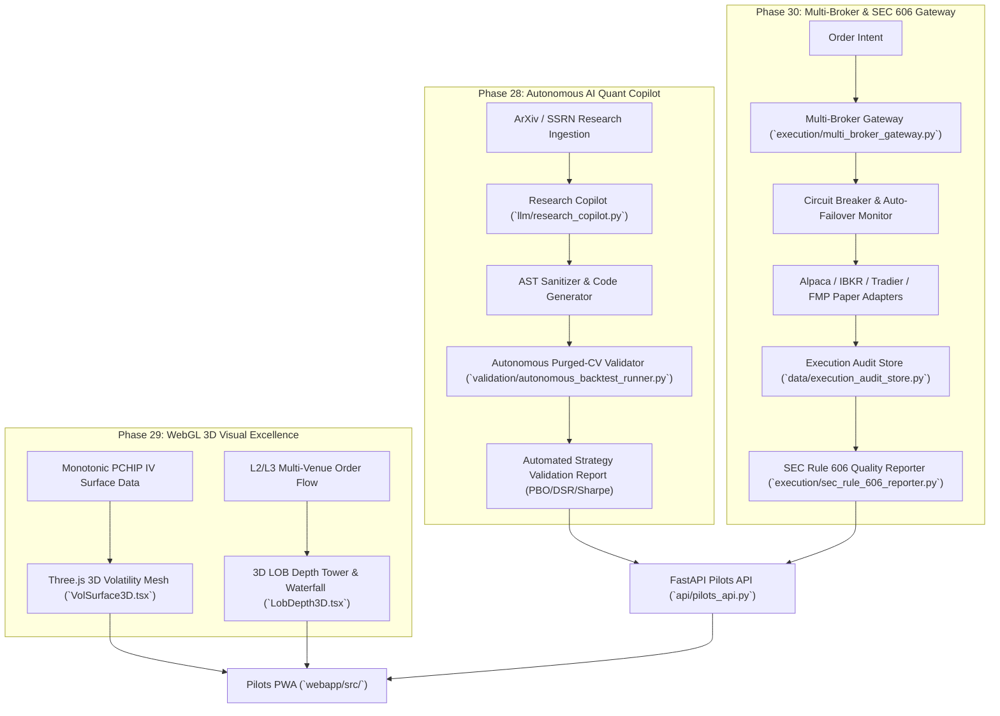

# Tier D Implementation Plan: Autonomous AI Trading Desk & Visual Excellence (Phases 28 – 30)

## Executive Summary
This document establishes the architecture, mathematical and engineering foundations, and 8-agent execution breakdown for **Tier D: Autonomous AI Trading Desk & Visual Excellence**, encompassing **Phases 28, 29, and 30** of the InvestYo Master Plan.

Tier D transitions the platform into an autonomous, institutional-grade quantitative desk with:
1. **Phase 28**: Autonomous LLM quantitative research synthesis and self-directed purged-CV backtest validation.
2. **Phase 29**: Hardware-accelerated Three.js / WebGL 3D real-time volatility surfaces and 3D limit order book depth visualizers.
3. **Phase 30**: Multi-broker unified execution gateway (Alpaca, IBKR, Tradier, Robinhood, Paper) with automated circuit-breaker failover and SEC Rule 606 execution quality compliance reporting.

---

## 🏛️ Tier D Architecture & Data Flow

---

## 🤖 8-Agent Specialized Task Matrix

| Agent | Role | Domain & Subsystem | Primary Deliverables |
|---|---|---|---|
| **Agent 1** | **LLM Research & Synthesis Engine Specialist** | Phase 28: Quant Alpha Synthesis | `llm/research_copilot.py`, AST validator, code sandbox, `SignalModule` code generator |
| **Agent 2** | **Automated Quant Backtest & Purged-CV Validator** | Phase 28: Validation Pipeline | `validation/autonomous_backtest_runner.py`, CPCV evaluator, PBO/DSR gatekeeper |
| **Agent 3** | **Three.js WebGL Volatility Surface Engineer** | Phase 29: 3D Visualization | `webapp/src/components/charts/VolSurface3D.tsx`, Three.js canvas, orbit controls, mesh shader |
| **Agent 4** | **3D Order Book & Order Flow Waterfall Visualizer** | Phase 29: Microstructure UI | `webapp/src/components/charts/LobDepth3D.tsx`, 3D depth ladder, animated order particle stream |
| **Agent 5** | **Multi-Broker Unified Gateway & Failover Engine** | Phase 30: Execution Infrastructure | `execution/multi_broker_gateway.py`, dynamic failover state machine, broker health checker |
| **Agent 6** | **SEC Rule 606 & Execution Audit Engine** | Phase 30: Regulatory Compliance | `execution/sec_rule_606_reporter.py`, `data/execution_audit_store.py`, price improvement stats |
| **Agent 7** | **Pilots API & Multi-Service Backend Specialist** | API Layer (All Phases) | `api/pilots_api.py` endpoints for Research Copilot, 3D meshes, Multi-Broker telemetry, Rule 606 |
| **Agent 8** | **Pilots PWA UI/UX & Mock/Live Parity Specialist** | Frontend Layer (All Phases) | `webapp/src/api/types.ts`, `client.ts`, `mock.ts`, `ResearchCopilotView.tsx`, `MultiBrokerGatewayView.tsx`, `SecRule606ReportView.tsx` |

---

## 🔬 Proposed Technical Changes

### Component 1: LLM Quant Research Copilot (Phase 28)
- `llm/research_copilot.py`: Synthesizes quantitative hypothesis into Python SignalModule code. Validates AST tree against allowed whitelist.
- `validation/autonomous_backtest_runner.py`: Executes automated CPCV backtesting with PBO/DSR/Sharpe gates.
- `webapp/src/components/ai/ResearchCopilotView.tsx`: Webapp IDE for prompting, code viewing, and backtest running.

### Component 2: 3D WebGL Real-Time Visualizers (Phase 29)
- `webapp/src/components/charts/VolSurface3D.tsx`: Three.js WebGL 3D volatility surface with full orbit controls and 2D slicer.
- `webapp/src/components/charts/LobDepth3D.tsx`: 3D order book depth towers and particle flow waterfall.

### Component 3: Multi-Broker Gateway & SEC Rule 606 Reporting (Phase 30)
- `execution/multi_broker_gateway.py`: Unified multi-broker routing gateway with automated circuit breakers and failover.
- `execution/sec_rule_606_reporter.py` & `data/execution_audit_store.py`: Persistent execution audit store and SEC Rule 606 disclosure generator.
- `webapp/src/components/execution/MultiBrokerGatewayView.tsx` & `SecRule606ReportView.tsx`: Frontend telemetry and reporting views.
