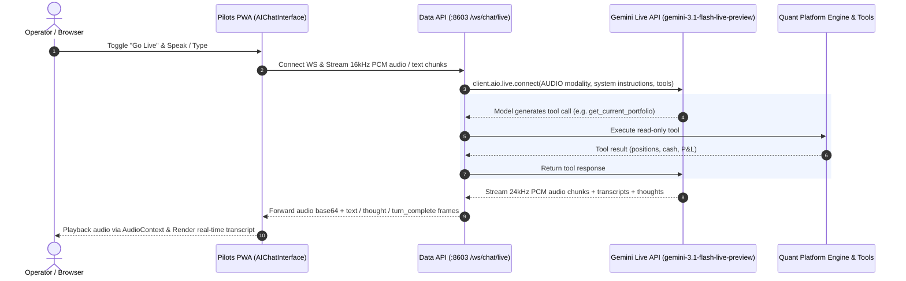

# Walkthrough: Gemini Live API & Real-Time Voice Chat System

We have implemented a real-time bidirectional voice and audio chat system powered by Google's **Gemini Live API** (`gemini-3.1-flash-live-preview`). It provides low-latency voice streaming, real-time speech transcription, model interruption, and quant tool grounding for the Stockpy platform.

---

## 1. Architecture & Design Overview



---

## 2. Key Changes Made

### A. Configuration & Settings ([`settings.py`](file:///Users/kevinlee/.gemini/antigravity/worktrees/Stockpy-live/build_gemini_chat_system/settings.py))
- Added `GEMINI_LIVE_CHAT_ENABLED` (bool, default `True`)
- Added `GEMINI_LIVE_CHAT_MODEL` (str, default `"gemini-3.1-flash-live-preview"`)
- Added `GEMINI_LIVE_VOICE_NAME` (str, default `"Aoede"`)
- Added `GEMINI_CHAT_MODEL` (str, default `"gemini-2.5-flash"`)

### B. Backend WebSocket Endpoint ([`api/ws_api.py`](file:///Users/kevinlee/.gemini/antigravity/worktrees/Stockpy-live/build_gemini_chat_system/api/ws_api.py))
- Implemented `/ws/chat/live` on `live_chat_router` mounted in `api/data_api.py` (Port 8603).
- Connects asynchronously via `google-genai`'s `client.aio.live.connect` with audio modality and speech config.
- Grounded with platform tools: `list_all_pilots`, `get_pilot_holdings`, `get_pilot_recent_trades`, `get_current_portfolio`, `get_platform_status`.
- Supports bidirectional streaming of raw linear PCM audio frames (`{"realtime_input": {"media_chunks": [{"data": "...", "mime_type": "audio/pcm;rate=16000"}]}}`) and text messages (`{"text": "..."}`).
- Formats and forwards model output events: audio chunks (`audio/pcm;rate=24000`), real-time transcripts, thoughts, and turn completion indicators.

### C. Frontend Web Audio Streaming ([`webapp/src/chat/audioStreamer.ts`](file:///Users/kevinlee/.gemini/antigravity/worktrees/Stockpy-live/build_gemini_chat_system/webapp/src/chat/audioStreamer.ts))
- **`AudioRecorder`**: Captures user microphone, resamples browser audio to 16 kHz 16-bit little-endian mono PCM, and emits base64 chunks for streaming.
- **`AudioPlayer`**: Manages continuous jitter-free playback buffer on `AudioContext` for 24 kHz 16-bit mono PCM chunks, with instant `interrupt()` support when the user speaks over the model.

### D. React Live Chat Hook ([`webapp/src/chat/useGeminiLive.ts`](file:///Users/kevinlee/.gemini/antigravity/worktrees/Stockpy-live/build_gemini_chat_system/webapp/src/chat/useGeminiLive.ts))
- Manages full WebSocket connection state (`disconnected` | `connecting` | `connected` | `error`).
- Automatically handles microphone recording, audio sending, incoming audio playback, transcript buffering, and thought/context display.

### E. Interactive UI Component ([`webapp/src/components/AIChatInterface.tsx`](file:///Users/kevinlee/.gemini/antigravity/worktrees/Stockpy-live/build_gemini_chat_system/webapp/src/components/AIChatInterface.tsx))
- **Live Mode Toggle ("Go Live" / "Live Mode")**: Smooth transition between standard SSE text chat and real-time voice mode.
- **Voice Status Bar & Controls**: Interactive microphone mute/unmute button, pulsating audio active indicators, connection badges, and real-time transcript streaming.

---

## 3. Verification & Validation Results

### Backend Unit Tests ([`tests/test_gemini_live_chat.py`](file:///Users/kevinlee/.gemini/antigravity/worktrees/Stockpy-live/build_gemini_chat_system/tests/test_gemini_live_chat.py), [`tests/test_data_api_chat.py`](file:///Users/kevinlee/.gemini/antigravity/worktrees/Stockpy-live/build_gemini_chat_system/tests/test_data_api_chat.py))
```
pytest tests/test_gemini_live_chat.py tests/test_data_api_chat.py tests/test_data_api.py
======================== 68 passed in 3.46s =========================
```
- Token authentication and reject verification
- AI generation capability gating
- Gemini API key availability verification
- Bidirectional audio/text streaming and session forwarding
- Model tool call handling and execution

### Frontend TypeScript Check & Unit Tests
```
npm run --prefix webapp typecheck
> tsc --noEmit
(0 errors)

npm run --prefix webapp test -- src/components/AIChatInterface.test.tsx src/chat/audioStreamer.test.ts
 Test Files  2 passed (2)
      Tests  8 passed (8)
```
- A11y & inert DOM testing for closed/opened panel
- Context prop threading to chat queries
- Gemini Live Mode UI toggle, microphone toggle, and placeholder updates
- AudioPlayer initialization, interruption, and cleanup

---

## 4. Documentation Updates
- Updated [`CLAUDE.md`](file:///Users/kevinlee/.gemini/antigravity/worktrees/Stockpy-live/build_gemini_chat_system/CLAUDE.md) & [`AGENTS.md`](file:///Users/kevinlee/.gemini/antigravity/worktrees/Stockpy-live/build_gemini_chat_system/AGENTS.md) with the Gemini Live API specifications, WebSocket endpoint contract, and audio configurations.
- Updated [`docs/architecture/webapp-and-gui.md`](file:///Users/kevinlee/.gemini/antigravity/worktrees/Stockpy-live/build_gemini_chat_system/docs/architecture/webapp-and-gui.md) with details on the live audio pipeline, tool grounding, and security flags.
