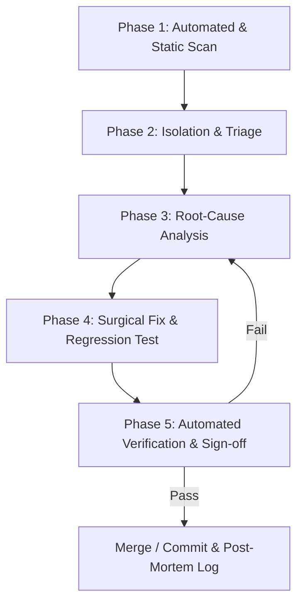

# Stockpy Bug Hunting Process & Vulnerability Management Framework

This document defines the standard operating procedure (SOP), classification model, root-cause investigation protocol, and verification workflow for hunting, triaging, fixing, and preventing bugs across the **InvestYo Quant Platform ("Stockpy")**.

---

## 1. Core Principles & Platform Invariants

Bug hunting in Stockpy strictly adheres to five core engineering invariants:

> [!IMPORTANT]
> **1. The Zero-Fallthrough Rule**  
> Never resolve errors by masking symptoms, swallowing exceptions in empty `except:` blocks, returning arbitrary default fallbacks (e.g., dummy `0.0` or empty dicts when upstream failed), or commenting out failing assertions. Every bug must be traced to its empirical root cause and fixed at the source.

> [!CAUTION]
> **2. Execution Quarantine Boundary**  
> Direct broker API interactions (e.g., Robinhood order placement, token exchange, account modifications) MUST only occur inside `execution/` (specifically `execution/order_manager.py`, `execution/risk_gate.py`, and `execution/kill_switch.py`). Placing execution logic in advisory, signal, or reporting modules is a Severity 1 Critical Defect.

> [!WARNING]
> **3. Zero Lookahead Bias Invariant**  
> Signal modules, technical indicators, and forecast models must never look into future time steps. Every indicator, strategy signal, and forecaster must pass time-series perturbation tests (`tests/test_quantitative_models.py` lookahead perturbation checks).

> [!NOTE]
> **4. Mock / Live Webapp API Parity**  
> The Pilots PWA (`webapp/`) operates against both a live FastAPI backend (`api/pilots_api.py`) and a mock API (`webapp/src/api/mockApi.ts`). Any change to `webapp/src/api/types.ts` or `client.ts` MUST have 1:1 signature and response shape parity with `mockApi.ts`.

> [!TIP]
> **5. Deployability Gate Compliance**  
> Strategy signal harness deployability requires **PBO < 0.5**, **DSR > 0.95**, **Net Sharpe > 0.5**, and **Max Drawdown < 30%** under tiered cost modeling.

---

## 2. Bug Classification & Severity Model

Every bug discovered during audits, testing, or production operation is assigned a severity tier based on risk and impact:

| Severity Tier | Impact Area | Response SLA | Examples |
|---|---|---|---|
| 🔴 **Severity 1: CRITICAL** | Security, Execution Safety, Data Corruption | Immediate (Block Release) | Committed private keys / API secrets; broker order verb outside `execution/`; silent lookahead bias in strategy signals; SQLite database corruption or deadlock; kill switch bypass. |
| 🟠 **Severity 2: HIGH** | Architecture, Harness Gates, API Parity | < 24 Hours (Requires Branch & PR) | Top-level module circular import cycles; strategy deployability gate regression; mock/live API drift causing broken PWA screen; unhandled network I/O fail in data engine. |
| 🟡 **Severity 3: MEDIUM** | Configuration, Error Handling, Performance | Scheduled Sprint | Undeclared runtime environment variable (`settings.py` missing key); missing error/loading state in UI; performance bottleneck (> 2s latency spike in signal computation). |
| 🔵 **Severity 4: LOW** | Documentation, Code Quality, Anchor Links | Standard Backlog | `shared/help_content.py` anchor mismatch with `docs/HOW_TO_GUIDE.md`; missing docstrings; non-critical type-hint gaps; minor UI spacing misalignment. |

---

## 3. The 5-Phase Bug Hunting Workflow



### Phase 1: Automated Detection & Bug Scanning

Run Stockpy's unified bug hunting runner to execute static AST analysis, security scans, unit tests, and typechecks:

```bash
# Comprehensive scan (7 stages — AST + webapp + preflight + pytest + known issues + Gravity AI + validation)
python scripts/bug_hunter.py

# Quick scan (5 stages — skips Gravity AI and validation report checks; uses targeted pytest)
python scripts/bug_hunter.py --quick

# With machine-readable JSON report
python scripts/bug_hunter.py --json output/bug_hunt_report.json

# Adjust failure threshold (default: HIGH)
python scripts/bug_hunter.py --fail-on MEDIUM
```

`bug_hunter.py` orchestrates the following scanners (steps 1–5 run in both modes; 6–7 are comprehensive-only):

1. **Static AST Auditor** (`scripts/auditor/stockpy_codebase_auditor.py`): Checks secret leakage, execution quarantine violations, top-level circular imports, undeclared env vars, unguarded I/O, and code quality metrics. The `--fail-on` threshold is passed through.
2. **Webapp Typecheck** (`npm run --prefix webapp typecheck`): Verifies TypeScript compilation and mock/live API type parity. Gracefully skipped if `webapp/node_modules` is not installed.
3. **Preflight Readiness Check** (`scripts/preflight_check.py --json`): Validates kill switch, DB, FRED key, Robinhood session, calibration drift, and alert channels.
4. **Pytest Verification**: Full suite in comprehensive mode (this also covers `test_bug_hunter`'s own self-test); targeted suite in quick mode (`test_help_content`, `test_dto_boundary_contracts`, `test_quantitative_models` lookahead perturbation). `test_bug_hunter.py` is deliberately excluded from the quick-mode list — it contains an integration test that shells out to `bug_hunter.py --quick`, and that quick run performs this very pytest step, so including it would make `--quick` recursively re-invoke itself.
5. **Known Issues Index**: Scans `docs/known_issues/` post-mortem documents and verifies `docs/incident_log.md` presence.
6. **Gravity AI Review Suite** (`Gravity AI Review Suite.py`): Runs 94+ specialized platform audit steps across DB resilience, historical store routing, LLM commentary safety, Robinhood execution bridge, prompt registry, and more. *Comprehensive mode only — skipped in `--quick`.*
7. **Validation Report Staleness**: Scans `output/validation_*.json` for strategies with stale (> 30 days) or failing deployability gates (PBO/DSR/Sharpe/MaxDD). *Comprehensive mode only.*

> [!IMPORTANT]
> The overall result is `FAIL` if **any** scanner returns `FAIL` **or** `ERROR` (subprocess crash/timeout). A crash is never a silent pass. `SKIPPED` statuses (e.g. webapp node_modules absent) do **not** cause failure.

### Phase 2: Systematic Isolation & Triage

When a defect surfaces:
1. **Identify the Component Domain**:
   - Quant Engine (`forecasting_engine.py`, `strategy_engine.py`, `processing_engine.py`, `signals/`)
   - Data Layer (`data_engine.py`, `data/`, `dto_models.py`)
   - Broker Execution (`execution/`, `api/pilots_api.py`)
   - Webapp Frontend (`webapp/src/`)
   - API / Infrastructure (`api/`, `investyo_mcp_server.py`, `desktop/`)
2. **Create a Minimal Reproducible Test Case**:
   - Isolate the failing function or endpoint into a targeted test file under `tests/` (e.g. `tests/test_bug_reproduction.py`).
   - Run the isolated test to verify deterministic failure before touching implementation code:
     ```bash
     pytest tests/test_<module>.py -k "test_reproduce_<issue>"
     ```

### Phase 3: Root-Cause Investigation Protocol

1. **Inspect Log Evidence**:
   - Extract raw, un-truncated stack traces using standard logging or `read_platform_logs`.
   - Never hypothesize without viewing exact line numbers and exception types.
2. **Trace Upstream Dataflow**:
   - Verify that raw data flowing into computation passes through `dto_models.py` DTOs.
   - Inspect intermediate array shapes and scalar bounds for `NaN`, `Inf`, or zero-division scenarios.
3. **Audit Against Codebase Constraints**:
   - Check if any lazy import was converted into a top-level import (causing a circular dependency).
   - Check if an env variable read via `os.environ.get()` is declared in `settings.py` and `.env.example`.
   - For `webapp/` issues, verify whether `mockApi.ts` matches the endpoint response shape in `api/pilots_api.py`.

### Phase 4: Surgical Fix & Regression Safeguarding

1. **Implement Root-Cause Fix**:
   - Apply the minimal, direct code fix targeting the verified root cause.
   - Do NOT wrap the error in blanket try/except blocks or substitute default dummy data.
2. **Write Mandatory Regression Test**:
   - Add a pytest test case in `tests/test_<module>.py` that explicitly checks the bug scenario.
   - For webapp edits, verify both `npm run --prefix webapp typecheck` and dev server execution (`npm run dev`).
3. **Update Known Issues & Incident Logs**:
   - If Severity 1 or 2, record a post-mortem entry in `docs/known_issues/<date>_<short_name>.md` and append to `docs/incident_log.md`.

### Phase 5: Verification & Sign-off

Before completing a bug fix:
1. **Run Targeted Tests**:
   ```bash
   pytest tests/test_<module>.py
   ```
2. **Run Static AST Audit**:
   ```bash
   python scripts/auditor/stockpy_codebase_auditor.py --root . --fail-on HIGH
   ```
3. **Run Preflight & Full Verification Gate**:
   ```bash
   python scripts/preflight_check.py
   make verify
   ```

---

## 4. Domain-Specific Bug Hunting Checklists

### A. Quantitative & Signal Engines
- [ ] **No Lookahead Bias**: Confirm time-series indicators use historical shifts (`df['close'].shift(1)` or strictly past windows).
- [ ] **Vectorized Math**: Ensure array operations use NumPy/Pandas vectorization without row-by-row `for` loops.
- [ ] **NaN/Inf Boundaries**: Confirm division operations (e.g. ratios, Z-scores) guard against zero variance/stddev without silencing true data errors.
- [ ] **Kelly Fraction Caps**: Verify position sizing Kelly values are capped by `settings.MAX_KELLY_FRACTION`.
- [ ] **Survivorship Bias**: Confirm historical universe backtests account for delisted symbols and display the survivorship bias warning.

### B. Broker Execution & Risk Quarantine
- [ ] **Quarantine Compliance**: Confirm no `robin_stocks` imports exist outside `execution/` or `data/portfolio_sync.py`.
- [ ] **Kill Switch Gate**: Verify `execution/kill_switch.py` is evaluated before any order queue composition or execution call.
- [ ] **Paper-First Execution**: Ensure live execution requires explicit confirmation flag (`--live` or operator confirmation).
- [ ] **Order Idempotency**: Confirm order submission logic prevents duplicate submissions on API retries.

### C. Webapp / Pilots PWA (`webapp/`)
- [ ] **Mock / Live Parity**: Confirm every method in `webapp/src/api/client.ts` exists with matching types in `webapp/src/api/mockApi.ts`.
- [ ] **Typecheck Clean**: Confirm `npm run --prefix webapp typecheck` produces zero errors.
- [ ] **Screen Help Anchors**: Confirm `<TabGuide tabKey="...">` uses valid keys declared in `webapp/src/help/helpContent.ts`.
- [ ] **No Stale Mutations**: Verify state updates return new immutably copied objects rather than mutating existing React state objects directly.

### D. Security & Environment Configuration
- [ ] **No Hardcoded Secrets**: Scan for API keys, AWS credentials, FRED tokens, or Postgres connection strings.
- [ ] **Settings Census**: Confirm every env variable read across the codebase is registered in `settings.py` and documented in `.env.example`.
- [ ] **`.env` Write Blocking**: Confirm `.env` file modification is blocked by pre-commit hooks and IDE hooks.

---

## 5. Automated Bug Hunting Tooling Guide

Stockpy provides dedicated scripts to automate bug detection:

### 1. Unified Bug Hunter (`scripts/bug_hunter.py`)
Run all static, contract, and test verification checks in a single command:
```bash
python scripts/bug_hunter.py                              # comprehensive (7 stages)
python scripts/bug_hunter.py --quick                       # fast (5 stages)
python scripts/bug_hunter.py --json output/report.json     # with machine-readable report
python scripts/bug_hunter.py --fail-on MEDIUM              # lower failure threshold
```

### 2. Static Codebase Auditor (`scripts/auditor/stockpy_codebase_auditor.py`)
Scans AST trees for circular imports, execution quarantine violations, secret leakage, and undeclared env vars:
```bash
python scripts/auditor/stockpy_codebase_auditor.py --root . --fail-on HIGH
```

### 3. Gravity AI Review Suite (`Gravity AI Review Suite.py`)
94+ deep platform audit steps covering DB resilience, historical store routing, LLM commentary safety, Robinhood execution bridge, and prompt registry:
```bash
python "Gravity AI Review Suite.py"
```

### 4. Strategy Validation Harness (`scripts/refresh_validations.py`)
Validates quantitative strategies against deployability gates (PBO, DSR, Sharpe, MaxDD):
```bash
python scripts/refresh_validations.py --strategy <strategy_name>
```

### 5. Preflight Readiness Gate (`scripts/preflight_check.py`)
System readiness check prior to running backtests or advisory cycles:
```bash
python scripts/preflight_check.py --json
```

---

## 6. Post-Mortem & Incident Documentation Standard

When a Severity 1 (CRITICAL) or Severity 2 (HIGH) defect is resolved, append an entry to `docs/incident_log.md` using the standard template:

```markdown
### YYYY-MM-DD — <short description of issue>

- **Detected:** <how the defect was found (e.g. bug hunter scan, preflight failure, stack trace)>
- **Symptom:** <observable failure state>
- **Root cause:** <empirical cause identified during Phase 3 investigation>
- **Remediation:** <code fix applied & test file reference>
- **Pause taken?** <yes/no>
- **Follow-up:** <regression test added to tests/ and bug hunter rules updated>
```

For complex technical post-mortems, create a detailed markdown writeup in `docs/known_issues/<YYYY_MM_short_name>.md`.
