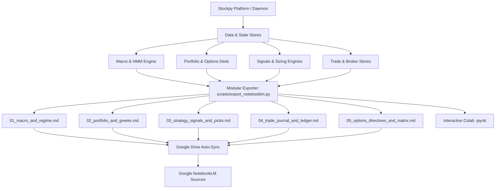

# Google Notebook & NotebookLM Integration Guide

This document describes the architecture, current implementation, and expansion roadmap for bridging the **Stockpy / InvestYo** quantitative platform with **Google NotebookLM** and **Google Colab / Jupyter Notebooks**.

---

## 1. Overview & Objective

The Google Notebook pipeline allows the operator to export structured, verified quantitative analysis from Stockpy directly into Google's research and notebook environments.

### Primary Use Cases:
1. **Google NotebookLM (Grounded LLM Research & Audio Overviews)**:
   - Grounding NotebookLM's multi-source Gemini models in exact, un-hallucinated point-in-time portfolio telemetry, factor z-scores, macro regime indicators, and options Greeks.
   - Generating AI Audio Overviews ("deep-dive podcasts") and synthesized research briefs comparing platform signals against macroeconomic shifts.
2. **Interactive Google Colab / Jupyter Analysis (`.ipynb`)**:
   - Exporting snapshot data frames into interactive notebooks for ad-hoc backtesting, scenario modeling, and custom visualization.

---

## 2. Current Implementation (Phase 1)

### 2.1 Backend Pipeline Script (`scripts/export_notebooklm.py`)
- **Location**: [`scripts/export_notebooklm.py`](../scripts/export_notebooklm.py)
- **Output File**: `~/.stockpy_local/output/notebooklm_source.md` (resolved via `settings.OUTPUT_DIR`)
- **Invocation**:
  ```bash
  python scripts/export_notebooklm.py
  # Or via uv:
  uv run python scripts/export_notebooklm.py
  ```

#### Extracted Data Layers:
1. **Macro Context**: Trailing VIX, 10Y-2Y yield curve spread, and BAML High Yield OAS credit spreads queried from `HistoricalStore(readonly=True).get_macro()`.
2. **Current Portfolio**: Point-in-time account snapshot from `HistoricalStore.latest_account_snapshot()` mapped via `_serialize_portfolio` (Total Equity, Buying Power, Position Quantities, Cost Basis, and Market Value).
3. **Active Strategy Follows**: Active strategy subscriptions, allocated capital, and status from `FollowsStore().list_active()`.

### 2.2 CLI Introspection & PWA Command Runner
- Registered in [`cli_introspect/targets.py`](../cli_introspect/targets.py) and compiled into [`cli_introspect/command_manifest.json`](../cli_introspect/command_manifest.json).
- Executable as a background job directly from the **Pilots PWA Commands Screen** (`webapp/src/screens/Commands.tsx`).

### 2.3 Webapp Dashboard Widget (`webapp/src/components/NotebookMLExport.tsx`)
- Provides on-demand JSON clipboard copy and file download for quick ad-hoc exports from the browser.

---

## 3. Honesty & Safety Invariants

1. **CONSTRAINT #4 — Never Fabricate Data**:
   - Missing, uncomputable, or cold-start metrics format as `"N/A"`, `null`, or explicit notice banners — **never coerced to `$0` or placeholder defaults**.
   - NotebookLM treats `$0` as a verified holding or zero-risk metric; maintaining explicit `"N/A"` ensures the LLM grounds its reasoning accurately.
2. **Read-Only Fail-Safe (CONSTRAINT #6)**:
   - Database operations use `HistoricalStore(readonly=True)` and fail-safe exception blocks so export execution never impacts core trading engines or locks SQLite WAL files.

---

## 4. Expansion Roadmap (Phases 2 – 6)



### Phase 2: Modular Multi-Source Knowledge Pack (`output/notebooklm/`)
NotebookLM supports up to **50 individual sources** per notebook and cross-references multi-document repositories significantly better than large monolithic files.

| File | Content | Primary Data Sources |
|---|---|---|
| `01_macro_and_regime.md` | Gaussian HMM regime state, transition probabilities, Sahm Rule, inflation, credit spreads | `HistoricalStore.get_macro()`, `regime/hmm_regime.py` |
| `02_portfolio_and_greeks.md` | Holdings, position weights, net Greeks ($\Delta_{\$}, \Gamma, \Theta, \mathcal{V}, \beta\text{-weighted }\Delta_{\text{SPY}}$), margin usage | `HistoricalStore`, `pilots/options_risk.py` |
| `03_strategy_signals_and_picks.md` | Daily BUY/SELL/HOLD ratings, conviction scores, `buyRange`/`sellRange`, Kelly sizing, Multifactor z-scores (Value, Quality, Momentum, LowVol) | `signals/`, `StrategyEngine`, `sizing/position_sizer.py` |
| `04_trade_journal_and_ledger.md` | Closed trade log, FIFO win rates, profit factor, average holding duration, MAE/MFE edge ratios | `data/broker_fills_store.py`, `PaperAccountStore` |
| `05_options_directives_and_matrix.md` | Premium selling directives (Put Credit Spreads, Iron Condors, 0DTE setups), IV Rank, VRP cones | `technical_options_engine.py`, `pilots/volatility_surface.py` |

### Phase 3: Daemon & Orchestrator Automated Hook
- **Continuous Generation**: Wire the export routine into `desktop/daemon_runtime.py`'s `_timer_loop` and `main_orchestrator.py` post-run steps.
- **Auto-Refresh**: Every scheduled pipeline cycle automatically refreshes markdown files in `output/notebooklm/`.
- **Briefing Diffs**: Integrate day-over-day signal changes from `scripts/daily_briefing.py`.

### Phase 4: Google Drive Auto-Sync
- **Direct Cloud Ingestion**: Authenticate with Google Drive API via existing service account (`credentials.json`).
- **Live-Synced Folder**: Automatically push updated markdown docs to a target Google Drive folder (`Stockpy/NotebookLM_Sources/`).
- **Zero-Touch Ingestion**: Because NotebookLM can directly sync with Google Drive files, platform updates are reflected in NotebookLM with zero manual file uploading.

### Phase 5: Interactive Google Colab & Jupyter Notebook Generator (`.ipynb`)
- Generate pre-populated `.ipynb` notebooks containing:
  - Pre-loaded data frames of recent daily bars and fundamental metrics.
  - Interactive Plotly equity curves and payoff diagrams.
  - Ready-to-run vectorbt backtesting cells for rapid prototyping.

### Phase 6: PWA Knowledge Pack Downloader
- Extend `<NotebookMLExport />` on the Pilots PWA Dashboard to add a **"Download Complete Knowledge Pack (.zip)"** button for one-click downloading of all modular markdown sources.

---

## 5. Summary of Related Files

- [`scripts/export_notebooklm.py`](../scripts/export_notebooklm.py) — Core export pipeline script.
- [`webapp/src/components/NotebookMLExport.tsx`](../webapp/src/components/NotebookMLExport.tsx) — PWA Dashboard export widget.
- [`cli_introspect/targets.py`](../cli_introspect/targets.py) — CLI targets manifest registry.
- [`docs/FMP_INTEGRATION.md`](FMP_INTEGRATION.md) — Financial Modeling Prep data layer reference.
- [`docs/JULES_INTEGRATION.md`](JULES_INTEGRATION.md) — Jules autonomous agent reference.
