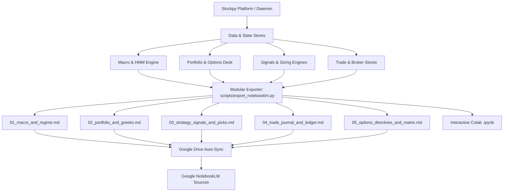

# Google Notebook & NotebookLM Integration Guide

This document describes the architecture, current implementation, and expansion roadmap for bridging the **Stockpy / InvestYo** quantitative platform with **Google NotebookLM** and **Google Colab / Jupyter Notebooks**.

---

## 1. Overview & Objective

The Google Notebook pipeline allows the operator to export structured, verified quantitative analysis from Stockpy directly into Google's research and notebook environments.

### Primary Use Cases:
1. **Google NotebookLM (Grounded LLM Research & Audio Overviews)**:
   - Grounding NotebookLM's multi-source Gemini models in exact, un-hallucinated point-in-time portfolio telemetry, factor z-scores, macro regime indicators, and options Greeks.
   - Generating AI Audio Overviews ("deep-dive podcasts") and synthesized research briefs comparing platform signals against macroeconomic shifts.
2. **Interactive Google Colab / Jupyter Analysis (`.ipynb`)**:
   - Exporting snapshot data frames into interactive notebooks for ad-hoc backtesting, scenario modeling, and custom visualization.

---

## 2. Current Implementation

### 2.1 Backend Pipeline Script (`scripts/export_notebooklm.py`)
- **Location**: [`scripts/export_notebooklm.py`](../scripts/export_notebooklm.py)
- **Output Files**:
  - Consolidated Document: `output/notebooklm_source.md` (single-file upload)
  - Modular Knowledge Pack: `output/notebooklm/*.md` (multi-source upload)
- **Invocation & CLI Options**:
  ```bash
  python scripts/export_notebooklm.py                      # Generates both consolidated & modular pack
  python scripts/export_notebooklm.py --modular-only       # Generates only output/notebooklm/*.md
  python scripts/export_notebooklm.py --consolidated-only  # Generates only output/notebooklm_source.md
  python scripts/export_notebooklm.py --section macro      # Generates only 01_macro_and_regime.md
  python scripts/export_notebooklm.py --output-dir /path   # Custom target output directory
  ```

#### Modular Source Documents in `output/notebooklm/`:
1. **`01_macro_and_regime.md`**:
   - Executive classification: Market Regime, Gaussian HMM state, HMM Risk-On probability, Macro Kill-Switch status, Macro Gate protection mode.
   - Economic indicators: VIX (CBOE Volatility Index), 10Y-2Y yield curve spread, High Yield OAS credit spread, Sahm Rule recession indicator.
2. **`02_portfolio_and_greeks.md`**:
   - Capital summary: Total Equity, Buying Power, Cash/Dividends, Snapshot As-Of timestamp and staleness.
   - Net portfolio Greeks: Net Delta ($\Delta_{\$}$ and shares), Net Gamma ($\Gamma$), Net Daily Theta ($\Theta_{\text{daily}}$), Net Vega ($\mathcal{V}_{\text{1\%}}$), $\beta$-Weighted SPY Delta, SPY spot price, and missing/estimated beta disclosures.
   - Detailed holdings table: Symbol, Company Name, Quantity, Cost Basis, Current Price, Market Value, and Unrealized P&L.
3. **`03_strategy_signals_and_picks.md`**:
   - Active strategy subscriptions (Pilots): Pilot ID, allocated capital, status.
   - Tactical execution signals: Symbol, Action (BUY/SELL/HOLD), Conviction, `buyRange`, `sellRange`, Kelly sizing target (%), and Final Score.
   - Multifactor Z-Score attribution: Value, Quality, Momentum (XSec), LowVol, Size, and Composite z-scores.
   - Sizing guardrail telemetry: `sizing_was_capped`, `binding_constraint`, and ETF transmission multiplier.
4. **`04_trade_journal_and_ledger.md`**:
   - FIFO-reconstructed trading KPIs: Total closed trades count, Win Rate (%), Profit Factor, Total Realized P&L, Gross Profit/Loss, Average Win/Loss, Average Return %, Average Holding Duration (Days), and Best/Worst Trade P&L.
   - Chronological closed trades ledger: Symbol, Quantity, Entry/Exit Dates, Holding Days, Entry/Exit Prices, Realized P&L, and Return %.
5. **`05_options_directives_and_matrix.md`**:
   - Options regime: Target DTE, Reference VIX, Market Regime, Total Directives count.
   - Quantitative directives: Call/Put Credit Spreads, Iron Condors, Spot Price, Short/Long strike deltas, Net Premium, IV Rank (`True_IVR` / `IVR_Proxy`), and Trend Bias.
   - Fundamental health & news catalysts: Altman Z-Score, Piotroski F-Score, Days to Earnings, Earnings Risk flag, and recent company news headlines.

### 2.2 CLI Introspection & PWA Command Runner
- Registered in [`cli_introspect/targets.py`](../cli_introspect/targets.py) and compiled into [`cli_introspect/command_manifest.json`](../cli_introspect/command_manifest.json).
- Supports all CLI options (`--output-dir`, `--modular-only`, `--consolidated-only`, `--section`) directly from the **Pilots PWA Commands Screen** (`webapp/src/screens/Commands.tsx`).

### 2.3 Webapp Dashboard Widget (`webapp/src/components/NotebookMLExport.tsx`)
- Provides on-demand JSON clipboard copy and file download for quick ad-hoc exports from the browser.

---

## 3. Honesty & Safety Invariants

1. **CONSTRAINT #4 — Never Fabricate Data**:
   - Missing, uncomputable, or cold-start metrics format as `"N/A"`, `null`, or explicit notice banners — **never coerced to `$0` or placeholder defaults**.
   - NotebookLM treats `$0` as a verified holding or zero-risk metric; maintaining explicit `"N/A"` ensures the LLM grounds its reasoning accurately.
   - A genuine `$0.00` (e.g. liquidated account or zero buying power) is preserved and distinguished from missing data.
2. **Read-Only Fail-Safe (CONSTRAINT #6)**:
   - Database operations use `HistoricalStore(readonly=True)` and `BrokerFillsStore(readonly=True)`.
   - Lazy imports are strictly used for heavy components (`pilots_api`, `options_risk`, `trade_history`, `broker_fills_store`) so that an import failure in an optional subsystem never halts the execution of independent sections.
   - Every file write uses atomic replacement (`.tmp` + rename).

---

## 4. Expansion Roadmap (Phases 3 – 6)



### Phase 3: Daemon & Orchestrator Automated Hook
- **Continuous Generation**: Wire the export routine into `desktop/daemon_runtime.py`'s `_timer_loop` and `main_orchestrator.py` post-run steps.
- **Auto-Refresh**: Every scheduled pipeline cycle automatically refreshes markdown files in `output/notebooklm/`.
- **Briefing Diffs**: Integrate day-over-day signal changes from `scripts/daily_briefing.py`.

### Phase 4: Google Drive Auto-Sync
- **Direct Cloud Ingestion**: Authenticate with Google Drive API via existing service account (`credentials.json`).
- **Live-Synced Folder**: Automatically push updated markdown docs to a target Google Drive folder (`Stockpy/NotebookLM_Sources/`).
- **Zero-Touch Ingestion**: Because NotebookLM can directly sync with Google Drive files, platform updates are reflected in NotebookLM with zero manual file uploading.

### Phase 5: Interactive Google Colab & Jupyter Notebook Generator (`.ipynb`)
- Generate pre-populated `.ipynb` notebooks containing:
  - Pre-loaded data frames of recent daily bars and fundamental metrics.
  - Interactive Plotly equity curves and payoff diagrams.
  - Ready-to-run vectorbt backtesting cells for rapid prototyping.

### Phase 6: PWA Knowledge Pack Downloader
- Extend `<NotebookMLExport />` on the Pilots PWA Dashboard to add a **"Download Complete Knowledge Pack (.zip)"** button for one-click downloading of all modular markdown sources.

---

## 5. Summary of Related Files

- [`scripts/export_notebooklm.py`](../scripts/export_notebooklm.py) — Core export pipeline script.
- [`webapp/src/components/NotebookMLExport.tsx`](../webapp/src/components/NotebookMLExport.tsx) — PWA Dashboard export widget.
- [`cli_introspect/targets.py`](../cli_introspect/targets.py) — CLI targets manifest registry.
- [`docs/FMP_INTEGRATION.md`](FMP_INTEGRATION.md) — Financial Modeling Prep data layer reference.
- [`docs/JULES_INTEGRATION.md`](JULES_INTEGRATION.md) — Jules autonomous agent reference.
