# InvestYo Advisory Platform — Architecture & Data Flow

This document captures the primary data-flow path from raw market data through to
advisory recommendations. The system runs in **`ADVISORY_ONLY=true` mode by default**,
which means the OrderManager / BrokerBase surface on the right side of the diagram is
quarantined and never reached during normal operation.

---

## Primary Data Flow

```mermaid
flowchart TD
    %% ── External Data Sources ─────────────────────────────────────────────
    subgraph SOURCES["External Data Sources"]
        YF["Yahoo Finance\n(OHLCV, fundamentals)"]
        FRED["FRED API\n(VIX, yield curve, Sahm Rule,\nHY OAS, CPI, DGS10)"]
        ALP["Alpaca IEX\n(real-time quotes & bars)"]
        FHB["Finnhub\n(fundamentals, news)"]
        RH["Robinhood\n(account snapshot — ADVISORY ONLY)"]
    end

    %% ── Data Layer ────────────────────────────────────────────────────────
    subgraph DATALAYER["Data Layer"]
        DE["DataEngine / IDataProvider\ndata_engine.py\ndata/market_data.py"]
        HS["HistoricalStore\ndata/historical_store.py\n(SQLite WAL — bars, snapshots,\nfundamentals, macro series)"]
        RHP["robinhood_portfolio.py\nRead-only account snapshot\n(3-tier: DB → JSON cache → live)"]
    end

    YF & ALP & FHB --> DE
    FRED --> DE
    DE --> HS
    RH --> RHP

    %% ── DTOs ──────────────────────────────────────────────────────────────
    subgraph DTOS["Data Transfer Objects  (dto_models.py)"]
        MBDTO["MarketBarDTO\nOHLCV + derived technicals"]
        FDDTO["FundamentalDataDTO\nP/E, P/B, ROE, EPS, dividend yield…"]
        MEDTO["MacroEconomicDTO\nregime, VIX, Sahm Rule, yield curve,\nkillSwitch, hmm_risk_on_probability"]
        RHDTO["RobinhoodPositionDTO\nqty, avg_cost, unrealised P/L,\ndividends_received"]
    end

    HS --> MBDTO & FDDTO
    DE --> MEDTO
    RHP --> RHDTO

    %% ── Processing Engines ────────────────────────────────────────────────
    subgraph ENGINES["Processing Engines"]
        PE["ProcessingEngine\nprocessing_engine.py\nRSI, MACD, Aroon, ATR, Graham,\nGordon, momentum metrics,\nmultifactor raw inputs"]
        ME["MacroEngine\nmacro_engine.py\nRules-based regime +\nHMM second opinion"]
        HMM["HMMRegimeDetector\nregime/hmm_regime.py\n3-state Gaussian HMM\n(bull / sideways / bear)"]
        TOE["TechnicalOptionsEngine\ntechnical_options_engine.py\nGJR-GARCH σ, IVR, Black-Scholes Greeks,\nAroon+Coppock trend bias"]
        FE["ForecastingEngine\nforecasting_engine.py\nARIMA · Monte Carlo · Holt-Winters\nCNN-LSTM · skill-weighted ensemble"]
        FT["ForecastTracker\nforecasting/forecast_tracker.py\nInverse-RMSE skill weights\n(SQLite)"]
    end

    MBDTO & FDDTO --> PE
    MEDTO --> ME
    ME --> HMM
    HMM --> MEDTO
    PE --> TOE
    FE --> FT

    %% ── Signal Modules ────────────────────────────────────────────────────
    subgraph SIGNALS["Signal Modules  (signals/)"]
        direction LR
        SM1["macro_regime\nw=45"]
        SM2["edge_garch\nw=35"]
        SM3["dividend_quality\nw=25"]
        SM4["rsi_extremes\nw=20"]
        SM5["graham_value\nw=15"]
        SM6["macd_momentum\nw=15"]
        SM7["aroon_trend\nw=15"]
        SM8["timeseries_momentum\nw=15"]
        SM9["cross_sectional_momentum\nw=15"]
        SM10["multifactor\nw=15"]
        SM11["forecast_alignment\nw=10"]
        SM12["relative_strength\nw=10"]
        SM13["sortino_drawdown\nw=10"]
        SM14["rsi2_mean_reversion\nw=10"]
        SM15["news_catalyst\nw=10"]
        SM16["regime_multiplier\nw=0\n(Kelly scalar only)"]
    end

    PE --> SM1 & SM2 & SM3 & SM4 & SM5 & SM6 & SM7 & SM8 & SM9 & SM10 & SM11 & SM12 & SM13 & SM14 & SM15 & SM16
    MEDTO --> SM1 & SM14 & SM16
    FE --> SM11
    TOE --> SM2

    %% ── Aggregation ───────────────────────────────────────────────────────
    subgraph AGG["Signal Aggregation"]
        SA["SignalAggregator\nsignals/aggregator.py\nWeighted sum · regime gates ·\noperator disable · meta-label hard gate"]
        MLR["MetaLabelerRegistry\nml/meta_labeling.py\nP(primary_signal_correct)\n— 1.0 until Stage 4 trains"]
    end

    SM1 & SM2 & SM3 & SM4 & SM5 & SM6 & SM7 & SM8 & SM9 & SM10 & SM11 & SM12 & SM13 & SM14 & SM15 & SM16 --> SA
    MLR --> SA

    %% ── Strategy Engine ───────────────────────────────────────────────────
    subgraph STRATEGY["Strategy Engine"]
        SE["StrategyEngine\nstrategy_engine.py\nfinal_score → BUY/HOLD/RISK REDUCE\nbuyRange · sellRange\nKelly Target · meta_label_composite"]
        KS["sizing/kelly.py\nsizing/vol_target.py\nBootstrap-conservative Kelly\nvol-target fallback"]
        TS["TransactionsStore\ntransactions_store.py\nSQLAlchemy · trade history\nconviction column"]
    end

    SA --> SE
    KS & TS --> SE
    MEDTO --> SE

    %% ── Advisory Engine ───────────────────────────────────────────────────
    subgraph ADVISORY["Advisory Engine  (ADVISORY_ONLY=true default)"]
        ADV["engine/advisory.py\nHolding-aware overlay\nCase A (below cost → SELL)\nCase B (dividend bias → HOLD)\nCase C (unrealised gain → HOLD)\nMacro gate (RECESSION/VIX/sector veto)\nVerbose rationale [A]–[D]"]
        REC["Recommendation\n(frozen dataclass)\naction · conviction\nrationale · suggested_position_pct"]
    end

    SE --> ADV
    RHDTO --> ADV
    MEDTO --> ADV
    ADV --> REC

    %% ── Watch Engine & Alerts ─────────────────────────────────────────────
    subgraph WATCH["Watch Engine & Alerts"]
        WE["watch_engine.py\nwatch_rules.yaml evaluation\nEdge-triggered conviction alerts\nAction-flip notifications"]
        NT["alerting.py\nntfy.sh push notifications\nRotating log: logs/investyo.log"]
    end

    REC --> WE --> NT

    %% ── Output / Sinks ────────────────────────────────────────────────────
    subgraph OUTPUT["Output Sinks"]
        HTML["output/daily_report.html\nHoldings & P/L · Δ Since Last Run\nSignals table · Rationale · Gravity audit"]
        SS["output/state_snapshot.json\n(+ rotated history/ copies)"]
        DL["output/decision_log.jsonl\nOperator acted / passed / modified"]
        GS["Google Sheet\n(FidelityData_Automated tab)\nlegacy sink via main.py"]
        NTFY_OUT["Phone push notification\nntfy.sh topic"]
    end

    REC --> HTML & SS & DL & GS
    WE --> NTFY_OUT

    %% ── Diff / Briefing ───────────────────────────────────────────────────
    subgraph DIFF["Δ Diff & Briefing"]
        SD["scripts/snapshot_diff.py\nΔ Since Last Run computation\nRotation + pruning"]
        DB["scripts/daily_briefing.py\nMarkdown briefing → stdout\n+ output/briefing_YYYY-MM-DD.md"]
    end

    SS --> SD --> HTML
    SS & DL --> DB

    %% ── Quarantined Broker Surface (ADVISORY_ONLY=true) ───────────────────
    subgraph BROKER["⚠ Quarantined — ADVISORY_ONLY=true"]
        direction LR
        OM["OrderManager\nexecution/order_manager.py\nIdempotency · risk gate · retry"]
        RG["PreTradeRiskGate\nexecution/risk_gate.py\n10-check pipeline"]
        BB["BrokerBase / AlpacaBroker\nexecution/broker_base.py\nexecution/alpaca_broker.py"]
        KSW["GlobalKillSwitch\nexecution/kill_switch.py\noutput/KILL_SWITCH file"]
    end

    SE -.->|"ADVISORY_ONLY=false only"| OM
    OM -.-> RG -.-> BB
    KSW -.-> OM

    style BROKER fill:#fee2e2,stroke:#ef4444,color:#7f1d1d
    style SOURCES fill:#f0fdf4,stroke:#22c55e
    style DTOS fill:#eff6ff,stroke:#3b82f6
    style ENGINES fill:#fdf4ff,stroke:#a855f7
    style SIGNALS fill:#fff7ed,stroke:#f97316
    style AGG fill:#fefce8,stroke:#eab308
    style STRATEGY fill:#f0fdf4,stroke:#22c55e
    style ADVISORY fill:#f0f9ff,stroke:#0ea5e9
    style OUTPUT fill:#fafafa,stroke:#a1a1aa
    style DIFF fill:#fafafa,stroke:#a1a1aa
    style WATCH fill:#fdf4ff,stroke:#a855f7
```

---

## Key Architectural Invariants

| # | Invariant |
|---|-----------|
| 1 | **DTO boundary** — all data crossing into calculation code must be coerced into `dto_models.py` types. No raw-dict lookups in signal or strategy code. |
| 2 | **Single sizing SSOT** — Kelly Target is computed **only** in `StrategyEngine._calculate_kelly_sizing()` → `sizing/kelly.py` / `sizing/vol_target.py`. No score-derived win-probability formulas anywhere else. |
| 3 | **Source-of-truth separation** — Robinhood is the source of truth for account state (qty, cost basis, dividends, equity). Market data providers (Alpaca / yfinance / Finnhub) are the source of truth for prices, bars, and fundamentals. These roles never cross. |
| 4 | **No fabricated data** — missing fields are `NaN`, never `0.0`. Held symbols without live quotes get `EQUITY_ONLY` coverage; their equity view uses `qty × avg_cost`, not a fabricated current price. |
| 5 | **Dead-letter resilience** — every per-symbol calculation is wrapped in try/except. One symbol's failure never aborts the run; it is captured in the dead-letter queue (`output/dead_letter.json`). |
| 6 | **Broker quarantine** — `ADVISORY_ONLY=true` (the project default) causes `main_orchestrator._execute_broker_orders` to return immediately before any broker import. The OrderManager / BrokerBase path (shown in red above) is never reached. |
| 7 | **No lookahead bias** — every indicator (RSI, MACD, ATR, Aroon, Coppock, Chandelier) is computed on a causal slice of historical data. The `tests/lookahead_check.py` perturbation harness enforces this in CI. |

---

## Module Ownership

Claude Code owns the entire repo — single-agent workflow, no domain split.

| Domain | Files |
|--------|-------|
| Signal modules, strategy sizing, ML, regime, validation | `signals/`, `strategy_engine.py`, `sizing/`, `ml/`, `regime/`, `macro_engine.py`, `validation/`, `execution/`, `tests/` |
| GUI, observability, reporting, scripts | `gui/`, `observability/`, `reporting_engine.py`, `diagnostics_and_visuals.py`, `scripts/` |
| Config, DTOs, data layer, orchestrators, requirements | `config.py`, `dto_models.py`, `data/`, `data_engine.py`, `main.py`, `main_orchestrator.py`, `requirements.txt` |

---

## Entry Points

| Entry point | When to use | Key difference |
|-------------|-------------|----------------|
| `python3 main.py` | Advisory refresh — fastest, broker-free | Calls `engine/advisory.py` directly; writes `output/daily_report.html` + `output/state_snapshot.json` |
| `python3 main_orchestrator.py` | Full async pipeline with schema validation | Runs all 50+ dashboard columns through Pandera; writes `output/daily_report_dashboard.html` |
| `streamlit run gui/app.py` | Visual control panel | Launches orchestrator as subprocess; reads file-backed state; never calls broker directly |
| `python scripts/preflight_check.py` | Readiness gate | 13 checks; advisory-mode auto-skips 4 broker checks |

---

*Last updated: 2026-06-26. Reflects Tier 5.3 advisory pause gate, Tier 4 validation cadence, Tier 2.4 news catalyst, and the ADVISORY_ONLY=true default.*
